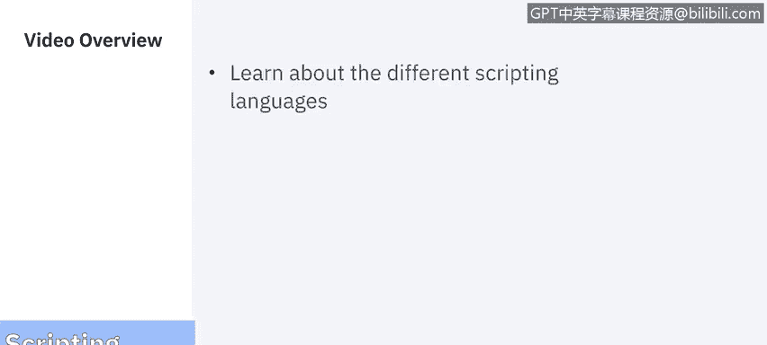
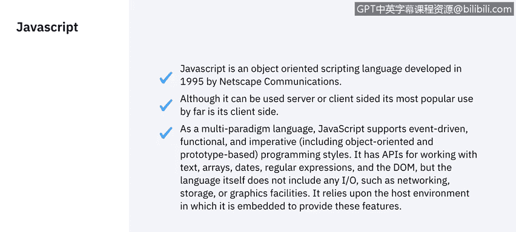
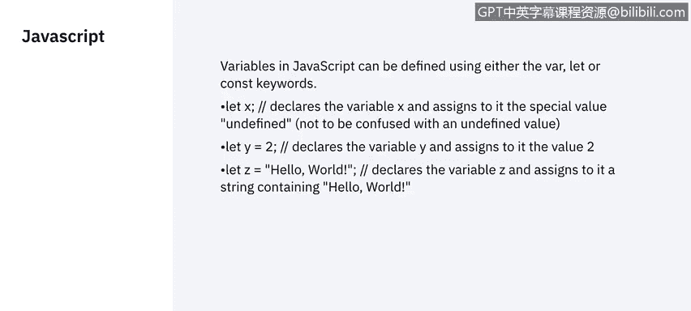
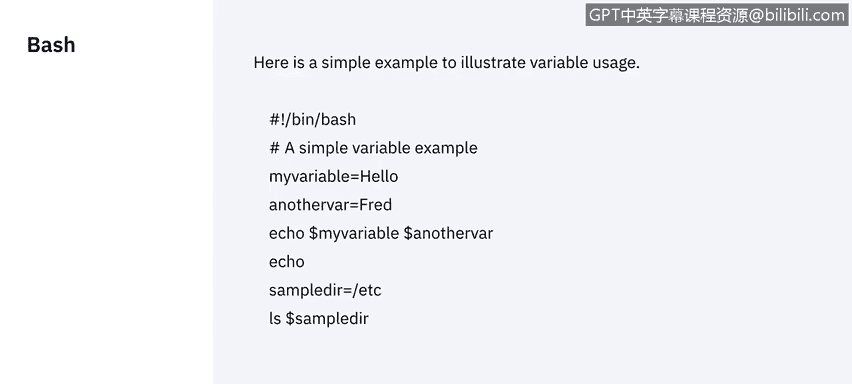
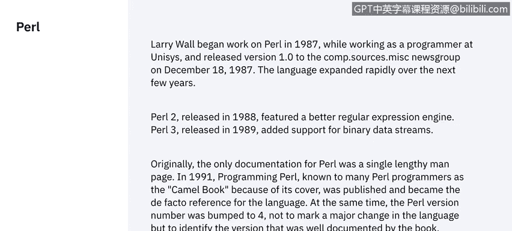
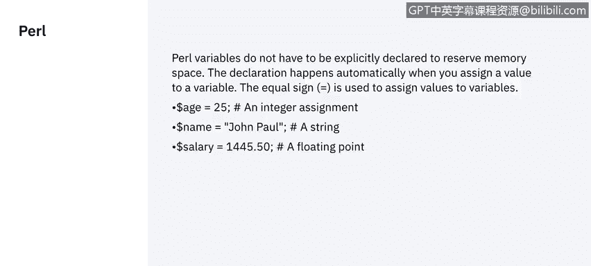
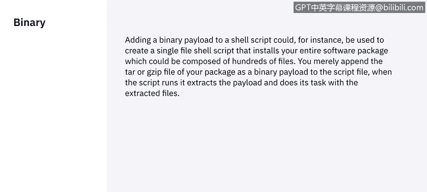
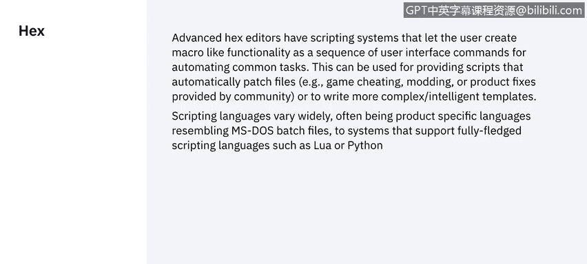
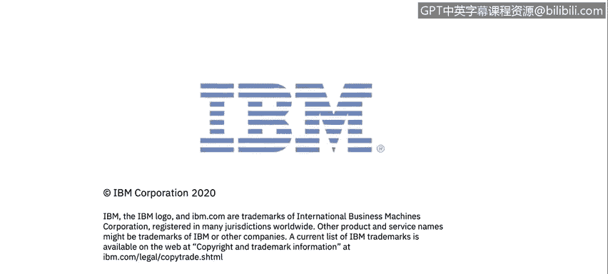

# 课程5：《渗透测试、事件响应与取证》：63：脚本语言入门 🖥️



在本节课中，我们将学习几种在网络安全领域常用的脚本语言。了解这些语言的基本概念和用途，对于执行自动化任务、分析数据和理解系统行为至关重要。

## 概述

脚本语言是用于编写简短程序以执行特定任务的编程语言。它们通常比编译型语言更易于学习和使用，并且可以直接在特定环境中运行。在网络安全工作中，脚本语言常用于自动化渗透测试任务、处理事件响应数据或进行取证分析。

## JavaScript

上一节我们介绍了脚本语言的概念，本节中我们来看看第一种语言：JavaScript。

JavaScript是一种面向对象的脚本语言。它由网景通信公司在1995年开发。当时，网景通信公司与太阳微系统公司关系密切，而太阳微系统公司是Java编程语言的主要支持者之一。当时的网页非常简陋，甚至动态GIF图片都还在发展中。为了执行一系列使网页更具交互性的行为，必须开发一种脚本语言。因此，网景公司的布兰登·艾克主导创建了这种脚本语言。



JavaScript被设计为几乎可以在任何环境中运行。它是轻量级的，并且是受保护的。它不允许人们像某些编程语言那样使用或共享资源。该语言不允许任何输入/输出操作，例如网络或存储操作。基本上，它将在客户端机器上运行，并将其保持在一个可以称之为“监狱环境”的沙箱中。

以下是JavaScript中定义变量的方法：

```javascript
var variableName;
const constantName;
let y = "IBM";
let greeting = "Hello";
```

变量可以使用 `var`、`const` 或 `let` 关键字定义。我们可以为变量分配数字或任何类型的值。任何文本内容都放在引号之间，并且定义必须以分号结束。



## Bash

了解了客户端脚本语言后，我们转向服务器和操作系统环境。Bash是为Unix系统创建的Shell。

Shell基本上是一个允许我们与操作系统通信的程序。Bash包含一个脚本解释器，允许我们创建小型、单一的程序来执行各种功能。例如，如果我们想在Unix中创建用户列表，可以编写一个Bash脚本来完成。

Bash中的变量定义非常简单：



```bash
variable_name=value
```

我们只需写入变量名、等号，然后赋值。之后，要引用一个变量，我们使用美元符号 `$` 来调用它。在脚本中，我们可以创建任意多的变量，然后在脚本内部调用它们。

## Perl



接下来，我们看看另一种在历史上对Web开发影响深远的脚本语言：erl。

Perl是一种脚本语言，创建于1987年。它用于客户端和服务器之间的脚本编写。如今，它在网页中仍有很多用途，能创建非常有趣的功能。它在某些方面效仿了JavaScript。它稍微复杂一些。Perl的传播者和支持者非常忠诚于这门语言，并且互联网上有很多资源可供学习。



与Bash类似，Perl中的变量不需要声明。不同之处在于，在Perl中声明变量时，我们必须使用美元符号 `$` 来告诉解释器我们将要使用一个变量。

## PowerShell

在讨论了主要基于Unix/Linux的脚本语言后，我们来看看Windows平台的解决方案。PowerShell是微软提供的脚本环境。

Windows直到2016年才广泛使用脚本语言，这比其他操作系统晚了大约20到30年。PowerShell基本上是一个运行在.NET框架上的解释器，它允许我们执行基本的脚本。我们可以执行文件操作、网络操作等。

## 二进制脚本

除了高级脚本语言，有时也需要在更低层级进行操作。二进制脚本就是其中之一。

机器代码就是我们所说的机器语言，是编译器对任何编程语言进行处理后的结果。实际上，用二进制编写脚本并不容易，它是为特定任务完成的。二进制脚本主要用于电信和二进制编码领域，例如当我们刻录CD和DVD或克隆存储系统时。二进制的概念是只有两种状态：0和1。存储这种状态的内存空间是计算中最小的单位，即比特。在数据传输中，比特是计算传输速率的基本单位。因此，你可能看到，这不是一种你会经常使用的语言。

将二进制有效负载添加到Shell脚本中的想法，是为了使用更小的数据包来覆盖程序中的库或文件，无论这个程序是你编写的还是正在更新的。但这通常也通过使用十六进制脚本来完成，后者更容易读写，而这正是我们接下来要讨论的内容。



## 十六进制脚本

最后，我们探讨一种用于直接操作数据的底层表示方法：十六进制脚本。

十六进制脚本主要是数学性的。它是阅读机器语言的一种更简单的方式，主要用于更新软件时。覆盖十六进制数字比覆盖二进制机器码更快，然后对已编译的机器代码进行加密、更改并重新编译。大多数公司通过覆盖文件中的十六进制数字来更新软件。它也可以用于监视某些值，并了解程序在内存中做了哪些更改，用于故障排除和调试。

普通计算机工程师使用十六进制代码的情况非常少见，除非你是非常专业的调试人员，或者正在调试应用程序的执行程序等。这就是关于十六进制脚本的介绍。

## 总结





本节课中，我们一起学习了多种脚本语言。我们从用于网页交互的JavaScript开始，然后探讨了用于Unix系统自动化的Bash，接着了解了用于通用脚本任务的Perl，以及Windows环境下的PowerShell。最后，我们简要介绍了底层的二进制和十六进制脚本的概念及其特定用途。理解这些工具将帮助你在网络安全的不同任务中选择合适的自动化或分析方法。