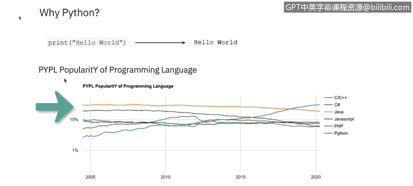
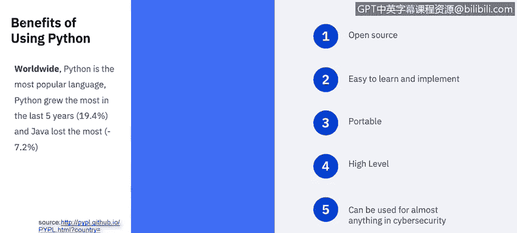
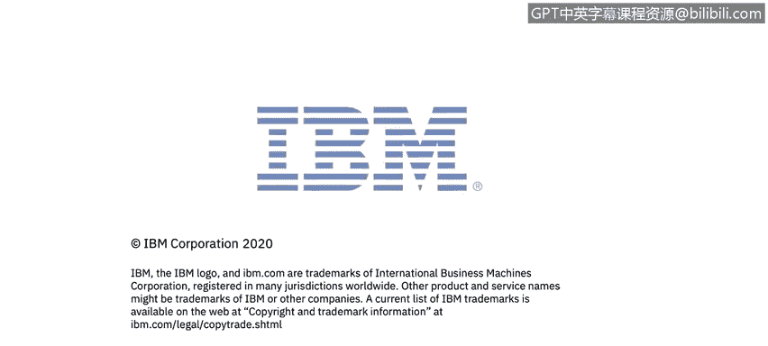

# 课程5：《渗透测试、事件响应与取证》：64：29_01_python-basics

## 概述
在本节课中，我们将要学习Python脚本的基础知识。我们将了解Python是什么，它为何在网络安全领域如此重要，以及它相较于其他编程语言的优势。课程将涵盖Python的核心特性、应用场景以及它如何帮助网络安全分析师开展工作。

## Python简介
Python由吉多·范罗苏姆于1991年创建，是一种脚本语言。它使用解释器逐行翻译代码并执行。

Python可用于开发基于Web和基于软件的应用程序。虽然它在访问底层计算机功能方面不如C等编程语言强大，但它在Web应用程序、图形用户界面、网络编程以及其他重要的网络安全应用领域的需求日益增长。

Python非常适合作为第一门编程语言，它能帮助你后续学习其他面向对象的语言，甚至有助于学习那些技术上并非面向对象的语言。在学习Java、C、PHP或之前课程中提到的其他常用语言之前，学习Python是迈向网络安全职业生涯的重要第一步。

## Python在网络安全中的应用
美国国家网络安全职业与学习研究所（NICCS）认可Python在多个信息安全领域的实用性。



Python为用户提供了包含大量现成函数的库，这使得创建应用程序比从零开始容易得多。作为一名网络安全专业人员，你可以使用Python开发自己的分析工具、黑客脚本并设计安全的程序。

Python不要求用户学习计算机在最低层次是如何工作的，但它非常通用。以下是我们用Python编写的“Hello world”经典示例：
```python
print("Hello world")
```
从下图可以看出，根据PYPL编程语言流行度指数（该指数通过分析Google上语言教程的搜索频率得出），Python被公认为最流行的脚本语言。


## Python的优势
Python的设计和功能为初学者作为第一门脚本语言带来了诸多好处。以下是其主要优势：

**开源特性**
Python是作为一种开源编程语言开发的，类似于Linux是开源操作系统。Python的开源特性形成了一个强大的开发者社区，他们支持并推动这门语言的发展。由于Python是开源的，有大量可用信息，并且使用这门语言是免费的。

**易于学习和实现**
Python被有意设计得简单直接、易于使用且通常很轻量，与其他语言相比，它只需最少的代码即可完成任务。事实上，Python通常比C或Java等其他编程语言所需的代码量少得多。Python结构简单直接，意味着使用该语言的学习曲线更短，尤其适合脚本编程新手。互联网上有大量免费的Python学习资源，包括视频和示例项目。鉴于网上有大量免费材料，几乎任何人都可以在不上正式课程的情况下获得Python的实用知识。作为一名安全分析师，你需要对脚本语言有基本的理解。随着网络安全职业生涯的发展，你将需要额外的高级培训。

**可移植性**
Python具有可移植性，这意味着它可以在Windows、Linux和Unix系统上使用。

**高级语言特性**
Python像C++一样是通用语言，但它还具有高级语言的额外优势。高级意味着更用户友好，用对人类思维来说更易懂的关键字取代了晦涩的术语。Python的结构使其更易于学习和实现。

**可读性与调试**
Python直接的设计和易用性也提高了其代码的可读性。这种提高的可读性使得调试代码更加直接，这意味着即使是初级或初学者程序员也能相当容易地排查和调试自己的代码，并且整体上完成调试所需的时间要少得多。

**在网络安全中的广泛应用**
Python几乎可以用于网络安全的任何领域。因为Python的学习曲线通常较短，它已成为网络安全领域从业者的首选编程语言，其中许多人编程背景有限。Python的易用性意味着任何积累了相对较强技术背景的经验丰富的网络安全专业人员，都可以快速学习Python语言的基础知识并开始编程和实现代码。凭借对Python和一般编程概念的深刻理解，网络安全专业人员几乎可以使用Python代码完成他们需要的任何任务。例如，Python被大量用于恶意软件分析、主机发现、数据包解码、访问服务器、端口扫描和网络扫描等。考虑到Python在脚本编写、任务自动化和数据分析方面如此高效，随着网络安全变得越来越重要，Python的流行度上升是可以理解的。

**丰富的库**
如上所述，Python的易用性无疑是使其成为网络安全专业人员首选语言的最重要因素之一，但Python丰富的模块库也是一个主导因素。Python因其广泛的库而闻名并被大量使用，这意味着网络安全专业人员无需为常见任务重新发明轮子，并且在大多数情况下，可以快速找到已经可用的网络安全分析或渗透测试工具。





## 总结
本节课中我们一起学习了Python脚本的基础知识。我们了解到Python是一种强大、易学且开源的脚本语言，特别适合网络安全领域的应用。它因其简单的语法、丰富的库、强大的社区支持以及在恶意软件分析、网络扫描、自动化任务等方面的广泛应用而受到青睐。掌握Python是网络安全分析师职业发展中的一项关键技能。