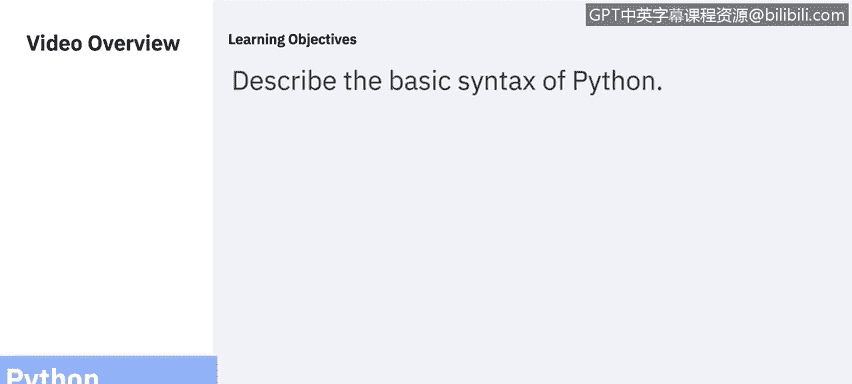
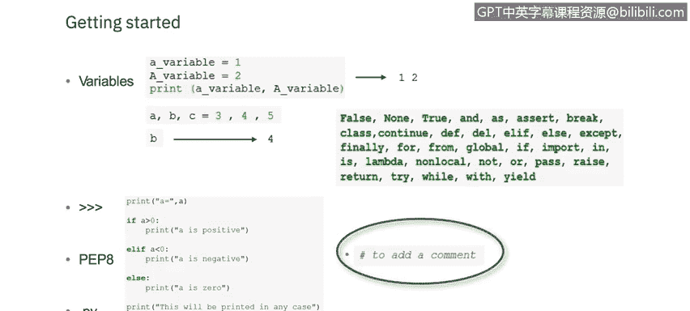
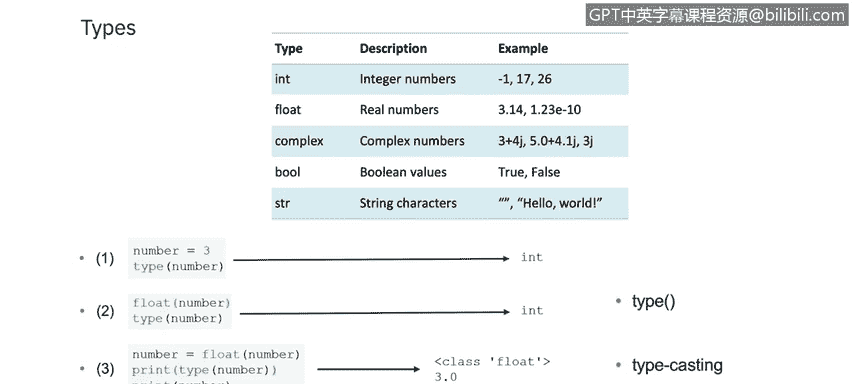
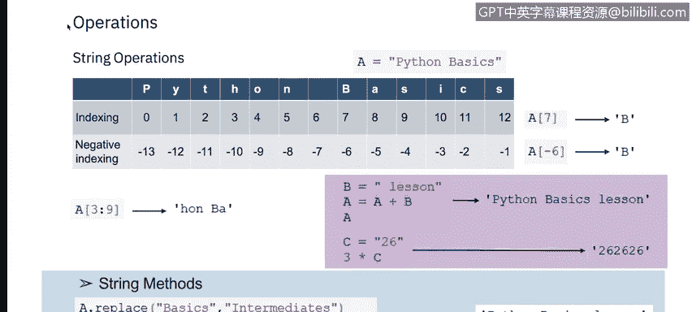
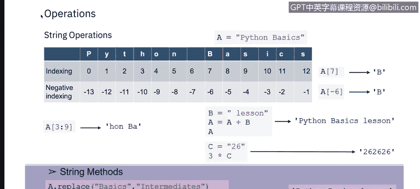
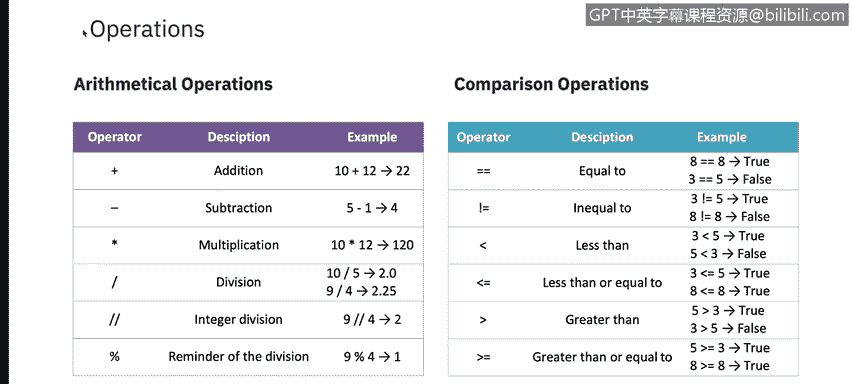
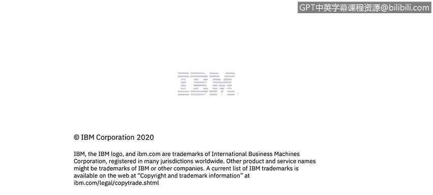

# 课程5：《渗透测试、事件响应与取证》：65：ython入门指南 🐍

在本节课中，我们将学习Python编程语言的基本语法。我们将从如何执行Python代码开始，逐步了解变量、数据类型、字符串以及各种运算符。这些基础知识是后续进行脚本编写和自动化任务的重要前提。

## Python语法与执行方式

Python语法可以通过两种方式执行：直接在命令行中编写代码，或者在服务器上创建一个以`.py`为扩展名的Python文件，然后在命令行中运行它。

## 代码缩进

缩进指的是代码行开头的空格。在其他编程语言中，代码缩进仅用于提高可读性。但在Python中，缩进至关重要。Python使用缩进来表示一个代码块。

程序员可以自行决定空格的数量，但必须至少使用一个空格。需要注意的是，在同一个代码块中，必须使用相同数量的空格，否则Python会报错。

## 变量

在Python中，当你为某个名称赋值时，就创建了一个变量。变量是用于存储数据值的容器。与其他脚本语言不同，Python没有声明变量的命令。变量在你首次为其赋值时即被创建。

此外，变量不需要声明为任何特定类型，甚至在设置后可以更改类型。字符串变量可以使用单引号或双引号来声明。

### 变量命名规则

以下是Python变量的命名规则：
*   变量名必须以字母或下划线字符开头。
*   变量名不能以数字开头。
*   变量名只能包含字母数字字符和下划线。
*   变量名区分大小写，例如`age`和`AGE`是两个不同的变量。

Python允许在一行中为多个变量赋值，也可以在一行中将同一个值赋给多个变量。

`print`语句通常用于输出变量。要组合文本和变量，Python使用加号`+`字符。

变量可以存储不同类型的数据，不同类型的数据可以执行不同的操作。在编程中，数据类型是一个重要的概念，我们接下来将进行讨论。

## 其他重要概念

屏幕上显示的三个大于号`>>>`表示示例代码。

关于更多语法细节，你可以查阅PEP 8 Python风格指南。这是一套关于如何格式化Python代码以最大化其可读性的规则。按照规范编写代码有助于使由多人编写的大型代码库更加统一和可预测。PEP是“Python增强提案”的缩写。

现在我们来谈谈`.py`文件。它是一个用Python编写的程序文件或脚本，可以用文本编辑器创建和编辑，但需要Python解释器来运行。`.py`文件通常用于编程、Web服务器和其他计算机系统管理任务。

最后，注释可用于解释Python代码。注释可以使代码更易读，或在测试代码时防止其执行。注释以井号`#`开头，Python会忽略它们。

## 数据类型

Python默认内置了以下类别的数据类型：
*   `int`：整数
*   `float`：浮点数（实数）
*   `complex`：复数
*   `bool`：布尔值
*   `str`：字符串

让我们更深入地了解其中几种数据类型。在Python中，当你为变量赋值时，就设定了其数据类型。

### 数字类型

Python中有三种数字类型：
1.  `int`（整数）：整数是正或负的整数，没有小数，长度不限。
2.  `float`（浮点数）：浮点数是正或负的数，包含一个或多个小数。浮点数也可以是科学计数法表示的数字，用`e`表示10的幂。
3.  `complex`（复数）：复数写作`a + bj`的形式，其中`j`是虚部。

此外，你可以使用`int()`、`float()`和`complex()`方法进行类型转换。有时你可能希望为变量指定类型，这可以通过**类型转换**来完成。Python是一种面向对象的语言，因此它使用类来定义数据类型，包括其原始类型。

## Python字符串

Python中的字符串字面量由单引号或双引号包围。`‘Hello’`和`“Hello”`是相同的。你可以使用`print()`函数显示字符串字面量。

通过变量名后跟等号和字符串，可以将字符串赋值给变量。

让我们看几个例子：
*   `a = “Python basics”` 将值“Python basics”赋给变量`a`。

列表允许你将一组枚举的项存储在一个位置，并通过其位置或索引访问项。使用索引时，在本例中，第七个位置的值是`‘b’`。

### 负索引

除了使用从0开始的索引，我们还可以使用从-1开始的负索引。在本例中，索引-7对应的值是`‘b’`。

你也可以使用索引切片，如本例中的`a[3:9]`所示。从上表可以看出，这相当于`‘hon Ba’`。

这里我们可以看到几个算术运算符的例子：
*   如果`b = “ lesson”`，那么`a + b`的结果是`“Python basics lesson”`。
*   如果`c = 26`，那么`3 * c`的结果是`26 26 26`。

我们还应该回顾一些字符串方法：
*   `a.replace(“basics”, “intermediates”)`的结果是`“Python intermediates lesson”`。
*   而`a = a.replace(“basics”, “intermediates”)`的结果是`“Python intermediates lesson”`。

你可以在下一张幻灯片上看到可用的不同运算符。

## Python运算符

在这张幻灯片上，你会看到两种不同类型的操作：
1.  **算术运算符**：用于对数值执行常见的数学运算。
2.  **比较运算符**：用于比较两个值。

Python中还有其他可用的运算符：
*   **赋值运算符**：用于为变量赋值。
*   **逻辑运算符**：用于组合条件语句。
*   **身份运算符**：用于比较对象，不是比较它们是否相等，而是比较它们是否是内存中相同的对象。
*   **成员运算符**：用于测试序列是否存在于对象中。
*   **位运算符**：用于比较二进制数。

## 总结

本节课中，我们一起学习了Python编程的基础知识。我们从Python代码的执行方式和重要的缩进规则开始，了解了变量的创建、命名规则和赋值方法。接着，我们探讨了Python中的主要数据类型，特别是数字类型和字符串，并学习了如何操作字符串和使用索引。最后，我们介绍了Python中各种运算符的用途，包括算术、比较、赋值、逻辑、身份、成员和位运算符。掌握这些核心概念是编写有效Python脚本的第一步。