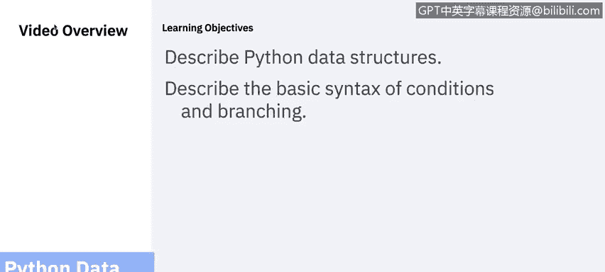
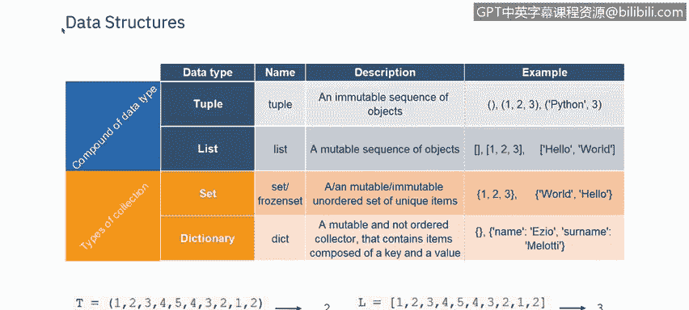
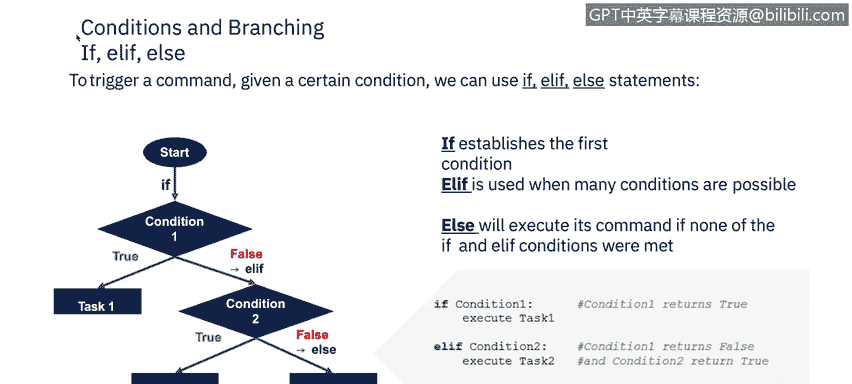
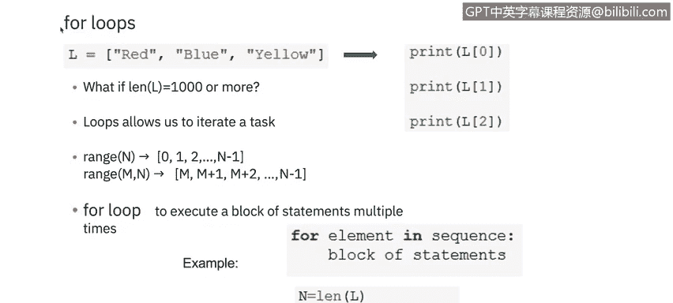
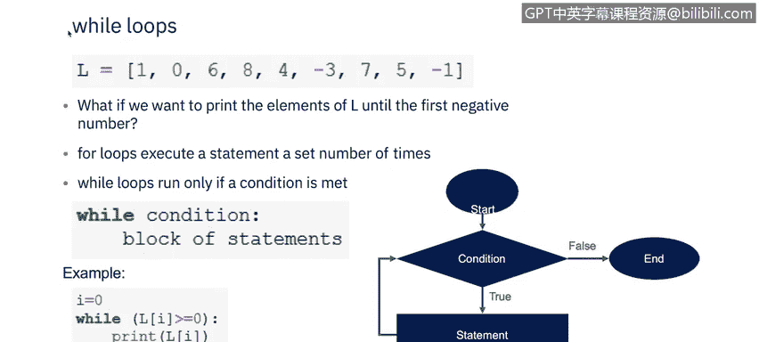
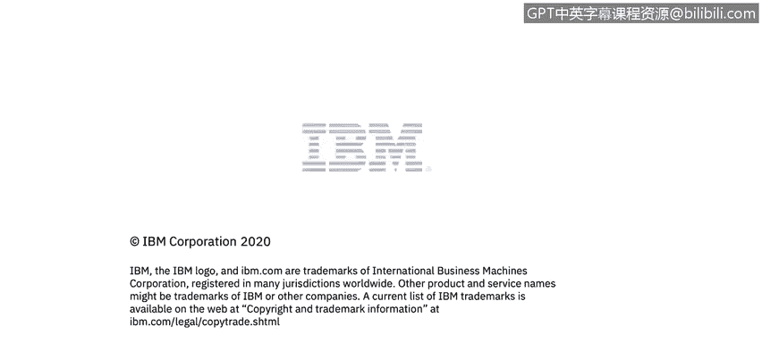

# 课程5：《渗透测试、事件响应与取证》：66：Python数据结构、条件与循环

## 概述

在本节课中，我们将要学习Python中的核心数据结构，包括元组、列表、集合和字典。同时，我们也将探讨如何使用条件语句（`if`、`elif`、`else`）和循环语句（`for`、`while`）来控制程序的执行流程。这些是编写任何Python程序的基础。



## Python数据结构

数据结构是一种组织和存储数据的方式，以便我们能够高效地访问和修改它。

以下是Python中几种主要的数据结构：

### 元组

Python中的元组是一个异构的容器，用于存放多个项目。这可能会让你联想到数组，但由于Python本身不支持数组，我们使用元组和列表。

要声明一个Python元组，你需要在圆括号内键入一个由逗号分隔的项目列表，然后将其赋值给一个变量。

```python
my_tuple = (1, "hello", 3.14)
```

当你希望其中的项目在未来不被改变时，应该使用元组，因为元组是不可变的。其内部元素无法更改。

### 列表

列表是可变的，它们可以改变。列表中的元素由方括号内的逗号分隔。

```python
my_list = [1, 2, 3, 4, 5]
```

### 集合

集合可以是可变的或不可变的，具体取决于它是常规集合还是冻结集合。集合不保存重复值，并且是无序的。



```python
my_set = {1, 2, 3, 4}
```

为了对集合进行操作，Python为我们提供了一系列函数和方法。

### 字典

字典使用花括号，就像集合一样，但它以键值对的形式存储数据，而不是像集合那样存储单个值。所有的键都必须是唯一的，并通过冒号与值配对。键值对之间用逗号分隔。

```python
my_dict = {"name": "Alice", "age": 30}
```

## 条件与分支

上一节我们介绍了如何存储数据，本节中我们来看看如何根据条件控制程序的执行路径。

在创建程序时，我们几乎总是需要检查条件，并根据条件是真是假来改变程序的行为。最简单的条件语句是 `if`。



让我们建立第一个条件。如果它为真，它将执行任务一。如果它返回假，它将切换到另一个条件（如果存在的话）。

如果我们使用 `elif` 语句，它代表 `else if`，用于检查多个条件。如果条件二存在且为真，它将执行任务二；如果为假，它将执行后续条件以执行任务三。

当所有先前的条件都不满足时，使用 `else`。

以下是条件语句的基本语法结构：

```python
if condition1:
    # 执行任务1
elif condition2:
    # 执行任务2
else:
    # 执行任务3
```

### 条件语句示例

以下是两个条件语句的示例。

第一个示例中，我们总是会打印“Ho, and how are you”。然后有两个独立的 `if` 语句。如果变量 `name` 是“Antonio”，它会打印“Ho, it's Antonio”。如果变量 `name` 是“Martina”，它会跳过那一行。

第二个示例展示了一个 `if`-`elif`-`else` 的场景。如果 `a` 大于0，它会打印“a is positive”。如果检查 `a` 发现它小于0，它会执行其 `elif` 条件并打印“a is negative”。如果 `a` 恰好等于0，既不满足 `if` 也不满足 `elif` 条件，它将输出 `else` 分支的“a is 0”。

## 循环

现在，我们可以讨论如何重复执行任务。如果你想打印一个列表的元素，如果只有三个项目，很容易做到 `print(0)`，`print(1)`，`print(2)`。但如果超过1000个项目，你该怎么办？循环就是为了帮助处理重复性任务而存在的。

为了实现这一点，循环使用了 `range` 函数。这是一个Python内置函数，它返回一个遵循特定模式的序列，最常见的是连续的整数，从而满足为 `for` 语句提供迭代序列的要求。

以下是两种主要的循环类型：

### For循环

`for` 循环传统上用于当你有一段代码想要重复固定次数时。Python的 `for` 语句按顺序遍历序列的成员，每次执行代码块。

```python
for i in range(5):
    print(i)
```



### While循环

`while` 循环与 `for` 循环的不同之处在于，它们只在满足某个条件时运行。在这个例子中，我们想要打印列表 `L` 中的元素，直到第一个负数出现。只要条件为真，循环就会继续运行。一旦条件为假，循环就结束。

```python
L = [1, 2, -3, 4]
index = 0
while L[index] >= 0:
    print(L[index])
    index += 1
```



## 总结



本节课中我们一起学习了Python编程的基础构件。我们首先了解了四种核心数据结构：**元组**（不可变序列）、**列表**（可变序列）、**集合**（无序不重复元素集）和**字典**（键值对映射）。接着，我们探讨了如何使用 `if`、`elif` 和 `else` 语句来实现条件分支，控制程序的不同执行路径。最后，我们学习了 `for` 循环和 `while` 循环，它们是自动化处理重复任务、遍历数据集合的强大工具。掌握这些概念是迈向编写更复杂、更高效Python程序的关键一步。