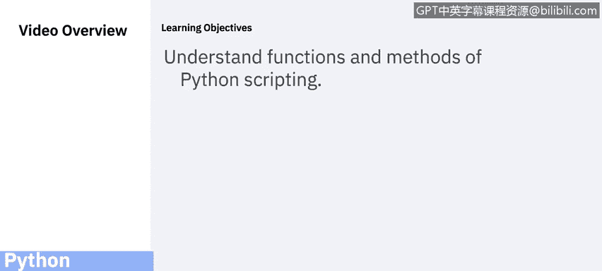
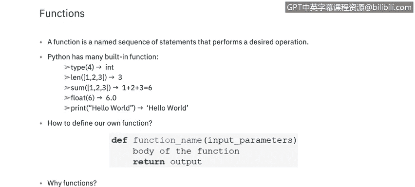
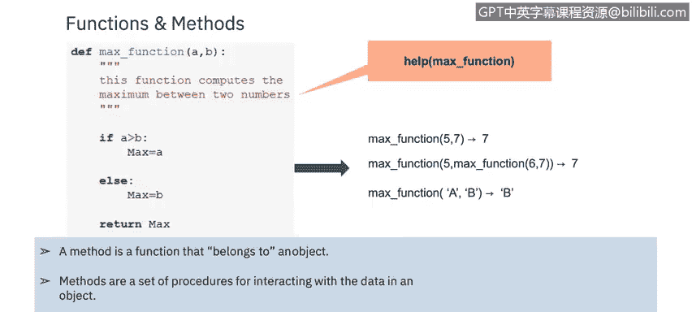

# 课程5：《渗透测试、事件响应与取证》：67：32_04_Python函数与方法 🐍

在本节课中，我们将要学习Python脚本中的函数与方法。它们是组织和重用代码的核心工具，能帮助你编写更清晰、更高效的脚本。

---



## 概述

函数是一段仅在调用时才会运行的代码块。你可以向函数传递数据（称为参数），函数也可以返回数据作为结果。Python内置了许多有用的函数，例如 `type()`、`len()`、`sum()`、`float()` 和 `print()`。

上一节我们介绍了Python的基础概念，本节中我们来看看如何定义和使用函数。

## 定义与调用函数

在Python中，使用 `def` 关键字来定义一个函数。要调用一个函数，只需使用函数名后跟括号即可。

**代码示例：定义一个简单函数**
```python
def my_function():
    print("Hello from a function")

# 调用函数
my_function()
```

## 参数与实参

信息可以作为参数传递给函数。参数在函数名后的括号内指定。你可以添加任意数量的参数，只需用逗号分隔它们。

参数和实参这两个术语常被混用，都指传递给函数的信息。严格来说，**参数**是函数定义时括号内列出的变量，而**实参**是调用函数时传递给该参数的具体值。

以下是向函数传递信息的示例：

**代码示例：带参数的函数**
```python
def greet(name):
    print("Hello, " + name)

greet("Alice")
greet("Bob")
```

## 函数的重要性



编写自定义函数链可以简化代码，提高可读性。函数是可重用的，可以被多次调用，这避免了代码重复。

## 参数数量

默认情况下，必须使用正确数量的参数来调用函数。这意味着如果你的函数期望两个参数，你就必须用两个参数来调用它，不能多也不能少。

## 方法与函数的区别

Python中的方法与函数有些相似，但方法与对象和类相关联。方法与函数有两个主要区别：
1.  方法是隐式地作用于调用它的那个对象。
2.  方法可以访问其所属类中包含的数据。

我们将在下一个视频中了解更多关于Python库的知识。

---



## 总结


本节课中我们一起学习了Python的函数与方法。我们了解了如何定义和调用函数，如何通过参数传递信息，以及函数在提高代码可读性和重用性方面的重要性。最后，我们还简单对比了方法与函数的区别，为后续学习面向对象编程打下基础。