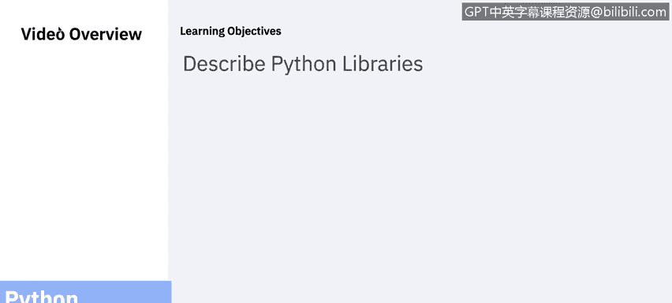
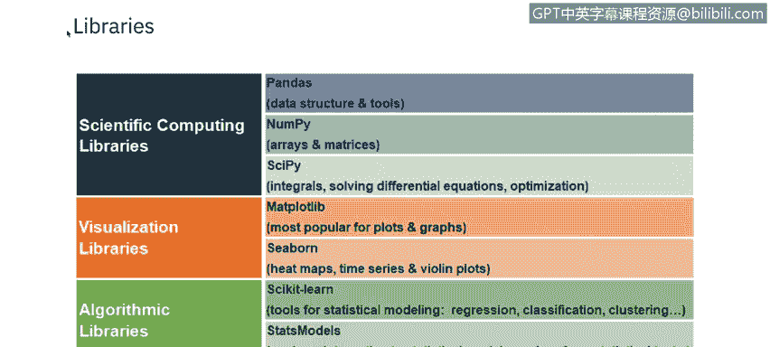
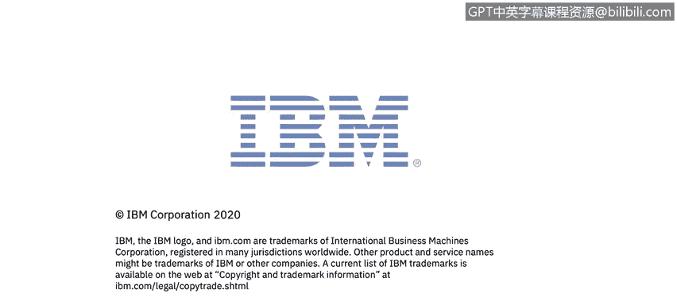

# 课程5：《渗透测试、事件响应与取证》：68：ython库

## 概述
在本节课中，我们将要学习Python库的基本概念，了解一些常用的库及其功能，并探讨一个具体的应用目标。

---

## Python库简介
Python库是一个函数和方法的集合，它允许你在不编写代码的情况下执行许多操作。

以下是Python中可用的一部分库：

*   **Pandas**：提供易于使用的数据结构。
*   **NumPy**：是数值计算的基础包，它定义了数值数组和矩阵类型以及它们的基本操作。
*   **SciPy**：是SciPy栈的一个组成部分，提供了许多数值计算例程。
*   **Matplotlib**：是一个成熟且流行的绘图包，提供出版质量的二维绘图以及基础的三维绘图。
*   **Seaborn**：用于开发热图、时间序列图和小提琴图。
*   **Scikit-learn**：是一个机器学习算法和工具的集合。
*   **Statsmodels**：用于探索数据、估计统计模型和执行统计检验。

可以看到，许多库根据功能被分成了不同的类别。

---

## 应用目标与练习
上一节我们介绍了Python库的基本概念和一些常用库。本节中，我们来看看一个具体的应用目标，并提供一个可以在自己计算机上完成的实验练习。

我们的目标是构建一个能够执行以下操作的应用程序：

以下是该应用程序需要实现的功能列表：
1.  请求用户输入一个数字。
2.  计算该数字的质因数分解。
3.  打印一个字典，其中键是质因数，值是相应的幂指数。
4.  循环执行此操作。
5.  如果用户要求退出，则结束应用程序。

请查看课程提供的实验步骤来完成此练习。

---

## 总结
本节课中，我们一起学习了Python库的定义，认识了一些在数据分析、科学计算和机器学习等领域常用的库，并了解了一个关于质因数分解的应用程序构建目标。