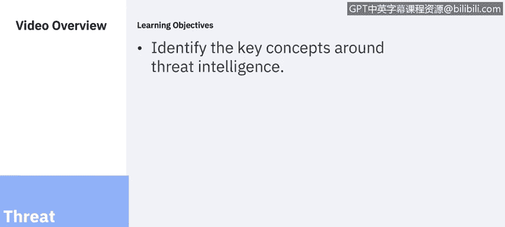

# 课程6：《网络威胁情报课程（IBM）》：1：威胁情报概述

在本节课中，我们将学习网络威胁情报的核心概念，了解当前网络安全面临的主要挑战与驱动因素，并探讨威胁情报如何帮助组织建立主动的防御姿态。

## 欢迎与课程目标 😊

欢迎学习由IBM带来的网络威胁情报课程。

在本课程中，你将学习：
*   识别围绕威胁情报的关键概念。
*   描述网络防御策略的示例。
*   讨论数据防丢失和端点保护的概念与工具。
*   探索一款数据防丢失工具，并学习如何在数据库环境中对数据进行分类。
*   描述安全漏洞扫描技术与工具。
*   识别应用程序安全威胁和常见漏洞。
*   探索一款SIEM产品，并学习如何审查可疑警报并采取行动。

我是Corine Ricecamp，来自IBM安全学习服务团队的网络安全专家。我将作为本课程的一部分，为大家呈现多个课程模块。

在整个系列视频中，你将听到来自IBM内部多位主题专家的讲解。你还将有机会通过多个虚拟实验室来应用所学知识。

让我们开始吧。

## 什么是网络威胁情报？🛡️

网络威胁情报是关于威胁和威胁行为者的信息，这些信息有助于减轻网络空间中的有害事件。

网络威胁情报提供诸多益处，包括：
*   赋能组织建立主动的网络安全态势。
*   推动建立可预测的网络安全态势。
*   提升威胁检测能力。
*   在检测到网络入侵期间及之后，为更好的决策提供信息。

## 当前的安全挑战与驱动因素 📈

如今，每个组织在IT安全方面都面临着相似的挑战。IT解决方案需要易于使用和访问，但对于几乎每个行业而言，保护数据资产和网络访问都至关重要。

让我们看看一些最普遍的驱动因素。以下是来自多份研究2019年网络安全趋势报告中的几个关键数据点：

**数据泄露记录**
2019年泄露记录数量显著增加，超过85亿条记录被暴露，是2018年的三倍多。记录暴露数量大幅上升的首要原因是配置错误，其数量同比增长了近十倍。这些记录占2019年泄露记录的86%。

**人为错误与钓鱼攻击**
人为错误占31%。钓鱼攻击是2019年用于初始访问的最常见载体，但与2018年相比有所下降，当时它占了近一半的总量。

**物联网威胁**
针对物联网设备的攻击包括企业领域，预计到2020年将有超过380亿台设备连接到互联网。物联网威胁态势已逐渐形成，成为可能影响消费者和企业级运营的威胁载体之一，攻击者使用相对简单的恶意软件和自动化的、通常是脚本化的攻击。在用于感染物联网设备的恶意代码领域，IBM X-Force研究追踪到2019年的多个恶意软件活动，这些活动已明显从针对消费电子产品转向同时针对企业级硬件，这是我们在2018年未观察到的活动。被入侵且具有网络访问权限的设备可能被攻击者用作潜在的支点，试图在组织内建立立足点。

**成本放大器**
云迁移、IT复杂性和第三方违规是所研究的26个因素中的成本放大器，这些因素导致了数据泄露的成本。其中贡献成本最多的五个因素是：第三方参与、合规性失败、大规模的云迁移、系统复杂性和运营技术。如果涉及第三方，数据泄露的成本会增加超过37万美元，调整后的平均总成本达到429万美元。在发生泄露时正在进行重大云迁移的组织，其成本增加了30万美元，调整后的平均成本为422万美元。系统复杂性使泄露成本增加了29万美元，平均成本为421万美元。

**技能缺口**
最近发布的2019年(ISC)²网络安全劳动力研究指出网络安全专业人员严重短缺。该研究首次估计，全球目前有280万熟练专业人员在该领域工作，还需要额外的407万人来保卫组织。

## 威胁形势的演变 🎯

当今的威胁在数量和规模上持续上升，因为复杂的攻击者每天都在突破传统的防护措施。犯罪分子、黑客活动分子、政府和对手受到经济利益、政治动机和名声的驱使，攻击你最宝贵的资产。他们的行动资金充足且像商业一样运作，攻击者会根据潜在的投入和回报耐心地评估目标。

他们的方法极具针对性。他们利用社交媒体和其他入口点追踪有访问权限的人员，利用信任并将其作为漏洞加以利用。与此同时，疏忽的员工会因人为错误无意中将企业置于风险之中。更糟糕的是，过去的安全投资可能无法抵御这些新型攻击。

从这份2019年数据泄露成本报告中可以看出，数据泄露的平均总成本现在是392万美元，每次数据泄露的平均记录数超过25000条。

导致泄露给组织带来如此高成本的主要原因之一是识别和遏制泄露所需的时间，这在2019年平均为279天。我们将在本课程中探索更多威胁情报数据。

## 内部威胁分析 👥

在这项研究的背景下，内部威胁的发生源于以下原因：
*   疏忽或无意造成问题的员工/承包商。
*   犯罪或恶意的内部人员。
*   凭证窃贼。

关键要点是，每次事件中成本最高的内部威胁是凭证盗窃。这些事件的发生频率和成本都显著增加。事实上，自2016年以来，每家公司的事件频率已从平均1起增加到3.2起，增加了两倍多；平均成本从49.3万美元增加到2019年的超过87.1万美元。从年度来看，组织在处理内部人员疏忽方面花费更多，但每次事件的成本要低得多。

## 总结 📝

本节课我们一起学习了网络威胁情报的基本定义及其价值，深入分析了当前网络安全领域面临的主要挑战，包括数据泄露、物联网威胁、成本驱动因素和人才短缺。我们还了解了攻击者日益复杂的策略以及内部威胁，特别是凭证盗窃带来的高风险。这些知识为我们后续深入学习防御策略、工具和应用奠定了坚实的基础。