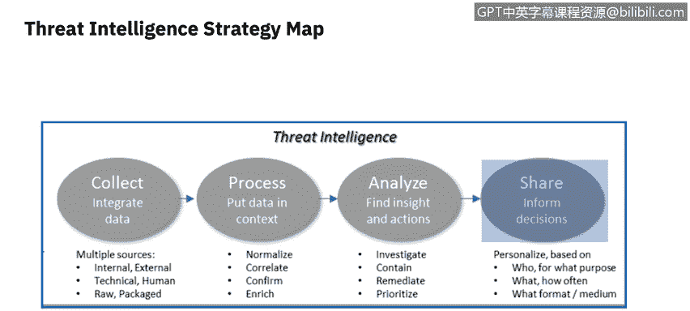
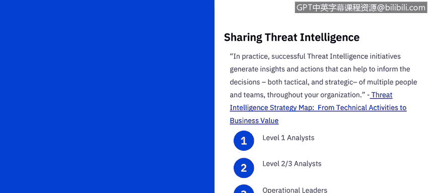
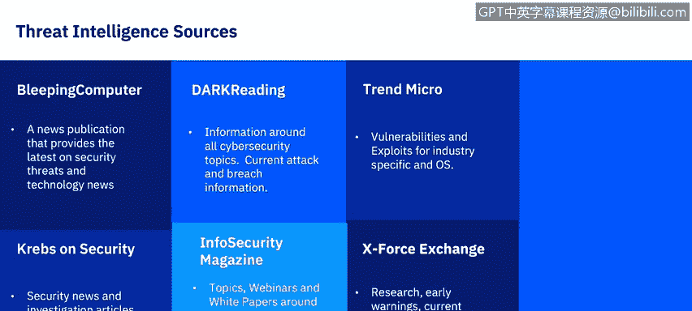
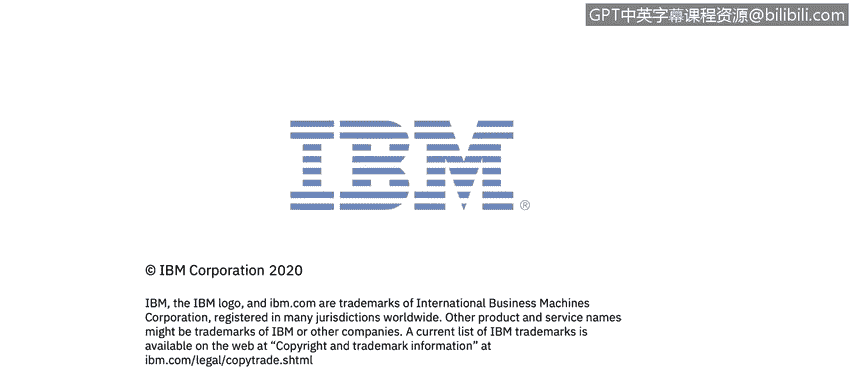

# 课程6：《网络威胁情报课程（IBM）》：2：1_威胁情报战略和外部来源

在本节课中，我们将学习如何识别威胁情报的外部来源。我们将探讨组织如何战略性地利用威胁情报，并了解威胁情报从数据到业务价值的完整流程。

## 威胁情报的战略价值

上一节我们介绍了课程概述，本节中我们来看看威胁情报的战略层面。威胁情报不仅仅是数据，它是一个完整的过程。

下图源自Derrick Brink的白皮书《威胁情报战略地图：从技术活动到业务价值》。该图描述了威胁情报如何从一个流程中产生价值。

## 威胁情报流程

威胁情报流程包含几个关键阶段，本课程将涉及其中许多要素。

### 1. 收集阶段

基于组织所需的相关信息，必须识别多个来源，以发现可能危及组织高价值资源的各种威胁、漏洞和攻击。换句话说，需要保护组织资产的**机密性、完整性和可用性**。

一旦识别，就需要从多个来源收集数据，包括外部和内部来源。本模块将重点介绍外部来源，在课程后续部分，我们将探讨来自网络扫描、数据保护和终端安全工具的内部来源。

### 2. 处理阶段

从系统工具或外部资源收集到威胁情报数据后，必须对其进行处理。处理可能包括**规范化、关联、验证和优先级排序**。这个过程必须利用自动化和编排来应对信息的复杂性和高容量。

### 3. 分析阶段

接下来，必须分析威胁情报，以揭示当前和未来可能对组织构成威胁的情况。我们将探索SIEM系统如何帮助您，作为一名分析师，分析系统和网络中正在发生的事情，并制定建议的行动方案。

### 4. 共享阶段

最后，作为分析师，您必须将信息分享给组织内的不同人员。您的沟通必须根据组织的不同层级进行定制，具体取决于漏洞或攻击是正在影响组织，还是该信息应用于教育组织了解行业内可能或大概的威胁，例如勒索软件对地方政府和组织日益增长的威胁。

## 情报沟通的层级

沟通内容需要根据不同受众进行调整。

以下是针对不同层级的沟通重点：

*   **一级分析师**：沟通需要支持安全运营中心进行的实时监控、检测、初步调查和事件升级。
*   **二级和三级分析师**：沟通需要支持事件响应团队进行的深入优先级排序、调查、遏制和补救，以及威胁狩猎和反欺诈团队专家的主动工作。
*   **运营领导者**：例如，您需要帮助安全运营和IT运营的领导者指导和确定其各自技术人员日常行动和活动的优先级。
*   **战略领导者**：您需要帮助首席信息安全官或其他高级领导者分配资源，并就如何将网络安全相关风险控制在可接受水平做出更明智的业务决策。

## 威胁情报的三个层面

CrowdStrike公司也从三个层面看待组织（以及作为安全分析师的您）应关注的情报领域：**战术、运营和战略**。

*   **战术层面**：侧重于执行恶意软件分析和信息丰富。
*   **运营层面**：侧重于理解对手的能力、基础设施和战术、技术与程序，然后利用这种理解进行更有针对性和优先级的安全运营。
*   **战略层面**：侧重于理解高层趋势。

## 战略威胁情报来源

现在，让我们回顾一些可用于洞察战略威胁情报规划的当前趋势和预测出版物。

每年，您都会发现各种研究，它们回顾12个月或更长时间，提供过去趋势的情报并对未来做出预测。您需要跟进最新信息，以帮助指导您了解哪些攻击已经或未来可能最影响您所在的行业。

以下是部分资源示例：

*   **CrowdStrike《2020年全球威胁报告》**：指出2019年的破坏并非由单一的破坏性擦除器造成，而是受到持续运营目标和社会基础问题的困扰。
*   **IBM《2019年数据泄露成本报告》**：探索了理解数据泄露原因和后果的几个新途径。
*   **M-Trends《2020年报告》**：已存在十多年，其目标始终是武装安全团队，提供他们防御当今最常用网络攻击所需的知识。
*   **埃森哲《威胁情报指数》**：分析了过去一年中，哪些重新出现的旧威胁正以新的方式被利用。该报告还按行业审视了新出现的威胁，并提供了一些预防建议。

## 分析师日常资源

作为分析师，您应将查看全球新出现的漏洞、威胁和泄露事件作为每日例行工作的一部分。

以下是作为一名网络安全专业人员，我定期查阅的部分资源。请注意，这只是可用资源的一小部分，未来您可能会发现更多专注于特定行业的资源。

大多数来源可以每日访问，或者可以通过电子邮件或其他应用程序接收其信息流。

以下是推荐的日常资源列表：

*   **Bleeping Computer**：提供最新安全威胁和技术新闻的新闻出版物。您可以接收信息流或每日访问其网站。
*   **Dark Reading**：涵盖所有网络安全主题，并提供当前攻击和泄露信息。
*   **InfoSecurity Magazine**：涵盖各类主题，还提供关于高级持续性威胁、网络犯罪等相关主题的网络研讨会和白皮书。
*   **Trend Micro**：帮助您了解特定行业和操作系统的漏洞和利用信息。
*   **Exploit Exchange**：既有研究板块，也提供早期预警和当前威胁信息。

在接下来的阅读材料中，请查看这些威胁情报来源，并复习可能推荐的其他来源。

## 总结

本节课中，我们一起学习了威胁情报的战略框架和外部来源。我们了解了威胁情报从收集、处理、分析到共享的完整流程，认识了针对不同组织层级的沟通策略，并探讨了战术、运营和战略三个情报层面。最后，我们介绍了一些关键的日常情报资源，帮助您作为分析师持续获取最新的威胁信息。掌握这些外部来源是构建有效威胁情报能力的基础。