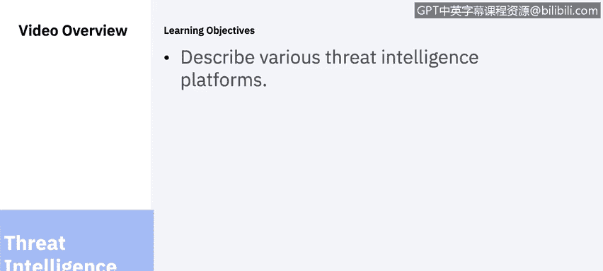
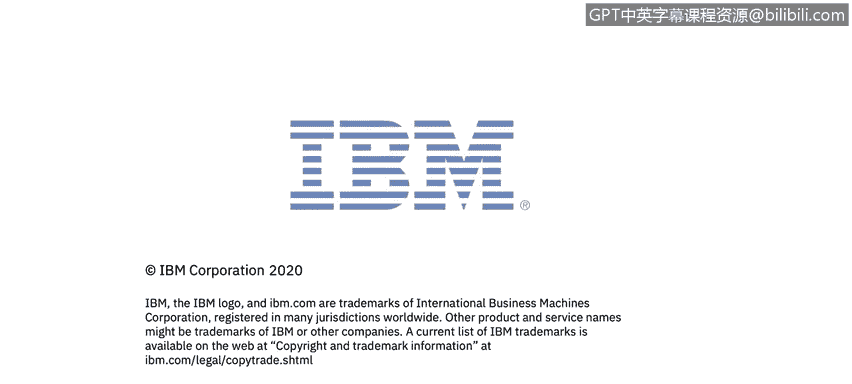

# 课程6：《网络威胁情报课程（IBM）》：3：2_威胁情报平台.zh

## 🛡️ 课程概述

在本节课中，我们将要学习威胁情报平台。你将了解威胁情报平台的定义、核心功能模块，并认识市场上几种主流的威胁情报平台及其特点。

---

## 📚 什么是威胁情报平台？

威胁情报平台是一个新兴的技术领域，它帮助组织实时地聚合、关联和分析来自多个来源的威胁数据，以支持防御行动。

威胁情报平台由几个主要功能区域构成，使组织能够实施智能驱动的安全方法。这些阶段由自动化工作流程支持，这些流程简化了威胁检测、管理、分析和防御过程，并跟踪其直至完成。

---

## 🔄 威胁情报平台的核心功能

上一节我们介绍了威胁情报平台的基本概念，本节中我们来看看构成一个成熟威胁情报平台的核心功能模块。这些模块协同工作，将原始数据转化为可行动的智能。

以下是威胁情报平台通常包含的六个关键阶段：

1.  **收集**
    威胁情报平台从多个来源收集和聚合多种格式的数据，包括CSV、STIX、XML、电子邮件和各种其他数据源。通过这种方式，威胁情报平台与SIEM平台不同。虽然SIEM可以处理多个威胁情报源，但它们不太适合临时导入或分析通常分析所需的无结构化格式。威胁情报平台的有效性将很大程度上取决于所选来源的质量、深度、广度和及时性。大多数威胁情报平台都提供与主要商业和开源情报源的集成。

2.  **关联**
    威胁情报平台允许组织开始自动分析、关联和透视数据，从而获得关于特定攻击的“谁”、“为什么”和“如何”的可行动情报，并引入阻断措施。这些处理流程的自动化至关重要。

3.  **丰富与情境化**
    为了围绕威胁构建丰富的上下文，威胁情报平台必须能够自动增强，或允许威胁情报分析师使用第三方威胁分析应用程序来增强威胁数据。这使得SOC和事件响应团队能够获得关于特定威胁行为者、其能力和基础设施的尽可能多的数据，以便对威胁采取适当的行动。

4.  **分析**
    威胁情报平台自动分析威胁指标的内容及其之间的关系，以便从收集的数据中生成可用、相关和及时的威胁情报。这种分析能够识别威胁行为者的战术、技术和程序（TTP）。此外，可视化功能有助于描绘复杂的关系，并允许用户进行透视以揭示更多细节和微妙的关系。我们将在下一个视频中看几个框架。

5.  **集成**
    集成是威胁情报平台的一个关键要求。来自平台的数据需要找到返回组织使用的安全工具和产品中的途径。功能齐全的威胁情报平台能够实现从数据源收集和分析的信息流，并将清理后的数据传播和集成到其他网络工具中，包括SIEM、内部工单系统、防火墙、入侵检测系统等。

6.  **行动**
    成熟的威胁情报平台部署也处理响应处理。内置的工作流程和流程加速了安全团队内部的协作以及更广泛的通信，如信息共享与分析组织，使团队能够掌控行动方案的制定、缓解、规划和执行。没有复杂的威胁情报平台，就无法实现这种程度的社区参与。强大的威胁情报平台使这些社区能够创建工具和应用程序，持续改变安全专业人员的游戏规则。

---

## 🏢 主流威胁情报平台介绍

了解了核心功能后，我们现在来看看市场上众多威胁情报平台中的几个。大多数威胁情报平台都提供免费和付费版本。你和你的组织需要根据所需访问级别以及可用于特定需求的预算来进行评估。

以下是几个具有代表性的平台：

*   **Recorded Future**
    该平台的一些功能包括：集中化和情境化所有威胁数据源。你可以添加专有数据和数据源，无论是来自行业机构、安全供应商、内部风险列表还是独立研究的数据，到仅次于政府的最大的公开可用数据集合中。其技术使用自然语言处理和机器学习来构建收集到的数据并建立连接，以提供丰富的智能，帮助你更快地进行调查。另一个功能是在单一事实来源上进行协作分析。集中化的智能通过在Recorded Future中直接协作分析，提高了团队的效率，在调查和研究中共同工作，然后将分析导出为易于共享的报告。最后，他们还提供定制智能以提高相关性。你可以在与第三方解决方案集成之前，针对特定用例定制威胁情报。定制的智能可提供更高保真度的警报，使团队能够专注于最重要的事情。

*   **FireEye**
    他们提供多种订阅服务，供你和你的组织选择，以满足安全计划所需的情报集成支持水平和深度。
    *   **融合情报**：一个全面的套餐，包括运营、网络犯罪和网络间谍情报产品，可用于了解完整的攻击生命周期，以针对感兴趣威胁行为者的TTPs准备防御。
    *   **战略情报**：学习如何根据最可能的威胁和行为者来调整安全资源，并在重大业务决策和安全资源规划方面管理业务和技术风险。
    *   **运营情报**：允许你对警报进行优先级排序和添加上下文，以便更有效、更高效地响应，并通过高保真度、机器可读的入侵指标及相关上下文信息来改进防御。
    *   **漏洞情报**：提供对组织构成最重大威胁的漏洞，并了解修补或以其他方式缓解这些漏洞的选项。
    *   **网络物理情报**：包含针对工业环境和运营技术面临的网络威胁和风险的可操作见解。它包括所有FireEye专注于运营技术和工业控制系统的情报。
    *   **网络犯罪情报**：帮助你了解专注于金融犯罪的威胁行为者，他们针对谁、如何攻击以及动机是什么。你可以获得对广泛活动、凭证收集、地下市场和使能基础设施的分析。
    *   **网络间谍情报**：促进理解为获取战略优势而攻击公司和政府实体的对手。它利用对追踪威胁行为者群体的战术、技术和程序的洞察，来更好地防御你的组织。

*   **IBM X-Force Exchange**
    这是一个基于云的威胁情报共享平台，使用户能够快速研究最新的安全威胁，聚合可操作的情报并与同行协作。通过利用IBM X-Force研究的深度和广度，可以快速研究和共享有关威胁的信息。你可以与其他解决方案集成。它允许你使用STIX和TAXII标准，以及通过RESTful API和JSON格式，以编程方式访问信息。并将情报与安全运营相结合，用于近实时决策。

*   **TruSTAR**
    TruSTAR是一个智能管理平台，可帮助你在工具和团队之间实现数据运营化，帮助你确定调查的优先级并加速事件响应。
    *   **简化的工作流集成**：行业领先的集成合作伙伴与TruSTAR连接，以丰富分析师调查，连接内部和外部数据源。分析师可以在应用程序内或TruSTAR原生环境中工作，具体取决于工作流需求。
    *   **安全的访问控制**：通过TruSTAR Enclaves帮助你根据团队或用例管理情报。每个Enclave提供对特定情报源的安全的、基于行的访问，在你需要的时间、地点和方式提供。
    *   **高级搜索功能**：更好的结果等于更明智的决策。TruSTAR提供高级过滤选项，可以跨IOC和报告进行搜索，让你快速访问所需的情报。
    *   **自动数据摄取和规范化**：无论你如何获取情报，TruSTAR都将以最小的成本帮助你实现其运营化。其自动化的非结构化数据提取和规范化功能帮助你快速轻松地关联情报源。

这些只是你作为网络安全分析师可能会遇到的少数几个威胁情报平台。

---

## 📝 课程总结

本节课中我们一起学习了威胁情报平台。我们首先定义了威胁情报平台，然后详细探讨了其核心功能模块：收集、关联、丰富、分析、集成和行动。最后，我们介绍了Recorded Future、FireEye、IBM X-Force Exchange和TruSTAR等几个主流威胁情报平台的主要特点。理解这些平台的功能和差异，对于有效利用威胁情报来增强组织安全防御至关重要。