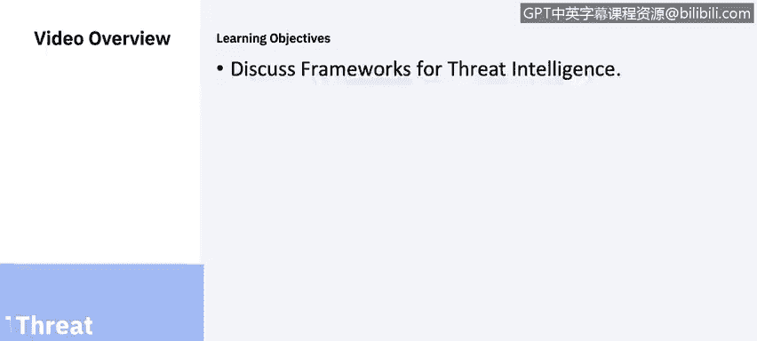
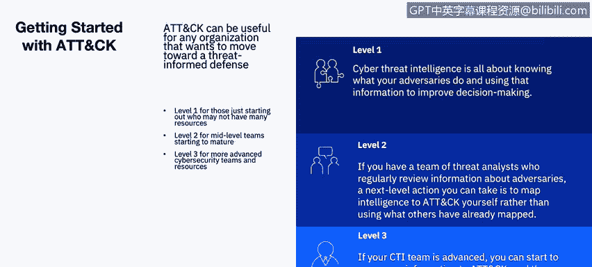
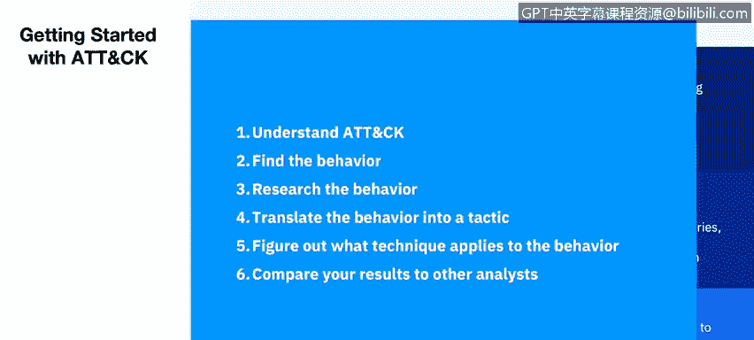
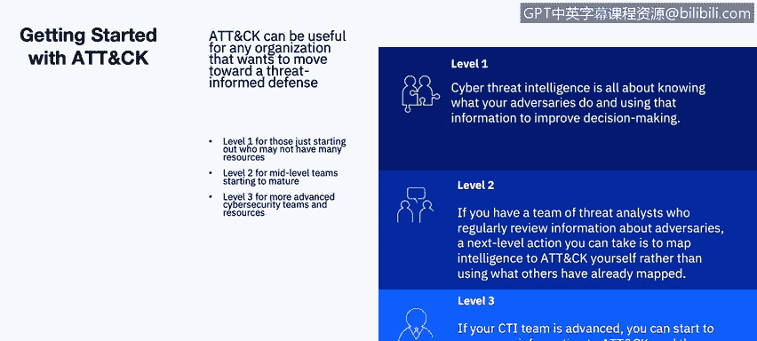
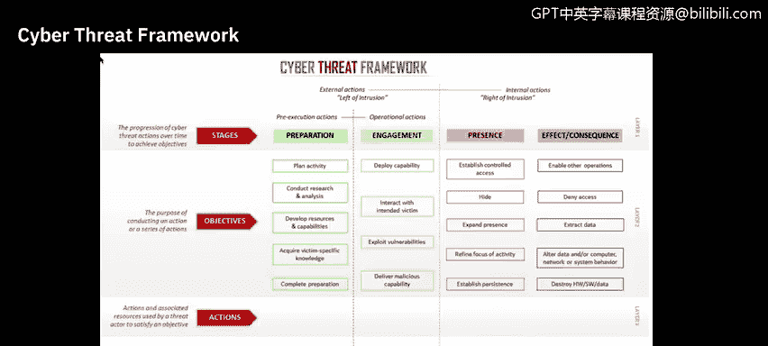
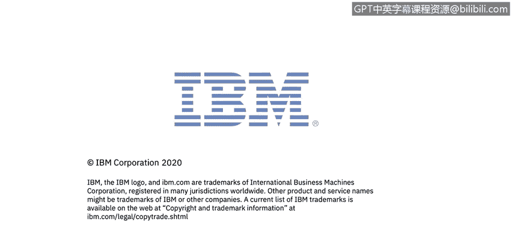

# 课程6：《网络威胁情报课程（IBM）》：4：3_威胁情报框架 🔍

## 概述
在本节课中，我们将学习威胁情报的核心框架。我们将探讨如何利用这些框架来理解、分析并应对复杂的网络安全威胁，从而将分散的安全工具和混乱的数据转化为有价值的洞察和行动。

---

## 现代IT安全环境的挑战 🛡️

上一节我们介绍了威胁情报的重要性，本节中我们来看看安全团队在实际操作中面临的基础环境。

企业IT安全环境通常由多年来为解决各种挑战而购置的众多分散技术组成。平均而言，一家企业会使用来自45个不同供应商的约85种安全工具。

拥有这些工具本身是好的，但关键在于它们是否被有效整合。如果这些工具无法跨团队、位置和平台协同工作，反而会带来更多的复杂性、风险和成本。其结果是，安全团队可能失去对网络的可见性，难以从技术的“分散混沌”中获得有价值的洞察和控制力。

---

## 威胁情报的三大基础模型 📊

理解了环境挑战后，我们需要理论工具来指导实践。威胁情报的理论基础主要植根于以下三个基本模型：

1.  **洛克希德·马丁的网络杀伤链**
2.  **MITRE ATT&CK 知识库**
3.  **入侵分析的钻石模型**

我们在之前的课程中讨论过网络杀伤链。钻石模型适用于分析只有两个参与者（受害者和对手）的场景，但如果对手的动机超出了社会政治或社会经济回报，或者对手是人工智能，该模型就可能失效。

因此，作为网络安全分析师，你应该频繁使用 **MITRE ATT&CK 框架**。

---

## 使用MITRE ATT&CK框架的实践指南 🛠️

ATT&CK框架将对手行为结构化。以下是开始使用该框架进行威胁情报分析的渐进式方法。

### 级别 1：入门
对于只有几名分析师、希望开始使用ATT&CK的团队，可以从关注单个威胁组织开始。
*   **选择目标**：从 `mitre.org` 网站上已映射的威胁组织中选择一个，或根据其以往的攻击目标进行选择。
*   **参考外部情报**：许多威胁情报订阅服务商也提供ATT&CK映射，可以作为参考。

### 级别 2：进阶分析
对于定期分析对手信息的威胁分析师团队，下一步是将情报自行映射到ATT&CK。
*   **映射内部报告**：将组织内部处理过的事件报告映射到ATT&CK。
*   **映射外部报告**：使用博客文章等外部报告作为起点，从单份报告开始练习。

以下是进行映射时可以遵循的流程：

1.  **理解ATT&CK**：熟悉ATT&CK的整体结构，包括**战术**（对手的技术目标）、**技术**（实现目标的方法）和**具体步骤**（技术的具体实现）。
2.  **识别行为**：超越IP地址等简单指标，从更宏观的角度思考对手的行为。
3.  **研究行为**：如果不熟悉该行为，需要进行更多研究。
4.  **将行为对应到战术**：考虑该行为背后的技术目标，从企业ATT&CK的12种战术中选择匹配的一项。
5.  **确定适用的技术**：这可能需要一些分析技巧，但结合ATT&CK网站上的示例是可以完成的。在网站上搜索特定战术，查看技术描述，以确定行为的归属。
6.  **与其他分析师比对结果**：不同分析师对同一行为可能有不同解读，这很正常。建议与其他分析师讨论映射结果，比较差异。

### 级别 3：高级应用与防御优先
对于高级团队，可以映射更多信息，并利用这些信息来优先安排防御工作。
*   **映射多元数据**：将内部事件响应数据、外部威胁情报订阅报告、实时警报和组织历史信息都映射到ATT&CK。
*   **比较与优先排序**：通过映射的数据，比较不同威胁组织，并优先防御那些被频繁使用的技术。

---

## 网络威胁框架（CTF） 🌐

除了行业框架，政府层面也有标准化努力。网络威胁框架由美国政府开发，旨在实现对网络威胁事件的一致描述和分类，并识别网络对手活动的趋势或变化。

该框架适用于所有从事网络相关工作的人员，其主要好处是**为描述和传达网络威胁活动信息提供了一种通用语言**。框架及其相关术语表能够以一致的方式描述威胁活动，从而实现高效的信息共享和威胁分析，这对高级政策决策者和注重细节的技术人员同样有用。

该框架涵盖了对手的完整生命周期：
*   **能力准备与目标选择**
*   **与目标的初始接触或对手实施的临时非侵入性干扰**
*   **在目标网络上建立并扩大存在**
*   **通过窃取、操纵或破坏产生效果和后果**

---

## 构建集成的安全生态系统 🔗

框架提供了分析语言，而IBM则鼓励企业以更有序的方式思考安全要务，即围绕逻辑领域构建，并以**安全分析**为核心学科。

这个核心由**认知智能**驱动，它能持续理解、推理并学习影响环境的各种变量，并反馈给整个互联的能力生态系统。不同层级的防御协同工作，以自动化策略并拦截威胁。理解威胁的层级将数据上传至安全分析层，以收集信息、确定优先级并采取行动。

真正的集成必须延伸到合作伙伴生态系统。这种集成使得跨公司甚至竞争对手的协作成为可能，以理解全球威胁和数据，并适应新的威胁。集成有助于提升可见性。

当能力围绕其领域组织起来时，你会开始理解这个“免疫系统”如何运作——安全组合的不同部分协同工作。

---

## 关键最佳实践总结 ✅

网络攻击成本不断上升，威胁日益升级和复杂化， perimeter防御已不再足够，需要流分析、异常检测和漏洞管理等新技术。这定义了问题并提供了帮助能力。那么具体应该怎么做？应遵循哪些最佳实践？

以下是核心的最佳实践：

1.  **主动预防**：识别、预测并优先处理安全弱点，以便采取行动防止漏洞被利用。利用前两课讨论的资源收集威胁信息，根据优先级和网络环境处理漏洞和风险，并管理设备配置以提升安全性（例如，移除无效防火墙规则，添加更有效的新规则）。
2.  **异常检测与响应**：使用能检测异常行为的工具。部署能够发现网络异常并为网络流提供可见性的解决方案。
3.  **安全智能与自动化**：采用利用集成、自动化和上下文的安全智能解决方案，以提供网络活动的完整视图。**自动化是关键**，它能更高效地利用现有人员，并将海量收集数据简化为少量可由现有安全人员处理的事件。

我们将在本课程后续部分深入回顾所有这些最佳实践。

---

## 总结
本节课中，我们一起学习了威胁情报的核心框架。我们从现代安全环境的复杂性出发，探讨了MITRE ATT&CK框架的实践应用层级、美国政府开发的网络威胁框架，以及构建以安全分析和认知智能为核心的集成安全生态系统的重要性。最后，我们总结了主动预防、异常检测和自动化智能响应等关键最佳实践。掌握这些框架和理念，是将碎片化威胁信息转化为有效安全行动的基础。