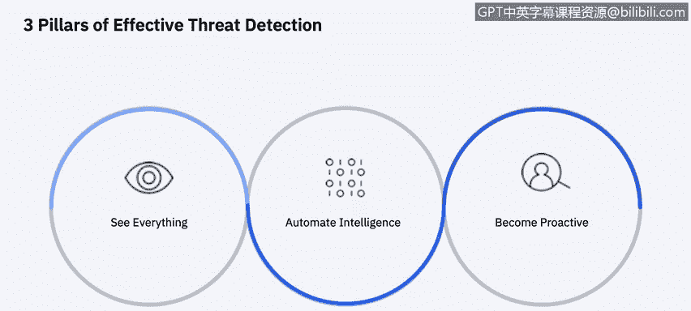

# 课程6：《网络威胁情报课程（IBM）》：5：4_安全情报

## 概述

在本节课中，我们将学习**安全情报**的概念、核心目标、关键特征以及支撑其有效实施的三大支柱。通过学习，你将能够描述安全情报如何帮助组织从海量安全数据中提炼出可执行的洞察，从而降低风险并提升安全运营效率。

---

## 什么是安全情报？🔍

几年前，我引入了“安全情报”这一术语，用以描述组织通过处理和分析安全信息所获得的价值。其处理方式与对待市场营销等其他业务职能的产出类似。

安全情报的目标是提供**可执行的、全面的洞察**，以降低任何组织（无论其规模大小）的风险和运营工作量。安全情报解决方案收集和存储的数据包括：日志、事件、网络流、用户身份与活动、资产配置与位置、漏洞、资产配置以及外部威胁数据。

安全情报提供分析能力，以回答贯穿风险与威胁管理**事前、事中、事后**全时间线的根本性问题。

---

## 安全情报的两大特征

上一节我们介绍了安全情报的目标，本节中我们来看看它的两大核心特征。

首先，安全情报是**分析技术进步**的成果。它是通过审查每一个可用的数据位，并对其进行**规范化、关联、索引和透视**所获得的智慧，旨在发现你的团队需要尽快调查的少数关键事项。

其次，安全情报描述了**通过持续调整系统分析和规则来消除误报结果**的迭代过程。这能减少大量有趣但非威胁性的事件。在核心的安全信息与事件管理引擎上，增加风险经理、漏洞经理和事件取证功能，可以提升从检测、防护到调查、修复整个安全事件时间线的准确性和上下文关联。

这些解决方案协同工作，可以帮助你**尽可能早地减少暴露面和识别攻击**。在本课程中，我们将更深入地探讨这些解决方案。

---

## 提升安全态势的三大支柱 🏛️

为了有效检测威胁并改善当前状况，需要依赖三大支柱。

以下是构建有效安全情报框架的三个关键要素：

1.  **全面可见性**：你需要从一个单一视角洞察整个企业。将所有孤立的数据汇集到一个集中的解决方案中，从而获得涵盖本地环境、云环境甚至运营环境的完整安全状态视图。
2.  **自动化智能**：数据量过于庞大，必须实现智能洞察的自动化。通过在数据之上构建分析引擎，你可以获得关于最关键威胁的、可执行且经过优先级排序的洞察。
3.  **主动防御**：你在前期能够自动化的部分越多，就能释放出越多的时间，从而从纯粹被动的姿态转变为更主动的姿态。有了更多时间，你可以主动**狩猎威胁**，在攻击周期的早期发现攻击者，更快地响应，并将经验教训反馈到防御体系中，实现持续改进。我们将在课程后续部分探讨威胁狩猎。

---

## 安全有效性报告揭示的挑战 ⚠️

为了强调理解并提升公司安全有效性的至关重要性，《2020年安全有效性报告：深入网络现实》揭示了一些惊人的发现。

主要发现是，很大比例的公司认为其安全投资通过保护关键资产和数据正在提供预期价值，但实际上他们并未意识到自己已经遭遇了入侵。

这种情况与网络对冲数据相吻合，该数据计算了发生未被检测到的入侵时，持续产生的财务和运营影响。这两组数据提供了前所未有的洞察：在入侵发生之前，结合财务影响来评估安全有效性。

这份执行摘要只是冰山一角。完整报告揭示了细节：尽管威胁和攻击数量不断增长，许多组织仍然错误地假设自己受到了保护。

---

## 关键洞察与未来方向 🚀

在我们开始深入探讨关于收集和关联情报数据的具体主题和解决方案之前，让我们先讨论来自报告的一些关键要点。

**可见性**是许多组织关注的关键问题。组织们担忧特权滥用和凭证滥用。端点警报和网络访问设备是事件信息的首要来源，分别提供警报和调查支持。

许多组织都混合使用了本地和云环境。

现在，让我们在本课程剩余部分更深入地探讨几种解决方案。

---

## 总结

本节课中，我们一起学习了**安全情报**的核心概念。我们了解到，安全情报是通过高级分析从多样化安全数据中提取可执行洞察的过程，其目标是降低风险。我们探讨了它的两大特征：作为分析结果的智慧，以及通过持续优化减少误报的迭代过程。我们还明确了构建有效安全情报的三大支柱：**全面可见性、自动化智能和主动防御**。最后，通过行业报告，我们认识到许多组织在安全有效性认知上存在差距，这凸显了深入实施安全情报解决方案的必要性。