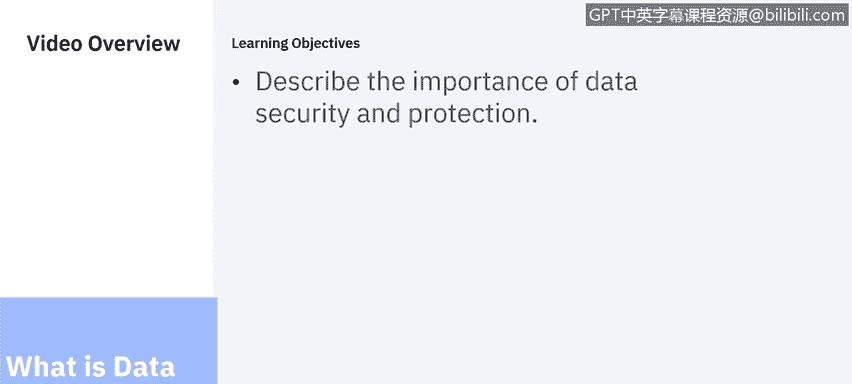
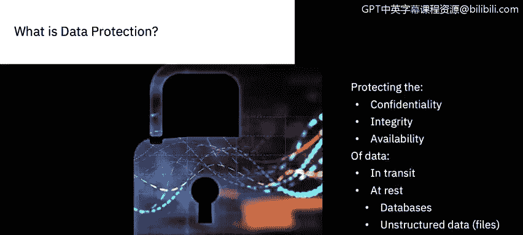
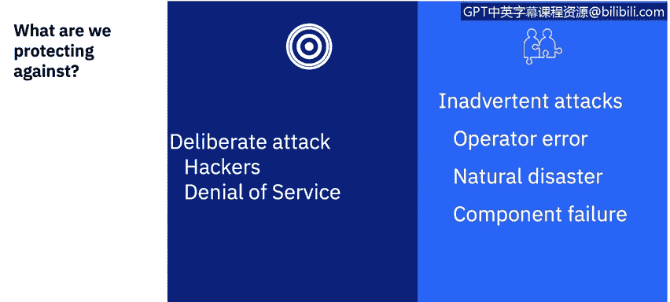
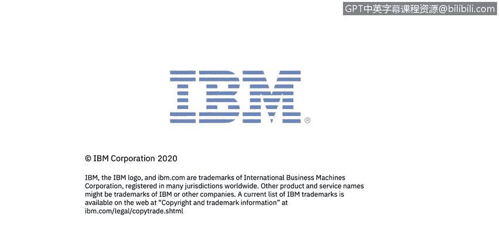

# 课程6：《网络威胁情报课程（IBM）》：6：5_什么是数据安全与保护 🔐

在本节课中，我们将要学习数据安全与保护的核心概念。我们将探讨数据安全与保护的定义、其保护对象以及为何需要进行保护。

## 概述 📋

数据安全是保护企业最关键资产——即数据——免受未经授权或不必要使用的过程。这不仅涉及部署正确的数据安全产品，还需要将人员、流程与所选技术相结合，以在整个数据生命周期内保护数据。企业数据保护是一项团队协作。

## 数据安全与CIA三要素 🛡️

上一节我们介绍了数据安全的总体目标，本节中我们来看看数据安全在**机密性、完整性与可用性**（CIA三要素）背景下的具体含义。我们必须保护静态数据和传输中数据的机密性、完整性与可用性，以防范有意和无意的攻击。

### 静态数据与传输中数据

以下是两者的主要区别：

*   **传输中数据**：指正在从一个点传输到另一个点的数据。传输可能通过网络、人与人之间进行，距离可近可远。
*   **静态数据**：指驻留在终端上的数据。这些终端包括数据库服务器、文件服务器、笔记本电脑或平板电脑等移动设备，数据存储于此以供后续使用。它也包括磁带存储等备份设备。

### 数据机密性

机密性意味着维护数据的私密性。这意味着数据的访问权限仅限于有权知晓该数据的参与者。机密性包含隐私概念，但也意味着在正确的时间，通过正确的方法，为正确的用户集提供正确的访问级别。

例如，考虑一所大学处理一名成年大学生的数据。该学生可能授权其父母查看财务记录以支付学费账单，但这并不意味着父母在法律上有权查看其学业成绩和进展。学生本人可能被授权查看自己的学业成绩，但肯定不能删除或编辑。学生的导师可能被授权查看、编辑和删除与学业成绩相关的信息，但仅限于该学生选修该导师课程期间。即便如此，导师也可能不被允许查看学生的财务信息。此外，导师可能被限制只能从授权的终端（如通过虚拟专用网络连接的注册笔记本电脑）查看学生的学业进展，而不能通过未加密的蜂窝网络连接的智能手机访问。

### 数据完整性

现在，让我们转向数据的完整性。确保数据的完整性意味着确保数据是可信且准确的，即未被篡改。完整性与机密性有重叠，即只允许被授权更改数据的人员进行操作。

在我们大学生的例子中，允许更改成绩的参与者数量应该非常少，甚至比允许查看学业进展的有限受众还要少得多。可能只有一位导师，或者一两位助教。实际上，定义谁被允许更改、插入或删除数据是确保完整性的一个重大挑战。

另一个挑战是与组织外部的各方合作。当学生的父母使用电子银行支付学费时，他们希望确保该过程安全且不被篡改。一旦发生安全漏洞，即使发生在大学无法控制的网络或终端上，也会被视为大学至少负有部分责任。

### 数据可用性

接着是可用性。数据必须在正确的时间对相应用户可访问。这并不总意味着立即可用，也不意味着数据必须持续可用。然而，数据必须在合理的时间内可用，具体时间因应用而异。

举个例子，学生在注册课程时必须能够获取学业进展信息。该信息无需每周7天、每天24小时可用，但必须在学生注册时可用，且响应时间应足以让学生完成注册操作。同样的信息在学生求职或申请研究生院时也必须可用，但此时的时间框架可能不同，可接受的响应时间可能是几天而非几秒钟。然而，预期数据在其创建后数年甚至数十年仍能被访问。

与机密性和完整性相比，可用性在更大程度上受到无意行为者和第三方的影响。请记住，数据可能需要保持可用数年甚至数十年。例如，自然灾害可能危及数据可用性：暂时切断网络连接、较长期损坏应用和数据库服务器，或长期破坏归档数据。计划的网络中断可能无意中切断数据访问途径；粗心可能导致备份磁带丢失或从数据库中误删表。

此外，发现违规行为的时间框架也不同。如果没有仔细的数据保护措施，违反机密性或完整性的行为可能数周、数月或数年都未被发现。违反可用性的行为往往被发现得更快，但也不总是如此，例如丢失备份磁带的情况。

## 我们保护数据防范什么？ 🚨

上一节我们探讨了数据安全的目标，本节中我们来看看数据必须防范的威胁。数据必须防范**蓄意攻击**和**无意（或意外）攻击**。

当我们思考数据安全与保护时，首先想到的可能只是蓄意攻击——由希望故意破坏我们系统、损坏或窃取我们数据的恶意行为者发起的攻击。蓄意攻击当然值得我们关注。

蓄意攻击有多种形式，例如拒绝服务攻击、社会工程学攻击、来自内部来源（如特权管理员或用户）的攻击，以及来自外部来源的攻击。攻击者的技能水平差异很大，从不真正理解工具或方法的“脚本小子”，到有动机、有组织的犯罪分子，再到拥有更高技能和大量资源的国家级机构。

回到我们的例子，大学系统可能成为以下目标：心怀不满的员工、试图破解系统的无聊学生、试图为作弊或更改成绩提供便利的更有动机的学生、试图获取并利用个人信用卡信息的外部犯罪分子，甚至是试图窃取有价值研究的外国国家机构进行的协同攻击。

然而，**无意造成的破坏**可能同样严重。这些事件包括硬件故障、天气或其他自然灾害，甚至是善意人员犯下的无心之过，或执行不力、不充分的程序。

威胁建模用于预测哪些类型的有意和无意的威胁可能对数据构成风险，以及应合理考虑采取哪些措施来保护数据。这引出了下一个要点。

## 为何要进行数据保护？ 💡

了解攻击的成本非常重要。这具有挑战性，因为其中一些成本难以量化。

*   **保护收入和利润**：数据泄露会削减收入，而攻击后的清理工作会增加成本，从而削减利润。
*   **维护组织声誉**：组织的声誉至关重要。
*   **支持数字化转型**：数据保护和安全解决方案可能是数字化转型工作的一部分。您的组织可能正在将服务上线，甚至创建新的服务产品。数据保护是这些转型工作得以建立的基础的一部分。
*   **遵守法规要求**：法律可能对数据泄露施加严厉处罚，远超修复损害的内在成本。行业标准可能不那么直接具有惩罚性，但可能是客户与您开展业务的事实要求。

数据保护和安全是预期要求。安全漏洞可能对公司的声誉造成毁灭性打击。安全的一个原则是不要在安全上的花费超过资产的价值，但在品牌或声誉的情况下，这种价值可能非常难以评估。

## 总结 ✨

本节课中，我们一起学习了数据安全与保护的基础知识。我们了解到，数据安全是保护数据免受未经授权使用的过程，其核心围绕CIA三要素（机密性、完整性、可用性）展开。数据需要防范蓄意和无意的攻击。进行数据保护是为了保护收入与利润、维护组织声誉、支持数字化转型并满足法规要求。我们看到数据安全与保护是必要的，但也充满挑战。在接下来的部分，我们将讨论数据安全的主要挑战和常见陷阱。