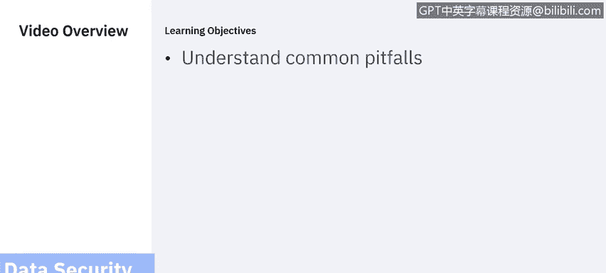

# 课程6：《网络威胁情报课程（IBM）》：8：7_数据安全常见陷阱

## 概述
在本节课程中，我们将探讨数据安全领域常见的五个主要陷阱。理解这些陷阱有助于我们构建更全面、更主动的防御策略，而不仅仅是满足基本合规要求。

在之前的章节中，我们讨论了数据安全与保护的定义、防护对象以及实施防护的原因。我们也分析了一些主要的挑战。本节中，我们将深入探讨数据安全中一些常见的陷阱。

需要指出的是，这并非一份详尽的陷阱列表，并且我们将从较高层面进行讨论，而非深入技术细节。

---

## 陷阱一：仅满足于合规要求
我们曾将遵守隐私法规列为一项主要挑战。诚然，遵守法律、法规和公认的行业标准是一个起点，但这远远不够。我们最重要的目标是降低安全漏洞的风险。

这意味着既要减少安全故障发生的可能性，也要最小化从安全漏洞中恢复的成本。法规合规是其中的重要组成部分。法规和标准合规工作可以为规划和实施数据安全保护解决方案奠定基础，从而降低安全故障的可能性。此外，法规和标准可能规定了在发生安全漏洞时必须采取的措施。证明合规是建立尽职调查的重要组成部分。

然而，我们的组织拥有独特的数据安全需求，满足这些需求的最终责任在于我们自己。我们很可能拥有一些未被监管标准覆盖但仍具有价值、若不加以保护则面临风险的数据资产。

仅满足于合规是短视的。此外，法规和标准无法跟上不断变化和演进的威胁环境。我们需要具备远见并积极主动地识别、建模并应对现有威胁，同时研究、了解并预测未来威胁。我们不能坐等法律、法规和标准去追赶威胁，这永远不会发生。理想情况下，我们应该达到一种准备状态，能够为未来标准和法规的演进提供信息并做出贡献。

良好的风险评估、持续的迭代式漏洞评估计划以及合理的控制措施，能使我们超越简单的合规检查，转向一种由我们主导解决方案的文化。

---

## 陷阱二：未能认识到集中式数据安全管理的必要性
组织的数据和IT结构往往是孤立的和分布式的。在复杂的运营环境中，很容易假设“其他人已经负责安全了”，或者采取“眼不见为净”或“目前一切正常”的态度。这些态度可能导致安全覆盖出现关键缺口，更糟糕的是，在不可避免的漏洞发生时引发相互指责。

组织必须将数据安全作为优先事项，将总体责任赋予一个单一的、高级别的监督角色，该角色应位于或接近高管层。这位高级管理者必须有权决定并实施必要的安全策略。

通常，安全经理并非首席执行官，而是一个直接向首席执行官或至少是首席信息官汇报的全职职位。获得首席执行官及其他高层对此职位的全力支持至关重要。

此角色负责定义安全愿景并确保其实现。该角色还需理解威胁环境在不断演变和增长。新型数据源和数据必须能迅速整合到整体的数据安全与保护解决方案中。这意味着解决方案必须具备足够的灵活性以适应这些变化。

必须实施适当的产品，以实现安全策略的集中管理。组织应部署某种形式的安全信息与事件管理解决方案，以集中警报并协调缓解措施。必须建立审计解决方案，以便全面、严格地审视整个组织的数据安全状况。

---

## 陷阱三：未能明确数据所有权责任
与未能集中管理相关的是未能明确数据本身的责任归属。拥有一位总体的安全经理是必要的，但还不够。我们还必须明确且详细地定义谁对敏感数据资产负责。

许多标准和法规要求明确设立首席数据官或数据保护官，其全职工作正是负责数据。他们通常直接向总体安全经理汇报。这位首席数据官或数据保护官必须具备技术资质并理解业务线。他们必须在技术层面评估风险并制定全面的数据安全策略。

---

## 陷阱四：未能解决已知漏洞
我们可能想象网络犯罪分子使用的是秘密漏洞，只有他们自己和其他非法行为者知道。然而，绝大多数攻击利用的都是已知漏洞。恶意软件和勒索软件通常针对至少六个月前发现的漏洞。这些漏洞通常已有补丁且广为人知。那些已存在补丁的漏洞导致了多起重大数据泄露事件。

仔细想想：漏洞是已知的，补丁也存在，但泄露仍然发生了。虽然快速打补丁是必要的，但这可能很困难。你必须拥有所用产品的准确清单。你需要了解易受攻击产品的详细技术知识。你必须测试补丁以确保其有效且不会破坏现有功能。你必须制定安装补丁的计划。你必须了解从第三方合作伙伴获取的资源的状况。

例如，如果你在业务系统中使用云服务，你必须理解云环境，并与云提供商合作，确保关键组件受到保护，免受已知风险的影响。这要求你了解自己拥有哪些数据资产，以及预期的基线状态应该是怎样的。你必须实施频繁的漏洞评估扫描计划。这意味着需要与业务线所有者及其他利益相关者协调，并建立一个稳健的变更与配置管理程序。

---

## 陷阱五：未能优先考虑并利用数据活动监控
在完成数据发现、分类、责任分配、实施合规措施、分析威胁以及对数据设置适当的访问控制和协议之后，很容易认为工作已经完成。但你是在保护你的数据，任何优秀的防御都需要持续且主动的监控。

监控数据访问在技术上是困难的。在数十亿笔交易中，可能只有少数几笔是可疑的。为了处理数据而过滤活动数据是一项挑战。必须尽可能高效地使用CPU、内存、网络带宽和磁盘，以免监控解决方案耗尽可用资源。

此外，你必须采取措施监控特权用户。即使只是确定监控什么以及如何监控，也可能令人望而生畏。但这至关重要，因为数据特别容易受到内部攻击，例如来自特权用户的攻击，无论是不满员工的恶意行为，还是外部攻击者利用被入侵的特权账户。

监控数据活动涉及许多方面，包括阻止或隔离执行可疑活动的用户、识别可能表明非法活动的异常值、实时屏蔽数据、为审计保留数据，以及与事件控制台集成以便及时通知响应团队。

为了应对这一挑战，我们必须采用分步方法，从最敏感的数据源开始，或许只是一两个，然后依次针对其他数据源。迭代将允许你将新的数据源纳入监控方案，并完善监控策略。

识别高风险用户账户，并关闭或限制不必要的访问点。进行整体监控，不仅跟踪数据库，还包括敏感数据和文件、Hadoop、NoSQL以及云平台。利用监控获得的数据生成有用的报告，并建立一个流程，将这些报告分发给利益相关者进行仔细审计。

---

## 总结
本节课中，我们一起学习了数据安全领域的五个主要陷阱及其防范方法：超越合规要求、建立集中安全管理、明确数据所有权、积极修补已知漏洞以及实施有效的数据活动监控。在下一节中，我们将讨论行业特定的挑战。