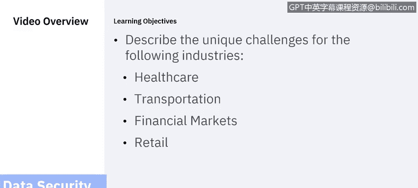
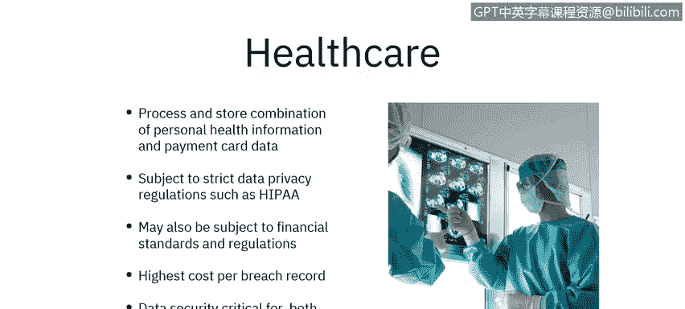
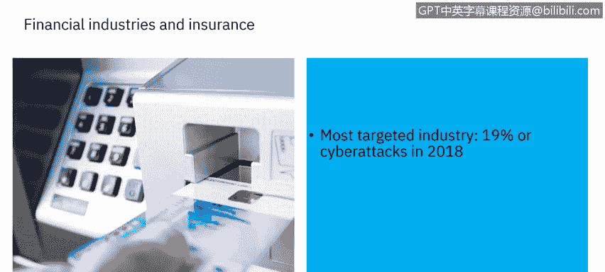
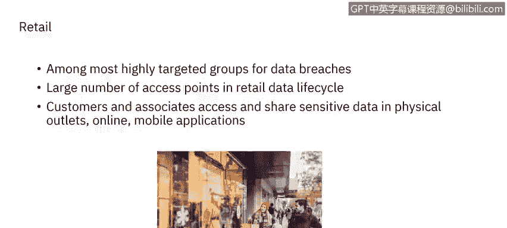

# 课程6：《网络威胁情报课程（IBM）》：6：行业特定的数据安全挑战 🔐

在本节课中，我们将学习不同行业所面临的特定数据安全挑战。我们将聚焦于四个具有独特数据安全需求的行业：医疗保健、交通运输、金融与保险以及零售业。了解这些行业的特定漏洞和法规要求，对于构建有效的安全策略至关重要。

每个行业都有其独特的数据安全挑战。通常，行业内部存在必须遵守的特定法规。恶意攻击者深谙这些行业的独特弱点，因此你也应该了解它们。

## 医疗保健行业 🏥

上一节我们概述了行业挑战的普遍性，本节中我们来看看医疗保健行业的具体情况。

医疗保健行业存储着包括个人健康信息和支付卡数据在内的多种敏感信息。这两类信息都容易受到无意或故意的滥用。这意味着我们必须实施流程和程序，以促进信息的安全处理，为即使出于好意的人类的不完美提供保障，并在安全漏洞发生时提供快速有效的处理路径。

这必须与在组织内不同部门、甚至在不同医疗机构之间，快速可靠地访问必要个人健康信息的要求相平衡。例如，心脏病发作的患者需要急救医疗技术人员、急诊室医生、心脏病专家、护士和医疗技术人员能够在分秒必争的环境中输入、编辑和查看健康数据。

但这些数据也必须与初级保健提供者、指定的家庭成员以及保险公司共享，甚至可能需要与国家医疗保险计划等政府实体共享。然而与此同时，心脏病患者拥有隐私权。界限可能不清晰，例如配偶可能需要访问权限，但由于家庭情况，某个兄弟姐妹必须被明确排除在外。

医疗保健行业也受到严格的数据保护法规约束。《健康保险流通与责任法案》（HIPAA）规范了特定类型健康信息的隐私和安全。由于需要处理支付信息，该行业还需遵守金融标准和法规，如支付卡行业数据安全标准（PCI DSS）。最后，医疗保健服务可能跨越州或国家边界，因此也需要遵守地区或国家标准。

医疗保健行业每次数据泄露记录的成本最高，约为平均成本的三倍，这使得数据安全保护对于维持医疗机构的财务健康至关重要。数据安全对于保持业务可行性和满足监管要求都至关重要。

## 交通运输行业 🚄

现在，让我们将目光转向作为国家和地区基础设施关键部分的交通运输业，它带来了自身的挑战。

交通运输数据安全要求涉及政府和私营部门。敏感数据可能通过多个供应商和政府机构形成一个复杂的链条，使得确定最终责任方变得困难。其IT基础设施通常分布广泛。以收费公路为例，它可能穿过地方、县、州甚至国家层面的多个政府管辖区。资产可能归政府所有，但由私人公司管理。必须整合多个地区的服务以提供单一的无缝服务。

例如，在一个交通系统上可用的智能卡，可能被期望在另一个物理位置相同但由完全不同的实体管理的系统上也能使用。敏感数据，包括车牌号码和支付卡信息，容易遭到滥用。收费卡信息是否应提供给交通执法部门？红灯摄像头会捕捉守法公民以及闯红灯者的敏感位置信息。这些数据应如何存储和分离？必须考虑公民自由和个人权利因素。在许多交通运输实体中，识别或指定一个中央责任机构要困难得多。集中式解决方案即使不是不可能，也极难实施。数据在系统传输过程中以及静态存储时都必须受到保护。

## 金融与保险行业 💰

接下来，我们转向金融和保险行业。

有一个关于美国银行劫匪威利·萨顿的故事，当被问及为何抢劫银行时，他回答说：“因为钱在那里。”这个现在被认为是杜撰的故事，却道出了金融行业挑战的核心。

毫不奇怪，金融和保险服务是受攻击最多的行业，在2018年占网络攻击总数的19%。该行业处理高度敏感的数据。

内部和外部行为者都有强烈的动机去窃取、篡改和不正当地利用数据。与此同时，客户希望获得个性化、无缝的数字资产管理体验。他们希望可靠地出售或交易股票和共同基金，希望能够支付账单、存入支票以及在银行或信用合作社之间转账。当他们使用自动取款机时，无论机器属于哪家金融机构，他们都希望能够取款。我们还见证了移动支付应用的兴起，这是消费者需求推动行业提供必须配备适当数据安全和保护措施的服务的另一个例子。

以下是该行业面临的一些主要挑战：

*   **高度针对性**：因其处理的资产价值而成为主要攻击目标。
*   **敏感数据处理**：涉及大量个人财务信息和交易数据。
*   **强烈的内外动机**：经济利益驱动内部和外部威胁。
*   **客户体验与安全的平衡**：客户要求便捷、个性化的数字服务，这增加了安全复杂性。

该行业存在许多特定法规和标准。我们已经提到了支付卡行业数据安全标准（PCI DSS）。此外，还有其他法规、标准和实体，例如金融业监管局（FinRA）、《萨班斯-奥克斯利法案》（SOX）以及巴塞尔协议I、II或III等。金融服务公司可能需要遵守地区性标准，如纽约州金融服务局第23 NYCRR 500号网络安全条例，以及国家和国际法规与标准。此外，业务损失是该行业数据泄露成本的最大贡献者。客户不会与他们不信任的公司做生意。

## 零售行业 🛒

最后，让我们看看零售行业。零售组织是高度受攻击的目标。

由于零售数据周期中存在许多接入点，数据盗窃和暴露的机会很多。物联网设备，如分布式销售点，必须集成到数据安全解决方案中。数据在传输过程中必须受到保护。较低的利润率也使得降低成本和简化运营变得重要。零售公司可能会寻求基于云的解决方案。

客户希望在保持隐私和安全的同时，获得个性化的零售体验。这需要数据，但零售商收集和使用的数据越多，他们承担的风险和漏洞就越大。在这种情况下，遵守PCI DSS是一个重要因素。

以下是该行业的关键考量：

*   **众多攻击面**：线上商店、实体店POS系统、供应链、物联网设备等。
*   **支付数据集中**：处理大量支付卡信息，受PCI DSS严格约束。
*   **客户数据利用**：个性化需求与数据隐私保护之间存在张力。
*   **成本压力**：薄利润促使企业寻求高效且低成本的安全解决方案。

## 总结 📝

本节课中，我们一起深入探讨了四个关键行业（医疗保健、交通运输、金融与保险、零售）所面临的特定数据安全挑战。我们了解到，每个行业因其处理的敏感数据类型、运营模式、监管环境及客户期望的不同，而面临着独特的安全威胁和合规要求。理解这些行业特定的背景是设计有效安全防护措施的第一步。在下一节中，我们将探讨应对这些挑战所需的12项关键数据保护能力。