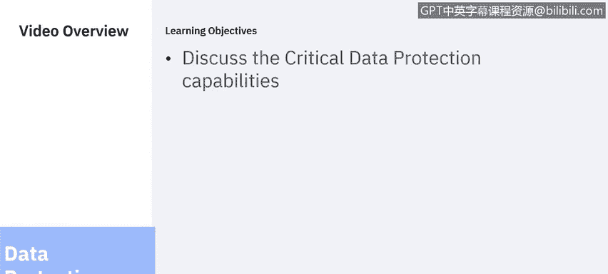
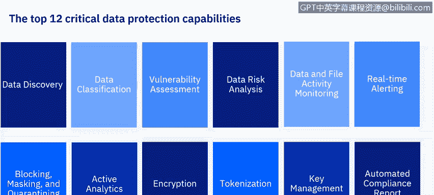
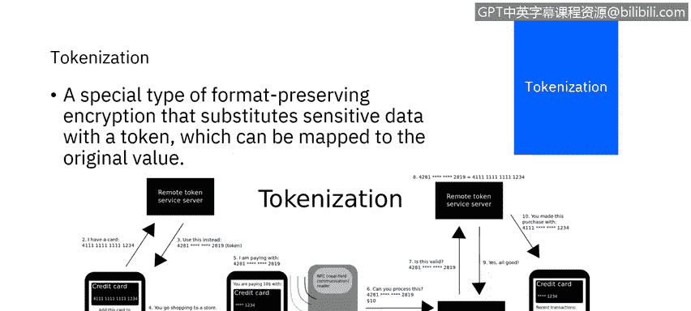
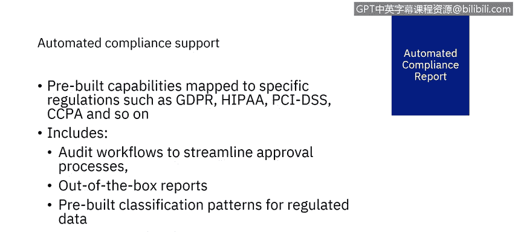

# 课程6：《网络威胁情报课程（IBM）》：11：10_关键数据保护能力

在本节课中，我们将继续学习12项关键数据保护能力。上一节我们介绍了前六项能力，本节中我们来看看剩下的六项能力：阻断、脱敏与隔离，主动分析，加密，令牌化，密钥管理以及自动化合规报告。

## 阻断、脱敏与隔离 🔒

数据安全解决方案必须能够智能地动态限制对敏感数据的访问。当安全解决方案检测到可疑行为时，通过模糊数据或阻止进一步操作来响应是有用的。这些响应措施包括阻断、脱敏和隔离。这些措施有助于通过将用户对数据的访问权限限制在其角色所需的范围内，来满足标准和法规的合规要求。

以下是这些措施的具体说明：

*   **阻断**：阻止可疑的数据请求完成。此请求可能是查看、更改、添加或删除敏感信息。阻断是细粒度的，因为它针对的是单个请求。由于请求被阻止，数据不会受到影响或返回给请求者，该过程只是未能完成。
*   **脱敏**：数据被部分返回，但部分数据被省略。例如，查看个人身份证号码的请求可能会返回用星号替换了某些数字的值。或者，可能只返回部分结果列表，例如，查看薪资信息的请求可能会产生排除高管薪资的结果。
*   **查询修改**：修改实际发送到数据库服务器的命令。这可能会将命令定向到不同的表或不同的列。
*   **隔离**：针对产生可疑活动的用户采取的行动；它会永久或暂时终止其对敏感数据的访问。

阻断、脱敏、隔离和查询修改通常与警报和日志记录操作相结合，以便可以报告可疑事件并保存以供审计。这些能力不仅有助于防止恶意行为者造成的数据安全漏洞，也有助于防止因人为错误甚至忠实执行必要操作而导致的违规。

## 主动分析 📊

主动分析获取数据活动监控生成的数据，并利用它们生成关于威胁的洞察。这些威胁可能包括SQL注入、恶意存储过程、拒绝服务、数据泄露、账户接管、模式篡改、数据篡改或其他异常情况。当识别出这些威胁时，主动分析可以提供应对威胁的建议措施，以降低风险。

## 加密 🔐

加密是将数据转换为不可理解形式的过程，原始数据只能通过解密过程获得。加密并不拒绝未经授权的用户访问数据，而是拒绝他们理解数据的含义。因此，加密后的数据对未经授权的用户是无用的。加密甚至可能使数据的含义模糊到无法识别为数据的程度，从而有效地隐藏其存在。

加密可以应用于传输中的数据（即从一个端点传输到另一个端点时）或静态数据（即驻留在端点上时）。由于数据在传输中和静态时的漏洞不同，加密数据的要求和方法也可能不同。例如，传输中数据加密方案可能优先考虑速度和最小化加密/解密过程使用的资源，而静态数据可能优先考虑加密强度和加密状态的长期保持，以及确保解密在数据的整个生命周期内保持可行。

以下是两种主要的加密类型：

*   **对称加密**：解密密钥很容易从加密密钥推导出来。这要求密钥必须受到保护以防泄露，但对称加密通常更快且资源消耗更少。
*   **非对称加密**：解密密钥不容易从加密密钥推导出来。在这种情况下，加密密钥可以公开，但解密密钥必须保持私密并受到保护以防泄露。

## 令牌化 🪙

令牌化类似于加密，它试图向未经授权的用户隐藏数据的含义。然而，令牌化不是加密数据，而是用令牌替换数据。这个由受信任方颁发的令牌可以被不受信任方访问，但不能被兑换。因此，不需要特定敏感数据的操作可以使用令牌作为代理来执行，这可能包括在参与者之间传递令牌或将令牌用作凭证。当需要原始数据时，再兑换令牌。

例如，购物者想在商店购物。购物者不是向店主的销售点提供敏感的信用卡信息，而是向受信任的服务器请求一个令牌，并将其提供给店主。店主能够处理令牌，但无法将其映射回信用卡号。为了完成销售，店主向商户收单机构查询该令牌是否适用于销售金额，商户收单机构再向远程令牌服务服务器查询令牌的有效性。收到服务器回复后，商户收单机构验证该令牌适用于购买。然后，远程令牌服务服务器将销售金额与原始数据进行匹配，并向银行卡发卡行更新销售详情。

## 密钥管理 🔑

正如我们所看到的，加密需要密钥。这些密钥必须被创建、管理并防止泄露。密钥也用于身份验证和其他目的。密钥的多样性和复杂性要求组织必须具备密钥管理能力。密钥管理必须是集中式的。密钥管理必须是有组织的，以维护数据的机密性、完整性和可用性。密钥不当暴露会损害数据的机密性和完整性，而授权用户无法访问密钥则会损害可用性。

## 自动化合规报告 📑

由于数据安全和保护的目标之一是遵守适用的法规和标准，我们必须了解这些法规的要求，以及如何将这些要求转化为数据安全解决方案中的流程、策略和程序。

自动化合规支持包括预构建的分类模式，以帮助我们识别法规涵盖的敏感数据。它提供预配置的报告，以收集和显示法规要求的数据。它提供工作流来实现强制性的流程和程序。它提供审计资源和存储库以证明合规性。从头开始实施即使是一个标准的合规性，也需要大量资源，成本将高得令人望而却步。开箱即用的预配置资源使这项工作变得可行。

## 总结

本节课中我们一起学习了最后六项关键数据保护能力：阻断、脱敏与隔离，主动分析，加密，令牌化，密钥管理以及自动化合规报告。在下一节中，我们将讨论Guardian数据安全解决方案。