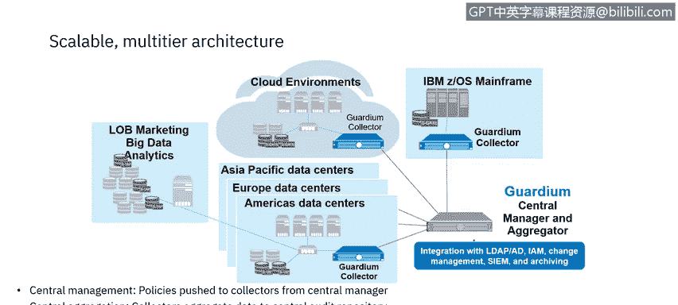
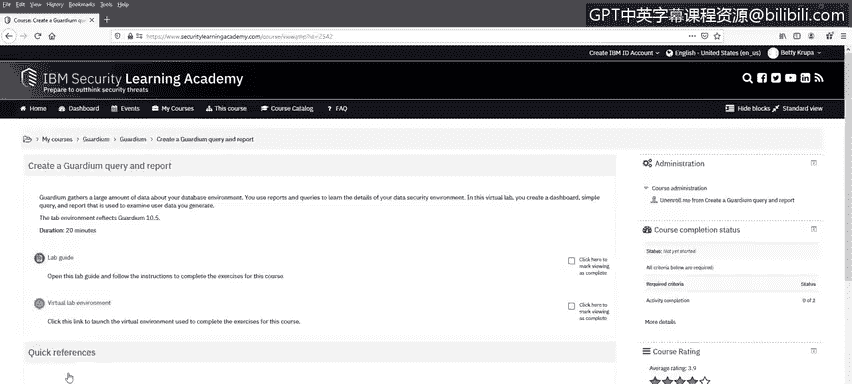
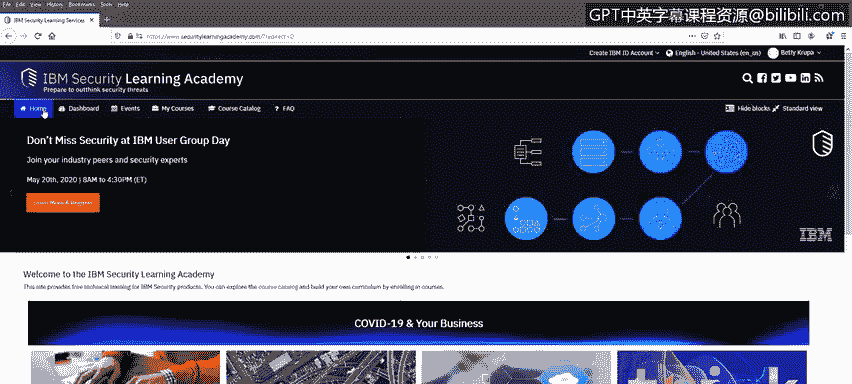
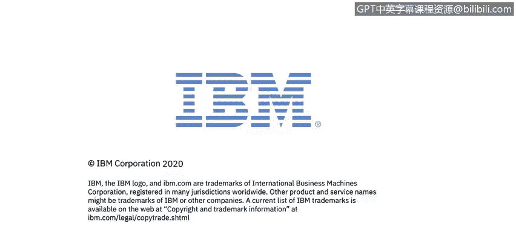

网络威胁情报课程：6.12：数据保护行业案例 🔐

在本节课中，我们将探讨IBM的数据安全解决方案，了解IBM Security Guardian如何通过可见性、自动化和可扩展性实现更智能的数据保护。我们将介绍Guardium的核心组件、功能架构，并预览IBM安全学习学院中的相关实践资源。

---

上一节我们探讨了数据安全的动机与挑战，本节中我们来看看IBM提供的具体解决方案——IBM Security Guardian。

Guardium是一个强大的数据安全与合规解决方案，支持分阶段实施。这允许客户从最紧迫的需求开始，逐步扩展功能覆盖范围。

客户可以从基本的合规需求起步，例如审计或法规要求的数据访问报告。随后，可以扩展覆盖范围至其他敏感平台，监控特权管理员访问，在全企业范围内发现敏感数据，并制定全面的数据保护策略。

Guardium帮助您保护数据免受未经授权的访问，确保数据隐私，识别风险并降低合规成本。它能够处理本地或云上的数据源，与数据库服务器、分布式数据存储库以及非结构化数据（如敏感文档和文件）协同工作。

以下是Guardium提供的主要能力：
*   **数据库发现与分类**
*   **非结构化数据发现与分类**
*   **漏洞评估**
*   **实时数据库访问监控**
*   **实时非结构化数据监控**
*   **实时告警**
*   **阻断、脱敏、会话终止、隔离和查询重写等操作**
*   **内置及自定义报告**
*   **开箱即用和自定义的合规工作流自动化**
*   **针对GDPR、SOX、Basel II、HIPAA等行业法规和标准的合规加速器**
*   **配置审计与主动威胁分析**

Guardium为企业的监控需求提供了完整的解决方案。它仅占用极少的数据库服务器资源，通常CPU利用率在3%到5%之间，从而减少对数据库系统操作的影响。

Guardium的实施方式确保了数据库管理员和拥有高级数据访问权限的特权数据库用户无法访问Guardium系统。因为Guardium在查询到达数据库之前拦截它们，并在结果返回给请求者之前拦截结果，所以可以阻止或报告数据访问，并对数据进行脱敏处理。

Guardium在异构数据库环境中表现一致。这使得策略、流程以及收集和报告的数据得以标准化。此外，单个Guardium系统可以监控和管理不同厂商的数据库产品的安全性。Guardium也能监控Amazon AWS RDS数据库引擎。

为了提供对数据库和应用程序的异构支持，Guardium使用了一个名为STAP的分布式代理进行基于主机的探测。这提供了轻量级的跨平台支持。

由于STAP代理在数据库服务器上运行于数据库和应用程序之下的底层，因此可以监控所有访问活动，这与网络监控不同，后者无法检测仅在数据库服务器上运行的活动。例如，在服务器控制台上本地工作的特权用户不会被任何仅监控网络流量的解决方案检测到，但会被Guardium检测到，并可被监控甚至阻止。

此外，因为STAP运行在数据库和应用程序之下，安装STAP时无需对数据库或应用程序进行任何更改。

独立的收集器和聚合器设备承担了大部分资源密集型处理任务，使得数据库服务器本身能够以最小的干扰运行。活动被实时记录，并立即可用于告警或报告。

默认情况下，字符串会被实时解析为更小的数据元素，以便活动信息更容易分类和生成报告。出于资源利用考虑，解析也可以推迟进行。告警是实时发生的。

Guardium使用收集器、聚合器和中央管理器的分层架构。
*   **收集器** 从数据存储库收集并解析关于敏感数据的活动信息，提供实时分析，并存储以备进一步处理。一个Guardium实施至少有一个，通常有多个收集器。
*   **聚合器** 从多个收集器收集并合并信息，提供敏感数据操作的企业级视图。拥有多个收集器的Guardium实施会有一个或多个聚合器。
*   **中央管理系统** 一个Guardium环境有一个中央管理系统，用于控制和监控该环境中的所有收集器和聚合器，并通过单一控制台提供整体视图。集中管理提供了策略的统一性，策略可以创建一次并分发到众多不同的端点。

集中式聚合从分布式来源收集数据安全信息，进行统一处理、存储和报告。异构数据源支持为不同类型的数据存储库提供类似的安全能力。

---

了解了Guardium的整体架构后，我们来看看其加密组件。

IBM Security Guardian Data Encryption是一个高度可扩展的集成产品套件，有助于最大限度地降低风险并减少加密密钥管理的运营成本。

它提供对文件、数据库、应用程序和云容器数据的加密，同时提供令牌化以及云密钥管理能力，包括密钥存储、轮换和生命周期管理。它将保护企业内的数据资产，涵盖云、虚拟化、大数据和本地环境。它为合规工作提供支持。

IBM Security Key Lifecycle Manager提供加密密钥管理能力。它支持多主集群，允许密钥同步和实时交付，以提高灵活性和易用性。它简化了安全密钥的生命周期，包括生成、分发和生命周期管理，从而降低成本。它可以简单安全地与IBM存储系统集成。

---

最后，我想提醒您注意IBM安全学习学院中提供的一些Guardium实验。

在 `www.securitylearningacademy.com`，让我们查看学院的Guardium专区。

这里有适用于Guardium入门者、用户和管理员的路线图。这些路线图是建立在您在本视频系列中学到知识基础上的绝佳起点。

这里有两个优秀的实验：
*   **Guardium数据库漏洞评估** 是一个基础级课程。它包含解释性视频、实验指南和虚拟实验环境。
*   **创建Guardium查询和报告** 是另一个优秀实验。它包含实验指南和虚拟实验环境。

---

**总结**

本节课中，我们一起学习了IBM Security Guardian产品，并预览了IBM安全学习学院中的Guardium专区。我们了解了Guardium如何通过分阶段实施、异构支持、分层架构以及集成的加密与密钥管理解决方案，为企业提供全面、高效且可扩展的数据安全与合规保护。