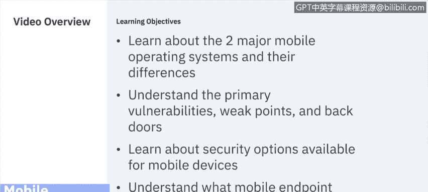
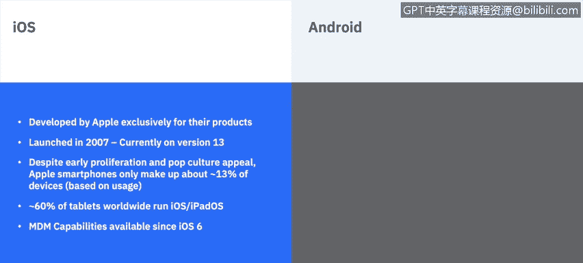
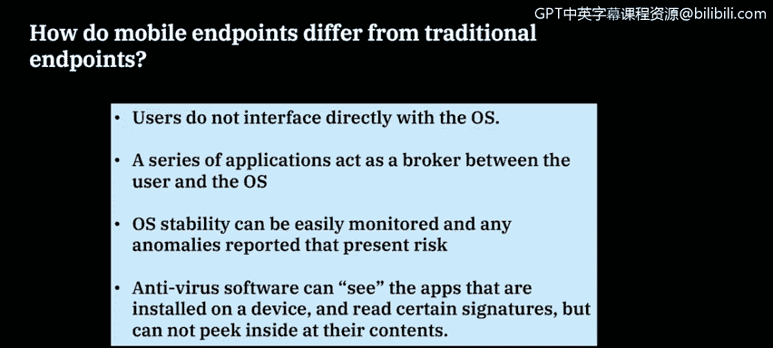
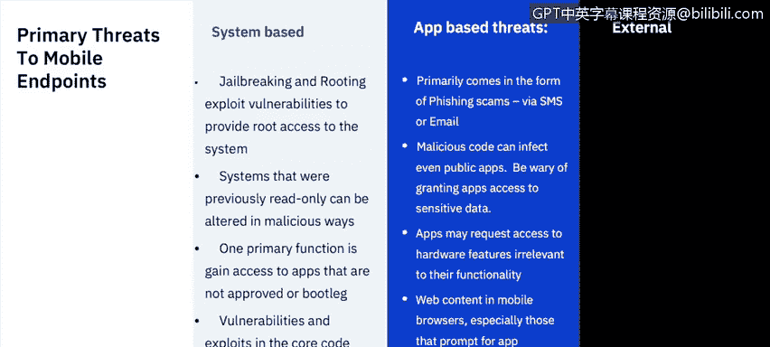
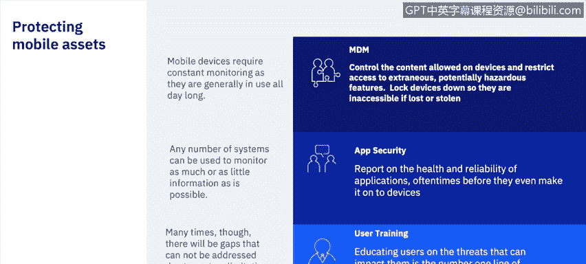

# 课程6：《网络威胁情报课程（IBM）》：13：12_移动终端保护

## 📱 概述

在本节课程中，我们将学习移动终端保护。我们将了解两大主流移动操作系统及其差异，识别移动设备的主要漏洞和薄弱点，并探讨可用的安全选项以及移动终端管理的日常职责。

## 📱 两大移动操作系统

目前市场上有两大主流移动操作系统：**iOS** 和 **Android**。过去曾存在其他系统，如 Windows Phone 和率先进入企业市场的 Blackberry，但目前 iOS 和 Android 占据了市场绝大多数份额。Windows Phone 已正式停止支持，而 Blackberry 也已开始将 Android 作为其主要操作系统。

### iOS

*   **开发者**：由 Apple 公司专为其产品开发。
*   **第三方设备**：没有第三方设备运行 iOS。
*   **发布时间**：于 2007 年发布，目前最新版本为 iOS 13。
*   **市场份额**：基于使用量，Apple 智能手机仅占市场约 13%。全球约 60% 的平板电脑运行 iOS 或 iPadOS。
*   **MDM支持**：自 iOS 6 起支持移动设备管理（MDM）功能。

### Android

*   **起源**：最初是 Android Inc. 的一个小型项目，旨在开发 Symbian 和 Windows Mobile 的替代品。
*   **收购与发展**：于 2005 年被 Google 收购。它基于 Linux 内核，目前主要由 Google 和开放手机联盟（Open Handset Alliance）开发。
*   **设备多样性**：虽然 Google 提供了 Android 的界面和市场上大量设备，但也存在用于不同行业的非 Google Android设备。
*   **发布时间**：首个公开版本于 2008 年发布，目前最新版本为 Android 10。
*   **市场份额**：约 86% 的智能手机和 39% 的平板电脑运行某种形式的 Android。
*   **MDM支持**：自 Android 2.2 起支持移动设备管理（MDM）功能。

## 🔍 移动终端与传统终端的区别

上一节我们介绍了移动操作系统，本节中我们来看看移动终端与传统终端（如服务器、台式机和笔记本电脑）有何不同。

首先，用户不直接与操作系统交互。与传统桌面软件不同，用户无法直接获得根（root）访问权限并查看构成操作系统的各种组件和文件夹。

相反，一系列应用程序充当用户和操作系统之间的中介。例如，当您打开设备上的“设置”按钮时，您并非直接编辑设置。“设置”本身就是一个应用程序，它代表您向操作系统发出命令（如调节系统音量）。

由于这种架构，可操作性（Otability）很容易被监控，并且可以报告存在风险的系统异常。除非我们讨论的是 Android 市场上的某些开源设备，否则消费者设备出厂时配置相当标准：开机、操作系统按特定顺序加载、建立安全链，然后用户看到可以运行应用程序的用户界面。如果这个系统链在任何环节被破坏，很容易被检测和报告。

此外，防病毒软件在移动设备上也很有用，它可以查看设备上安装的某些应用程序并读取特定签名。但与桌面端不同，它无法查看所有内容，不能窥探所有应用程序内部，其视野有限，且无法定制以查看通常无法看到的内容。

## ⚠️ 移动终端的主要威胁

了解了移动设备的特性后，接下来我们探讨它们面临的主要威胁。我们将威胁分为三类：**基于系统的威胁**、**基于应用的威胁**和**外部威胁**。

### 基于系统的威胁

这类威胁通常试图以某种方式修改操作系统，以获取设备上非标准的功能。这通常表现为 **“越狱”（Jailbreaking）** 和 **“Root”（获取根权限）**。

*   **越狱（iOS）**：这是 iOS 特有的，因为 Apple 完全不支持此行为。越狱会自动使您的所有保修失效，并且您的系统资源可能以您意想不到的方式被恶意感染。人们通常为了安装 App Store 上未批准或不可用的应用程序而进行越狱。
*   **Root（Android）**：Root 在 Android 上略有不同，因为它确实有其用途，特别是对于应用程序开发者。此外，Android 设备无需 Root 即可从外部安装应用程序。然而，Root 仍然会带来问题，尤其是当我们用它来以 Google 先前未授权的方式定制操作系统时，可能会创建可被利用的漏洞。

### 基于应用的威胁

这类威胁自然来自应用程序本身。

*   **网络钓鱼诈骗**：主要通过短信或电子邮件进行。您收到一封包含链接的电子邮件或看似官方的短信，点击后可能对您的设备造成安全危害。
*   **恶意代码**：恶意代码甚至可以感染公开的应用程序，因此请确保始终从可信来源安装应用。虽然 Apple 和 Google 在扫描其应用商店中的应用漏洞方面做得很好，但这并不意味着它们能发现所有漏洞。因此，请坚持选择那些在安全方面有良好历史和可靠记录的公司。
*   **权限滥用**：应用程序可能请求与其功能无关的硬件访问权限。例如，很久以前有一个 Android 手电筒应用，它需要打开相机闪光灯，但同时却请求访问系统联系人权限，这显然不是手电筒应用应有的需求。
*   **浏览器漏洞**：网络浏览器也包含漏洞。您可能在某些网站上看到弹出窗口，声称您的设备已被感染，并诱使您点击链接下载所谓的修复程序。请相信，Apple 和 Google 不会在浏览器中放置此类弹出窗口。这通常是外部攻击者试图诱使您在应用内点击链接，从而安装恶意软件。

### 外部威胁

当然，外部威胁也始终存在。

*   **基于网络的攻击**：Wi-Fi 和蓝牙漏洞可能被利用，例如通过将设备连接到外部媒体进行攻击。
*   **社会工程学**：常被用来获取未经授权的访问。攻击方式多样，例如，有人可能假装向您求助，借用手机给妻子打电话，从而获取您的号码。随后，他们可能会向您发送看似官方的诈骗短信，诱使您点击链接并输入信息或下载恶意应用。

## 🛡️ 如何保护移动资产

识别了威胁之后，我们来看看如何保护移动资产。首先，**移动设备管理（MDM）** 至关重要，它需要持续监控，允许您控制设备上的内容并限制对功能的访问。

如果设备上存在潜在危险信息（例如安装了已知含有恶意软件的应用程序），MDM 可以帮助修复问题，并在修复前阻止用户访问敏感信息。此外，如果设备丢失或被盗，MDM 可以锁定设备，使其无法访问。

**应用程序安全**是另一个重点。有许多第三方公司可以提供应用评级。如前所述，虽然移动端防病毒程序功能有限（尤其是与桌面端相比），但结合公共应用商店的安全措施以及第三方评级系统，可以全面了解市场上应用程序的状况。始终确保不从这些商店外部安装第三方应用，除非您 100% 信任来源，即便如此，也应遵循“信任但验证”的原则。

当然，**用户培训**也至关重要。教育用户了解市场上可能影响他们的威胁总是很重要的。您可以从他们个人日常使用的角度来阐述这些威胁，因为出现的威胁不仅可能影响组织，也可能影响用户的私人数据，如敏感文档甚至相机中的照片。因此，确保我们的用户教育是最新的，并让他们了解移动设备市场威胁所在。

## 📋 移动安全日常运维

上一节我们讨论了保护措施，本节中我们来看看负责移动设备安全的人员的日常运维工作是什么样的。这涉及大量监控，环境中可能存在成百上千台设备，但许多信息可以通过自动化系统处理并采取行动，无需太多管理员干预。

以下是日常运维的关键任务列表：

*   **监控设备操作系统版本**：确保操作系统版本是最新的。这对于移动设备尤其重要，因为通常没有单独的补丁功能，您无法仅修补 Wi-Fi 硬件，而是需要更新整个操作系统，其中包含漏洞和错误的修复。
*   **监控应用安装和版本**：同样，这在移动操作系统上更为重要，因为一旦安装，您无法轻松回退应用程序版本。如果旧版本在应用商店中仍可用，您必须完全卸载并重新安装。对于来自 iOS App Store 或 Google Play 商店的应用，您只能安装市场上可用的版本。如果当前版本有缺陷，您必须从设备中移除它，而无法回退到早期版本。
*   **监控并强制执行加密**：这一点始终很重要。如今许多设备出厂时已加密，但您仍需添加安全层，确保强制执行密码，并在可用时让用户利用这些密码以及生物识别解锁功能（如指纹或面部识别）。
*   **分发安全负载**：确保您拥有已知安全的安全负载（如配置、应用）并将其分发到设备上。不要轻信第三方公司声称其产品安全就接受他们的负载，务必“信任但验证”。
*   **自动化合规操作**：这是一个很好的功能，因为它很容易实现。如果设备出现漏洞（如被越狱）、设备认证失败或安装了不良应用，确保可以自动阻止用户访问敏感信息，甚至移除恶意应用，这样管理员就无需介入，但仍能在这些流程执行时收到主动警告。
*   **确保执行适当的网络访问控制（NAC）策略**：这在当今超级重要，尤其是对于移动设备。移动设备通常是勒索软件攻击的起点。用户随身携带这些设备，习惯于随时查看信息，这常常导致他们在未适当验证或未加思考的情况下点击链接。网络访问控制有助于确保只有经过批准的设备才能访问您的网络。
*   **定期教育用户**：我们希望始终了解市场上发生的一切。这可能看起来很多，尤其是当您除了台式机和笔记本电脑外还要兼顾 iOS 和 Android 设备时，但教育是成功部署的关键。
*   **始终更新应急计划**：如果发生大规模感染事件，您将如何应对？您能以多快的速度阻止移动设备访问网络、移除其上的应用，或直接切断它们与安全资源的连接？因此，始终要制定应急计划。

## 📝 总结

在本节课中，我们一起学习了移动终端保护的核心知识。我们首先了解了 iOS 和 Android 两大移动操作系统的特点与差异，然后探讨了移动终端与传统终端在架构和安全监控上的不同。接着，我们系统分析了移动设备面临的基于系统、应用和外部的三类主要威胁。为了应对这些威胁，我们介绍了移动设备管理（MDM）、应用安全策略和用户培训等关键保护措施。最后，我们梳理了移动安全日常运维的要点，包括监控系统与应用版本、强制执行加密、自动化合规操作以及制定应急计划等。通过持续监控、自动化管理和用户教育，可以有效保护移动资产，防止其威胁到更大的网络环境。