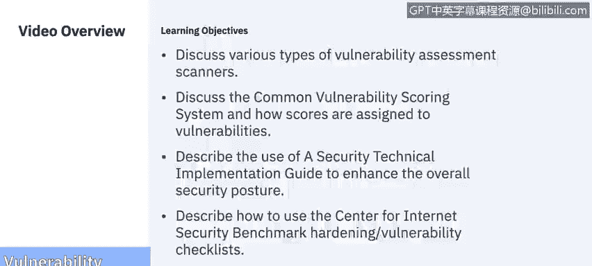
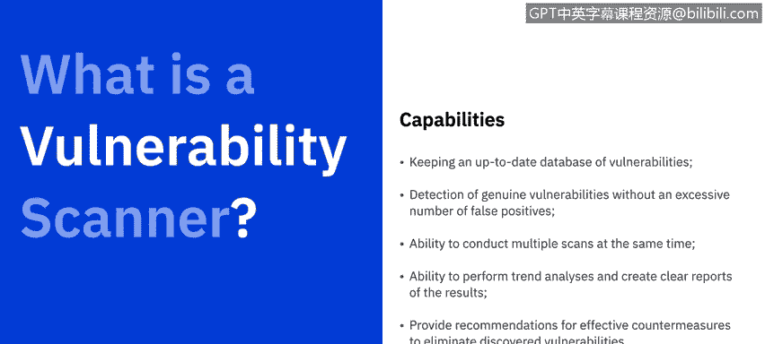
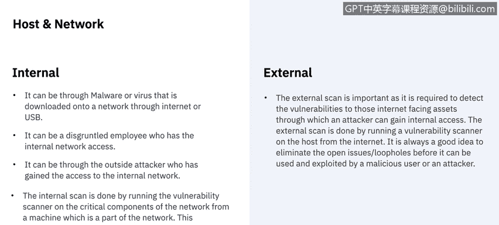
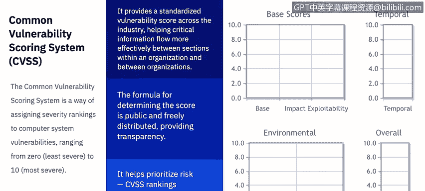
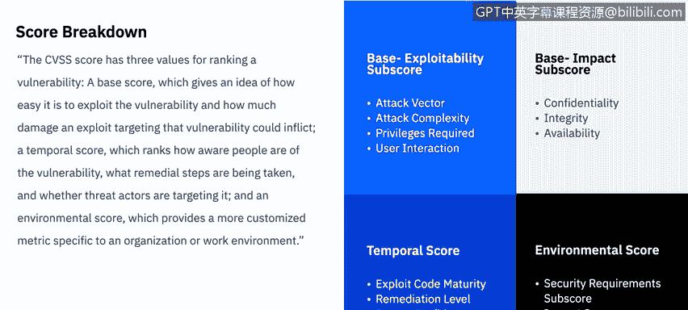
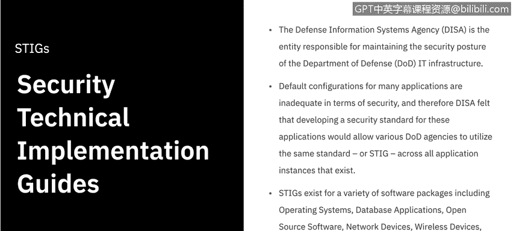
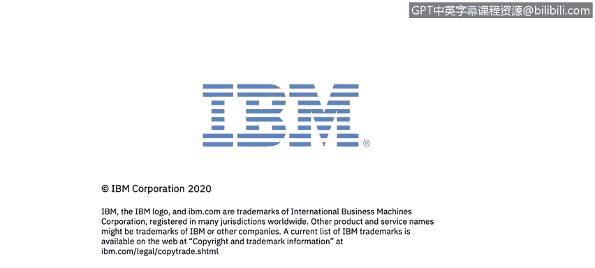

# 课程6：《网络威胁情报课程（IBM）》：14：漏洞评估工具 🔍

在本节课中，我们将学习漏洞评估工具。我们将讨论不同类型的漏洞扫描器、通用漏洞评分系统（CVSS）的评分方法，以及如何使用安全技术实施指南（STIG）和互联网安全中心（CIS）基准来增强整体安全态势。

## 漏洞扫描概述

根据美国国家标准与技术研究院的定义，漏洞扫描不仅能识别主机及其属性（如操作系统、应用程序、开放端口），还能尝试识别漏洞，而不仅仅依赖于人工对扫描结果的解读。

漏洞扫描有助于识别过时的软件版本、缺失的补丁和错误配置，并验证是否符合组织的安全策略或发现偏差。

## 什么是漏洞扫描器？

漏洞扫描器是一种具有多种功能的软件套件，其主要工作是评估系统中可能被威胁利用的潜在弱点。

漏洞扫描器的能力包括：
*   维护包含所有已知漏洞和利用程序的最新数据库。
*   检测真正的漏洞，同时避免过多的误报。
*   能够同时执行多次扫描，进行趋势分析，并生成清晰的结果报告。
*   提供有效的对策建议，以消除发现的任何漏洞。

## 漏洞扫描器的组成

漏洞扫描器由四个主要组件构成：扫描引擎、数据库、报告模块和用户界面。

*   **扫描引擎**：根据其安装的插件执行安全检查，识别系统信息和漏洞。
*   **数据库**：存储所有漏洞信息、扫描结果以及扫描器使用的其他数据。
*   **报告模块**：提供扫描结果报告，例如面向系统管理员的技术报告、面向安全管理员的摘要报告，以及面向企业高管的高级图表和趋势报告。
*   **用户界面**：允许管理员操作扫描器。它可以是图形用户界面（GUI）或命令行界面。

## 内部与外部扫描

漏洞扫描器可以针对内部威胁或外部威胁进行扫描，这取决于它是扫描主机还是网络。

**内部威胁**，无论是有意还是无意，都构成了对系统攻击的很大一部分。它可能通过互联网或USB下载到网络上的恶意软件或病毒，也可能是心怀不满的内部员工，或者是已获得内部网络访问权限的外部攻击者。内部扫描是通过在网络内的机器上运行漏洞扫描器，对网络的关键组件（如核心路由器、交换机、工作站、Web服务器、数据库等）进行扫描。

**外部扫描**同样重要，因为它需要检测面向互联网的资产中的漏洞，攻击者可能通过这些资产获得内部访问权限。外部扫描是通过从互联网对主机运行漏洞扫描器来完成的。在恶意用户或攻击者利用开放问题或漏洞之前将其消除，始终是一个好主意。

## 通用漏洞评分系统（CVSS）

确定威胁严重程度的一种方法是使用通用漏洞评分系统。CVSS是一种为计算机系统漏洞分配严重性等级的方法，范围从0（最不严重）到10（最严重）。

CVSS提供了跨行业的标准化漏洞评分，有助于在组织内部各部门之间以及组织之间更均衡地传递关键信息。其评分公式是公开且免费分发的，确保了透明度，并有助于优先处理风险。CVSS排名既提供一个总体分数，也提供更具体的指标。

CVSS分数本身分为三个主要部分：**基础分数**、**时间分数**和**环境分数**，它们共同提供0到10的总体分数。

### CVSS分数详解

CVSS分数包含三个用于对漏洞进行排名的值：

1.  **基础分数**：评估漏洞被利用的难易程度，以及利用该漏洞可能造成的损害程度。
2.  **时间分数**：评估人们对漏洞的认知程度、正在采取的补救措施以及威胁行为者是否正在针对它。
3.  **环境分数**：提供针对特定组织或工作环境的更定制化指标。

让我们进一步分解这些分数。需要注意的是，这将是对CVSS分数分解的一个相当高层次的概述。建议在视频结束后查看CVSS分数计算器，以了解构成每个子分数的所有不同因素。

*   **基础分数**实际上分为两个子分数：**可利用性**和**影响**。
    *   **可利用性子分数**考察攻击向量、攻击复杂性、所需权限以及涉及的用户交互。
    *   **影响子分数**与CIA三要素有关，即考察其对服务**机密性**、**完整性**和**可用性**的影响。
*   **时间分数**考察三个方面：利用代码的成熟度、修复级别和报告可信度。
*   **环境分数**考察安全要求子分数，并同时考虑CIA三要素的影响分数。

## 安全技术实施指南（STIG）

另一种评估工具是使用安全技术实施指南。国防信息系统局是负责维护美国国防部IT基础设施安全态势的实体。

许多应用程序的默认配置在安全性方面不足，因此DISA认为，为这些应用程序制定安全标准将使各国防部机构能够在所有现有应用程序实例中使用相同的标准或STIG。

STIG适用于各种软件包，包括操作系统、数据库应用程序、开源软件、网络设备、无线设备、虚拟软件等，并且其列表还在不断增长，现在甚至包括移动操作系统。

要查看最新的STIG，可以访问国防部公共网络交换网站（public.cyber.mil/stigs）。在那里，你可以看到最新的更新，下载应用程序查看器（每个操作系统都有一个），浏览这些数据库，并查看任何给定应用程序的最新安全技术实施指南。

## 互联网安全中心（CIS）基准与控制

本视频中我们将讨论的最后一个漏洞评估工具是互联网安全中心的基准与控制。CIS基准与控制类似于STIG，因为它们为任何给定的应用程序或过程提供安全设置和配置的指南与建议。不同之处在于，它不是来自国防部，而是来自行业内的安全专业人员。

CIS基准是唯一基于共识制定的最佳实践安全配置指南，由政府、企业、行业和学术界共同开发和接受。初始基准开发过程定义了基准的范围，并开始了工作草案的讨论、创建和测试过程。

使用CIS Workbench社区网站，建立讨论线程以持续对话，直到就建议的工作草案达成共识。一旦在CIS基准社区内达成共识，最终基准将在网上发布。

CIS控制是一组优先行动，共同构成一套纵深防御的最佳实践，以减轻对系统和网络最常见的攻击。CIS控制由IT专家社区开发，他们运用自己作为网络防御者的第一手网络经验，创建了这些全球公认的基于安全的最佳实践。

CIS控制中体现的有效网络防御系统的五个关键原则是：
1.  攻击为防御提供信息。
2.  优先级排序。
3.  度量和指标。
4.  持续诊断和缓解。
5.  自动化。

要使用这些控制，你需要确定你的企业或公司属于哪个实施组，然后将其与社区制定的20个不同控制项进行比较。

### 实施组与控制项

实施组根据公司的安全需求定义，1组需求最少或正常，3组需求最高。

*   **实施组1**：适用于数据敏感性较低的小型商业现货或家庭办公室软件环境。通常落在此处。组2和组3的组织也应遵循组1的子控制项（此规则适用于所有组：组3应能执行组2和组1的项，组2应能执行组1的项）。
*   **实施组2**：侧重于帮助安全团队管理敏感客户或公司信息的子控制项属于此组。
*   **实施组3**：适用于最大安全需求，这些子控制项旨在减少零日攻击和来自复杂对手的针对性攻击的影响。通常落在此处。

这些实施组将应用于20个不同的控制组。因此，对于每个控制组，都会有实施组1、2和3级别的响应。你可以想象有很多不同的组合。现在让我们来看看这些控制项。

以下是20个CIS控制项，它们分为三类：**基础**、**基础性**和**组织性**。在此不逐一朗读这20项，你可以暂停视频阅读，或访问CIS网站下载PDF或Excel格式自行查阅。

## 总结

本节课中，我们一起学习了多种漏洞评估工具。我们了解了漏洞扫描器的工作原理、内部与外部扫描的区别，以及如何使用CVSS对漏洞的严重性进行标准化评分。我们还探讨了如何利用STIG和CIS基准与控制来指导安全配置和强化系统，从而构建更强大的安全防御体系。掌握这些工具和框架，对于有效识别和管理网络风险至关重要。