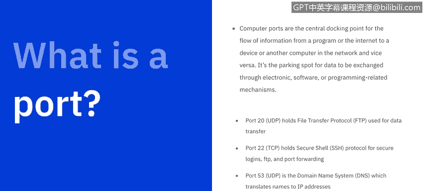

# 课程6：《网络威胁情报课程（IBM）》：15：14_端口扫描

## 概述

在本节课中，我们将学习端口扫描。我们将描述端口扫描是什么，以及我们能从中获得什么信息。我们还将了解Nmap和Zenmap这两款端口扫描应用程序。

---

## 什么是端口扫描？

根据美国国家标准与技术研究院的定义，**网络端口与服务识别**涉及使用端口扫描器来识别活动主机上运行的网络端口和服务（如FTP和HTTP），以及运行每个已识别服务的应用程序（如用于HTTP服务的Microsoft Internet Information Server或Apache）。

所有基础扫描器都能识别活动主机和开放端口，但有些扫描器还能提供关于被扫描主机的额外信息。

---

## 端口基础

让我们从基础开始：什么是端口？

计算机端口是信息从程序或互联网流向设备或网络中另一台计算机（反之亦然）的中心对接点。它是数据通过电子、软件或编程相关机制进行交换的“停车位”。

端口0到1023是众所周知的端口号，专为互联网使用而设计，尽管它们也可能有专门的用途。这些端口由互联网号码分配局管理。这些端口由苹果、MSN、SQL服务等顶级公司及其他知名组织持有。

您可能认识一些更突出的端口及其分配的服务，例如：
*   **端口20**（UDP）：文件传输协议，用于数据传输。
*   **端口22**（TCP）：SSH安全外壳协议，用于安全登录、FTP和端口转发。
*   **端口53**（UDP）：域名系统，将名称转换为IP地址。
*   **端口80**（TCP）：超文本传输协议。

端口号1024到49151被视为**注册端口**，意味着它们由软件公司注册。而端口49152到65536是**动态和私有端口**，几乎任何人都可以使用。

---

## 端口扫描原理

当这些端口被访问时，都会引发响应。因此，端口扫描器是一个简单的计算机程序，它检查所有这些端口，并会收到三种可能的响应之一：**开放**、**关闭**或**被过滤/丢弃/阻止**等。

*   如果端口**开放**或接受探测，计算机会响应并询问您需要什么。
*   如果端口**关闭**或未在监听，计算机会响应，确认其存在，但表明该端口当前正在使用且不可用。
*   如果端口**被过滤或阻止**，计算机甚至不会响应，您将得不到任何输入。

**端口扫描**是一种确定网络上哪些端口开放并可接收或发送数据的方法。它也是一个向主机上的特定端口发送数据包并分析响应以识别任何漏洞的过程。

---

## 常见的扫描类型

以下是五种常见的扫描类型：

**1. Ping扫描**
这是最简单的端口扫描，发送一个ICMP回显请求以查看谁在响应。

**2. TCP半开放扫描**
这可以说是最流行的扫描类型。它之所以流行，是因为它具有欺骗性且非常隐蔽。它也被称为SYN扫描或半开扫描。它发起连接但不完成，因此您能从探测中获得信息，但目标主机不会记录完整的连接信息。

**3. TCP连接扫描**
这是TCP半开放扫描的对应类型，它通过完成TCP连接更进一步。这使得它速度更慢、更“嘈杂”，意味着更容易被检测到。

**4. UDP扫描**
当您运行UDP端口扫描时，您会向每个端口发送一个空数据包或具有不同负载的数据包。**只有当端口关闭时，您才会收到响应**。它比TCP扫描快，但包含的数据量较少。

**5. 隐蔽扫描**
这些TCP扫描比所有其他选项都更安静，可以绕过防火墙，但仍然会被最新的入侵检测系统发现。

---

## 端口扫描工具：Nmap

这引出了最流行的端口扫描应用程序之一：**Nmap**。Nmap代表网络映射器，是一个用于网络探索和安全审计的开源工具。

它旨在快速扫描大型网络，尽管对单个主机也能很好地工作。Nmap以新颖的方式使用原始IP数据包来确定网络上有哪些主机可用、这些主机提供哪些服务（包括应用程序名称和版本）、它们运行的操作系统及其版本、以及正在使用何种类型的数据包过滤器或防火墙等数十种其他特征。

虽然Nmap通常用于安全审计，但许多系统和网络管理员发现它对日常任务也很有用，例如网络清单管理、管理服务升级计划以及监控主机或服务的运行时间。

---

## 图形化界面工具：Zenmap

最后是**Zenmap**，它仍然由Nmap开发，但提供了图形用户界面。这使得数据的呈现更加有用，整体应用程序也更容易使用。

---

## 总结

在本节课中，我们一起学习了端口扫描的基础知识。我们了解了端口的定义、分类以及端口扫描的工作原理。我们还介绍了五种常见的端口扫描类型，包括Ping扫描、TCP半开放扫描、TCP连接扫描、UDP扫描和隐蔽扫描。最后，我们认识了两款强大的端口扫描工具：命令行工具Nmap及其图形化界面Zenmap。理解端口扫描是识别网络潜在漏洞和进行安全评估的重要一步。