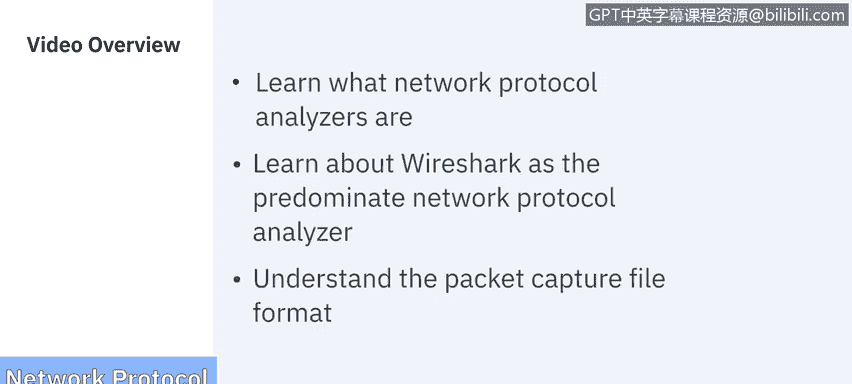
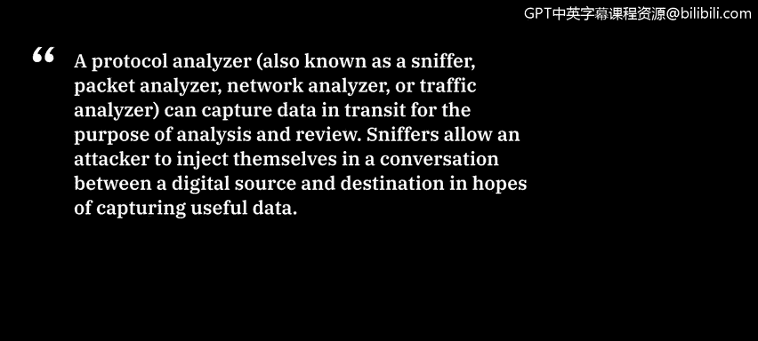

# 课程6：《网络威胁情报课程（IBM）》：16：网络协议分析器概述 🕵️

在本节课中，我们将学习什么是网络协议分析器，了解主流的分析器Wireshark，并探讨数据包捕获文件的格式。

## 什么是网络协议分析器？

上一节我们介绍了课程目标，本节中我们来看看网络协议分析器的基本概念。

一个协议分析器，也被称为嗅探器、数据包分析器、网络分析器或流量分析器，能够捕获传输中的数据，以便进行分析和审查。嗅探器允许攻击者将自己注入到数字源和目的地之间的对话中，以期捕获有用的数据。

这些网络嗅探器工作在OSI模型的数据链路层。这意味着它们不必遵守位于协议栈更高层的应用程序和服务所遵循的相同规则。嗅探器可以捕获线路上的一切并记录下来供后续审查。它们允许用户查看数据包中包含的所有数据。

## 主流分析器：Wireshark

了解了协议分析器的基本作用后，本节我们将聚焦于最主流的工具——Wireshark。

Wireshark是领先的嗅探器。Wireshark拦截流量并将二进制流量转换为人类可读的格式。这使得识别网络上的流量类型、流量大小、频率以及特定节点之间的延迟等信息变得容易。

以下是Wireshark的主要用户群体及其用途：
*   **网络管理员**：用于排查网络问题。
*   **安全工程师**：用于检查安全问题。
*   **质量保证工程师**：用于验证网络问题。
*   **开发人员**：用于调试协议实现。
*   **普通用户**：用于学习网络协议内部原理。

## Wireshark的核心功能

认识到Wireshark的广泛应用后，我们来看看它作为免费软件所提供的强大功能。

作为免费软件，Wireshark提供了令人印象深刻的功能集。

以下是Wireshark的主要功能列表：
*   对数百种协议进行深度检测，并且持续增加。
*   提供实时捕获和离线分析功能。
*   标配三窗格数据包浏览器。
*   支持跨多个平台运行，如Windows、Linux、macOS、FreeBSD、NetBSD等。
*   捕获数据可以通过图形用户界面或TTY模式下的`Tshark`实用程序浏览。
*   拥有业界最强大的显示过滤器。
*   提供丰富的VoIP分析功能。
*   可以读取和写入多种不同的捕获文件格式。
*   捕获文件可以用Gzip压缩，并可以即时解压。
*   可以从多种不同的媒体源读取实时数据。
*   支持对许多协议进行解密，包括IPsec、ISAKMP、Kerberos、SNMPv3、SSL/TLS、WEP和WPA/WPA2。
*   可以将着色规则应用于数据包列表，以便快速直观地分析。
*   输出可以导出为XML、PostScript、CSV、纯文本等多种格式。

## 数据包捕获文件

Wireshark之所以如此有影响力，关键在于它所捕获的数据。本节我们来探讨这些数据的存储格式——数据包捕获文件。

数据包捕获文件是进行文件分析的宝贵资源。在监控网络流量时，像Wireshark这样的数据包收集工具允许您收集网络流量并将其转换为人类可读的格式。

使用PCAP文件监控网络的原因有很多，以下是最常见的一些：
*   监控带宽使用情况。
*   识别未经授权的DHCP服务器。
*   检测恶意软件。
*   进行DNS解析分析。
*   用于事件应急响应。

Wireshark是世界上最流行的流量分析器。Wireshark使用PCAP文件来记录从网络扫描中提取的数据包捕获数据。这些数据被记录在扩展名为`.pcap`的文件中，可用于发现网络上的性能问题和网络攻击。

## PCAP文件格式变体

了解了PCAP文件的重要性后，我们来看看它的几种不同格式变体。

数据包捕获文件有四种不同的文件格式变体。

以下是四种主要的PCAP文件格式：
1.  **Libpcap**：`LIB`代表库。此格式用于基于Unix的系统，如Linux和macOS。
2.  **WinPcap**：这是Windows操作系统的变体。虽然Wireshark可以读取它，但它是一种较旧的格式，默认不再使用。
3.  **PCAPNG**：即“下一代”格式。这是Wireshark捕获数据包的默认格式，之所以被认为是下一代，是因为它既能捕获也能存储数据。
4.  **Npcap**：此格式仅由Nmap使用。Nmap是一个端口扫描应用程序，同时也具备捕获数据包的能力。

## 总结

本节课中，我们一起学习了网络协议分析器的基础知识。我们了解了协议分析器（或称嗅探器）的作用，深入探讨了最主流的工具Wireshark及其强大功能，并详细介绍了用于存储网络流量数据的数据包捕获文件的几种关键格式。掌握这些工具和概念是进行有效网络监控和安全分析的重要基础。