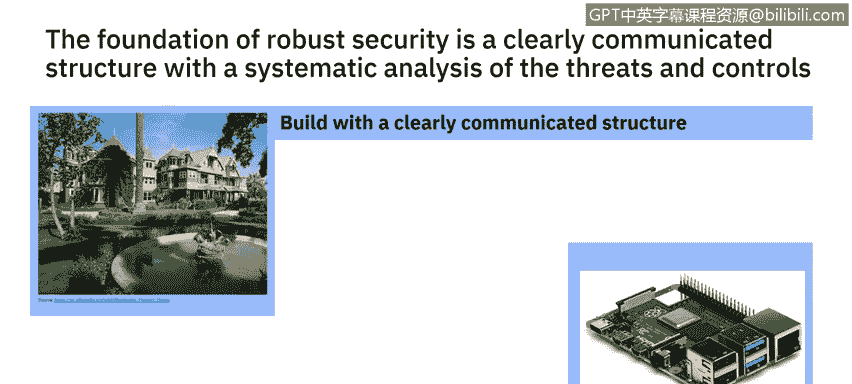
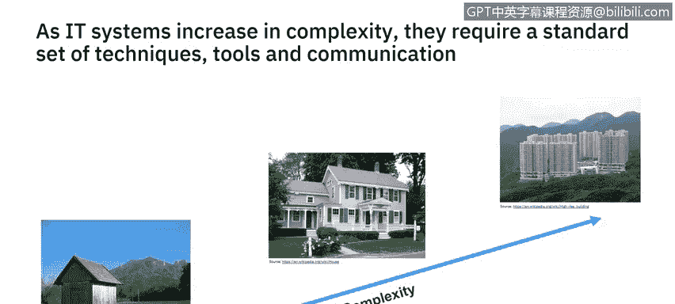

# 课程6：《网络威胁情报课程（IBM）》：17：16_安全架构特征

## 概述
在本节课程中，我们将学习安全架构的核心特征。我们将探讨为何架构思维至关重要，并通过实际案例理解如何系统性地构建安全控制措施，以形成一个健壮的安全架构。

---

## 安全架构的特征 🏗️

我是马克·巴克韦尔，是IBM专注于云转型安全的安全架构师。我加入IBM已有26年，最初是一名开放系统专家。我的第一个项目就需要一个高安全性的解决方案。此后，我持续参与了各种安全项目。我对安全架构充满兴趣，曾为IBM全球以及英国多所大学的硕士课程教授相关课程。真正吸引我的是以系统化方式构建安全控制措施，从而创建健壮安全架构的过程。

这是一个由四个短视频组成的系列，用于描述安全架构概念。第一个视频将解释安全架构的特征，包括为何架构思维很重要。接下来的视频将讨论不同类型的高层安全架构表示方法及其实际应用时机。第三个视频将探讨如何分解描述安全解决方案，以识别威胁并指定所需的安全控制措施。在最后一个视频中，我将讨论如何利用安全模式来加速基础设施和应用程序的安全开发。

现在，让我们从这个视频开始，解释安全架构的特征。

---

## 架构是良好安全的基础

我相信，架构构成了良好安全的基础。如何将安全措施组合在一起，与使用何种安全控制措施以及如何管理它们同等重要。

大家看到的这座房子是温彻斯特神秘屋，它是一个关于如何**不**应该建造房屋的绝佳例子。莎拉·温彻斯特在丈夫去世后继承了2000万美元。她招募了一支专门的木匠队伍，快速建造了160个房间，以至于没有人费心去绘制蓝图。她毫不犹豫地做出非正统的建筑决策：一段通向墙壁的楼梯、一个仅一英寸深的壁橱，以及一扇打开后是虚空的、不知通往何处的门。

这是一个很好的例子，说明了在没有架构师来定义房屋组件如何组合、没有项目经理来确保按规范建造的情况下，如何**不**去构建一个复杂系统。这对于安全架构同样适用。安全架构需要提供保证，确保解决方案被有效设计和构建，并将每个组件集成为一个系统。因此，**构建时需要有一个清晰传达的结构**。

---

## 系统性地分析威胁与控制

第二个教训是关于一个树莓派（Raspberry Pi）。美国喷气推进实验室（JPL）从事敏感研究，但也需要连接到互联网。2018年，一名员工带入了自己的树莓派，并将内部网络与互联网桥接，导致黑客窃取了约500 MB的数据。调查发现JPL的安全存在许多缺陷，包括缺乏检测网络上未经授权设备的机制，以及网络分段不足。

他们本可以更好地系统性地评估潜在威胁，并设计控制措施来应对这些威胁。因此，**系统性地分析威胁和控制措施会有所帮助**。

---

## 避免复杂性与无效安全

最后，不要像这个安全门一样构建安全措施。我们来谈谈复杂性，以及安全架构在何处最有效。

当建造一个棚屋时，一个人就可以完成，并且用一张纸片列出组件清单来规划即可。对于建造一所房子，则需要一个由熟练专业人员组成的团队，包括电工、水管工、木匠等。他们将按照建筑师提供的解决方案工作，并由项目经理管理。

随着复杂性的增加，例如香港的这些高层建筑，将涉及许多团队参与建设。将使用不同的技术和工具。规划将处于不同的抽象层次，高层架构展示整体解决方案而不包含具体细节。这个高层架构将被分解为每栋建筑的设计、每层楼的设计，然后是每个公寓单元的设计。

与其为每个楼层和单元创建单独的设计，不如定义一系列可以重用的模式。**模式**提供了一种快速开发相似系统或组件的方法。将为不同的专业领域制定专门的解决方案，例如电力解决方案、管道解决方案。这是对同一整体解决方案的不同视角，针对特定专业领域提供了更多细节。

IT架构也采用相同的方法，针对设计、交付和操作系统团队的不同成员，使用不同层次的抽象。可能会有一个整体系统的架构图，然后逐步分解为更多细节，直到有描述如何在机架中安装硬件的文档。将存在不同的视角，其中一个视角将是**安全**，用于识别系统内的安全能力。描述解决方案的每个文档都需要与团队中其他视角（无论是存储、平台还是可用性）相集成。所有这些都应使用系统化的方法来传达架构，该架构是使用一套标准的工具和技术创建的。使用标准化的沟通方式将使团队成员能够确保构建出健壮的系统。

---

## 架构思维 🧠

架构思维是关于创建和传达良好的结构与行为，旨在避免混乱。在IT系统中，我们谈论使用不同层次的抽象来描述架构，涵盖实施和运维两个方面。这需要一个谨慎的平衡，因为解决方案需要既经济实惠又安全可靠。

描述架构的方法有很多，但本质上，架构将由**静态结构**和**动态行为**组成。这是什么意思？

*   **静态结构**描述了组件将如何连接在一起。例如，用一根线连接两个组件，并不意味着它们会执行有用的功能。
*   **动态行为**描述了组件将如何随时间交互，包括通信如何被保护。

随着系统的组合，有一系列设计决策塑造着系统，在**安全性、可用性、韧性和成本**之间进行权衡。作为安全架构师，你需要考虑，安全不应凌驾于系统所需的其他特性之上。

---

## 总结
本节课中，我们一起学习了安全架构的核心特征。我们了解到，良好的安全需要坚实的架构基础，就像建造房屋需要蓝图一样。我们通过温彻斯特神秘屋和JPL树莓派事件等案例，明白了缺乏系统性规划和威胁分析的后果。最后，我们探讨了架构思维，认识到安全架构需要在静态结构、动态行为以及安全、成本、可用性等多重因素间取得平衡。在下一个视频中，你将了解不同类型的架构模型以及何时使用它们。