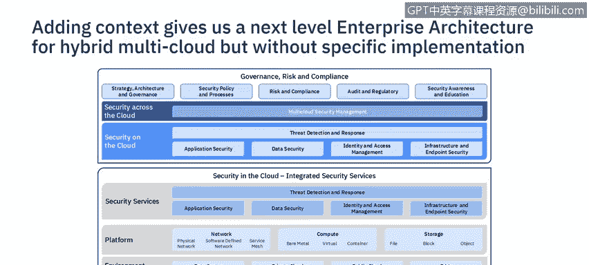
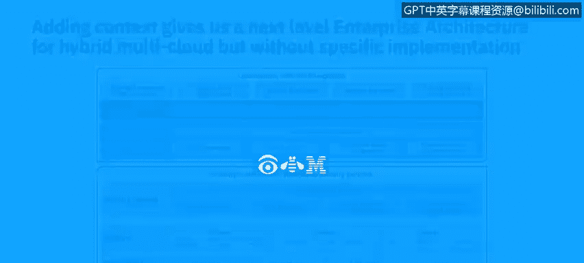

# 课程6：《网络威胁情报课程（IBM）》：18：17_高级架构模型

在本节课中，我们将要学习高级安全架构模型。我们将探讨高级架构模型的特征、不同抽象级别的表示方法，以及如何在实践中应用这些模型。

上一节我们介绍了架构对于构建健壮安全体系的重要性。本节中，我们来看看如何描述高级安全架构。

## 架构的定义

架构被定义为建筑的艺术。当建造一栋建筑时，通常从一个整体效果图开始，它提供了建筑外观的视觉概念。

它不定义建筑将如何建造，并且很少告诉我们背景信息。

在这个建筑示例中，它确实通过等高线和湖泊提供了一些背景信息，但它没有提供允许我们建造该建筑的细节。

在IT架构中，这可以被视为企业级架构。将会有进一步的图纸来提供系统背景和实现的细节。

## 高级架构的类型

我们可以将问题分解为更进一步的抽象级别：企业架构和解决方案架构。

以下是两种主要的高级架构类型：

*   **企业架构**：考虑整个企业的广泛范围。它以非常高的级别展示问题空间的主要组成部分，组件数量很少。它可能展示一些高层级的相互关系和背景，但非常概括。它可以展示流程、高层级业务服务或不同的领域，这种表示非常松散。
*   **解决方案架构**：随着我们分解问题，我们需要添加背景和技术组件。我们开始进入解决方案架构。现在我们开始添加关于环境和技术视角的背景。架构图变得更加复杂。

## 架构的表示方法

我们使用所谓的构建块来表示这些架构。

这些构建块用于表示业务需求。它可以是一个能力、领域或业务服务。这些构建块代表一个松散耦合的分组。

以下是不同级别的构建块：

*   **企业级**：架构构建块是高层级的指导性组件，指导解决方案架构的开发。架构构建块是产品和供应商中立的。
*   **解决方案架构级**：解决方案构建块指定实现功能的技术组件或特定产品。根据平台和环境添加上下文。它们可能是产品或供应商相关的。

## 构建块示例

在这个示例中，我们有五个高层级的架构构建块。

它们是通用的安全领域，如数据和应用程序安全。它们不是特定的安全功能。

而解决方案构建块则展示了安全功能，如证书颁发机构或应用程序防火墙，但在此示例中不特定于任何供应商或产品。

## 企业架构示例

这是一个混合多云企业安全架构的高层级示例，其中架构构建块显示有五个逻辑安全领域，由物理安全支持。

由于这是关于多云安全的，它显示了与多云安全管理进行集成，并通过治理、风险和合规进行监督。

这是一个很好的高层级领域集合，有助于组织项目或分解问题，但它没有告诉我们有关技术、能力或环境的任何背景信息。

## 详细的企业架构示例

在这个企业架构示例中，我们开始添加安全能力的分组，以提供每个领域构成的更多细节。

但它仍然没有任何背景信息。这可以作为热图来描述所提供能力的成熟度。

我曾见过组织使用这种图表来评估成熟度，然后将能力标记为红色、琥珀色或绿色，以便专注于安全控制的补救。

## 下一层级的细节

在这个企业安全架构中，我们将安全领域分为内置到云基础设施中的安全控制和添加到云基础设施之上的安全。

对于内置安全领域，控制可以部署到网络、计算和存储平台上，然后进一步分解。

对于网络，控制可以位于物理底层网络、软件定义的覆盖网络以及使用服务网格的容器通信中。

然后，这些平台中的每一个都可以部署到不同的环境中：企业内部数据中心、私有云、公共云和边缘计算服务。

相同的安全领域用于内置安全和附加安全，因为每个云都不同，包含的内容不同，并且通常需要安全作为附加组件。

在图的顶部，再次显示了多云安全管理，以集成每个环境。

总体而言，需要治理、风险和合规来确保安全有效运作。

这种架构图用于描述在特定IT环境背景下需要考虑的安全控制的不同视角维度。

在这种情况下，它帮助安全架构师描述混合多云环境中安全控制的复杂性。

它可以用于讨论跨不同环境对通用IT和安全平台的需求。否则，这会导致复杂性增加，从而导致成本上升和安全有效性降低。

所有这些架构图都是在非常高的层级上看到的，它们不描述物理实现。

在下一个视频中，您将进一步了解解决方案架构的表示方法，因为解决方案被分解为具体的实现。

本节课中我们一起学习了高级安全架构模型，包括其定义、类型、表示方法以及通过具体示例了解了不同抽象级别的架构图如何帮助我们描述和理解复杂的安全环境。