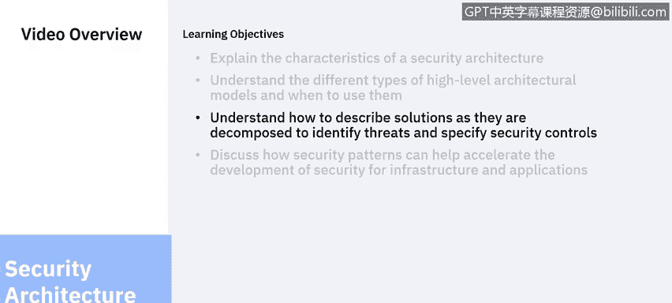
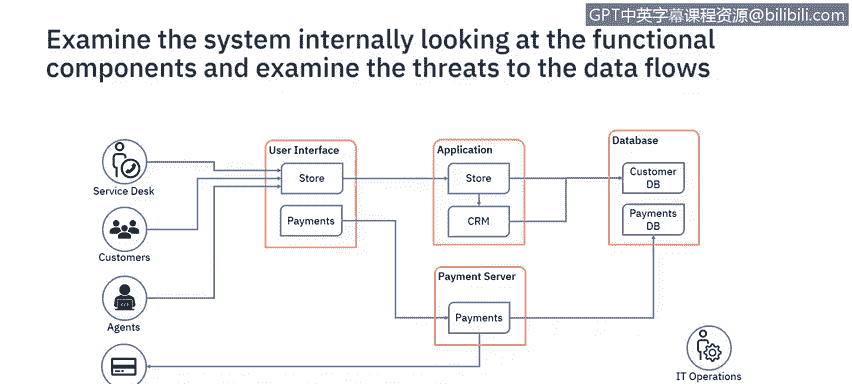
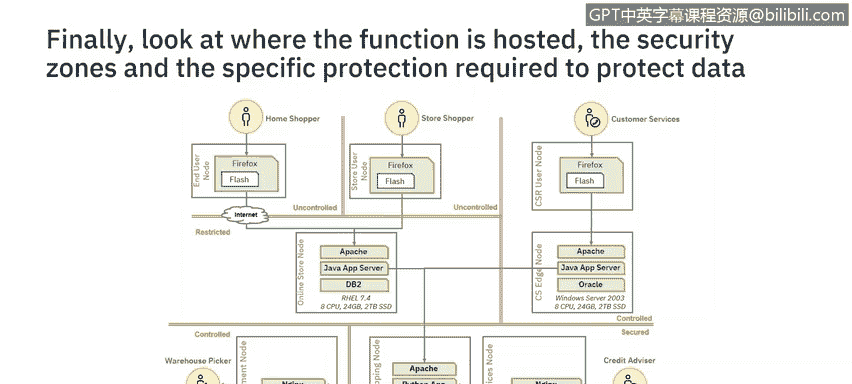

# 课程6：《网络威胁情报课程（IBM）》：19：18_解决方案架构

## 概述
在本节课程中，我们将学习如何描述安全解决方案架构。我们将探讨解决方案架构模型、不同抽象级别的表示方法，以及如何在实践中应用这些表示方法。在安全解决方案架构的开发过程中，我们将识别威胁并指定具体的控制措施。

## 架构开发步骤
架构开发通过一系列步骤进行，从整体的企业架构分解到具体的解决方案。

上一节我们介绍了企业安全架构的概念，本节中我们来看看如何描述安全解决方案架构。

这张幻灯片展示了从整体企业架构到详细操作模型的不同表示级别，详细操作模型会指定不同的硬件组件。不同架构之间存在重叠，边界并非总是清晰，有时会使用混合版本的图表。

这些图表将从两个角度使用：一是作为安全架构师，支持更广泛团队正在开发的解决方案；二是作为安全架构师，设计需要考虑IT架构所有方面的安全服务。

本视频将重点介绍如何为解决方案指定安全措施，包括架构概述、系统上下文、功能模型和操作模型。在开始之前，您可以暂停视频，思考构成此架构的不同层级。

## 架构概述
一旦明确了需要设计和交付的解决方案，下一步就是记录架构概述。

架构概述是一个高级概念图。该图没有特定格式，但需要足以传达您试图开发的概念。它使项目能够以系统的初始视图启动，但此图尚未考虑安全性。

## 系统上下文
可以通过首先识别系统边界来考虑安全性。

以下是识别系统边界时需要考虑的要素：
*   **参与者**：位于系统外部，可以是人或系统。
*   **用例**：每个参与者执行的活动。
*   **数据流**：这些用例处理的数据将流入和流出系统。

安全控制措施保护的对象正是这些数据以及执行这些用例的可用性。因此，创建系统上下文将记录需要保护的外部数据流，并考虑参与者和用例。然后，我们可以对正在处理的数据类型进行分类，基于策略，这将指导所需的安全控制措施以及可能使用的环境。

了解这些信息后，我们就可以开始考虑系统内部的安全性。

## 功能模型
系统外部的参与者和数据流会启动系统内部的数据流。

因此，下一步是记录系统的功能组件以及这些组件之间的交互。每个交互都将包含一个数据流。在此级别，我们还可以查看系统内的威胁参与者，并开始识别保护传输中和静态数据所需的控制措施。

在此级别，我们记录的是应用程序功能，而不是系统将如何实施和操作。我们需要另一张图来实现后者。

## 操作模型
需要识别实现应用程序功能所需的能力。

以下是构建操作模型时的关键步骤：
*   根据数据分类和具体实现，将组件放置在不同数据分类的区域中。
*   根据组织的策略和标准，开始识别安全控制措施。
*   在此级别，需要讨论具体的技术或产品决策，例如某个版本的Flash或Windows 2003在组织中是否可接受。
*   为了支持环境，可能会开始识别新的参与者，例如安全运营团队。需要确定此能力是外包还是内部运营。如果外包，则需要更新安全上下文以包含新的参与者，该参与者将具有新的用例和需要在传输及静态时保护的数据。

需要考虑的方面还有很多，但希望这能让您了解如何使用架构思维来系统地思考安全性。

## 关键考量问题
随着架构的详细阐述，可以提出一些问题来完善设计。

以下是一些在架构细化过程中需要回答的关键问题：
*   **谁**是执行安全措施的利益相关者或参与者？
*   **何处**是每个系统、组件和参与者的位置？
*   **何时**需要安全控制措施？最好有实施的优先级。
*   **为何**需要该系统？这有助于确定控制措施及其实施的优先级。
*   **什么**需要被保护？
*   **如何**保护数据？

思考所有这些类型的问题将是一个迭代的过程，早期的图表会被更新，后期的图表也会随之更新以反映这些要求和改进。

## 总结
本节课中，我们一起学习了安全解决方案架构的描述方法。我们从架构概述开始，逐步深入到系统上下文、功能模型和操作模型，了解了如何通过识别参与者、数据流和威胁来系统地设计和指定安全控制措施。我们还探讨了在架构开发过程中需要迭代回答的关键问题。在下一个视频中，我们将讨论如何通过使用不同的安全模式来加速解决方案的实施。