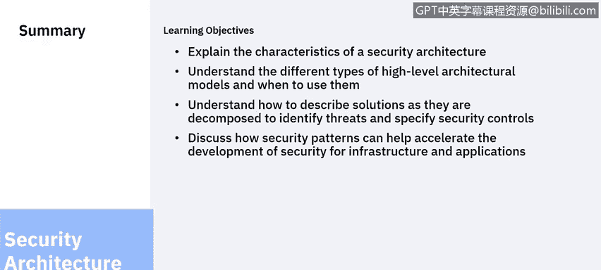

# 课程6：《网络威胁情报课程（IBM）》：20：19_安全模式

欢迎回到安全架构概念单元。在上一个视频中，我们讨论了如何描述一个解决方案。在本单元中，我们将继续探讨如何利用模式来加速系统设计。

## 概述

在本节课中，我们将要学习什么是架构模式，以及如何利用现有的、经过验证的模式来加速安全解决方案的设计过程，避免重复劳动并遵循最佳实践。

## 什么是架构模式？

上一节我们介绍了解决方案架构的描述方法，本节中我们来看看如何利用模式来提升设计效率。

架构模式是针对常见问题的可复用解决方案。它基于最佳实践提供了一个模板，帮助你解决部分问题。模式本身并非一个完整的解决方案，因为它没有考虑具体解决方案的上下文环境。

## 模式的类型与来源

模式有多种不同的格式和来源。在较高层次上，来自IBM云架构的示例可以提供一个起点。有时，模式由软件供应商提供，用以说明如何使用他们的软件；而在其他情况下，模式是通用的。

以下是模式的主要类型与作用：

*   **供应商特定模式**：这些模式展示了软件预期使用方式，并提供了快捷的实现路径。
*   **通用模式**：存在许多更通用的模式，它们能帮助提供不同层次的细节。有些模式甚至详尽如RBM参考手册，记录了完整的、经过测试的解决方案，描述了如何将它们组合在一起。

## 模式的应用价值

在开始设计之前，始终应寻找通用模式，这有助于识别最佳实践、遵循最佳实践并缩短开发周期。

## 单元内容回顾与总结

最后，让我们回顾一下本单元所讲授的内容。

我讨论了安全架构的特征。随着系统复杂性的增加，我们需要一套标准的工具和技术，使我们能够清晰地沟通良好的结构和行为，其目的是避免混乱。我们在温彻斯特神秘屋中看到了混乱，我们不希望在我们构建的系统中重蹈覆辙。

我讨论了不同的高层架构模型。企业架构可用于在组织层面进行沟通，提供系统组件的概览，而无需深入实现细节。我演示了三种不同的视角，并讨论了它们各自的用途。

我讨论了解决方案架构，它帮助我们识别威胁以及保护传输中和静态数据所需的控制措施。不同抽象层次的图表将有助于我们的架构思考过程。

我还讨论了如何通过利用经过验证的架构模式来加速解决方案的设计。

本节课中我们一起学习了安全架构的核心概念、不同层次的模型以及利用架构模式进行高效设计的方法。这就是本单元最后一个视频的结尾。感谢聆听，祝你在将安全融入解决方案的架构设计中一切顺利。

