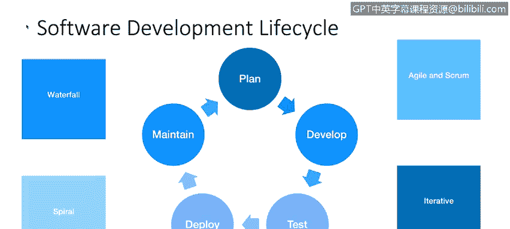
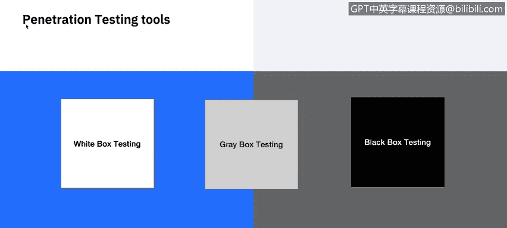

# 课程6：《网络威胁情报课程（IBM）》：6：应用安全概述

在本节课中，我们将学习应用安全的核心概念。我们将了解应用安全的定义、关键术语、它与网络安全的区别，以及常见的软件开发周期。此外，我们还将探讨识别应用漏洞的不同技术，如静态和动态分析。

## 应用安全定义

应用安全包含为提升应用安全性而采取的措施，通常通过发现、修复和预防安全漏洞来实现。不同的技术被用于在应用生命周期的不同阶段（如设计、开发、部署、升级和维护）发现此类安全漏洞。

## 关键术语与概念

在回顾应用生命周期之前，我们先确保理解一些关键术语，以及应用安全如何与我们其他课程和模块中涵盖的整体信息安全相契合。

**网络安全** 是在网络层面对系统和信息资产的保护，通常涉及路由器、交换机、服务器、工作站和无线网络等领域。防火墙、入侵防御系统和数据防泄漏等技术被用于保护这些系统。此外，补丁管理工具和漏洞扫描器用于发现和预防网络级别的安全弱点。这些都是我们在本课程之前讨论过的主题。

**应用安全** 则是在软件层面对应用前端、源代码和信息资产的保护，涉及网站、数据库、移动应用以及客户端和服务器应用等系统。Web应用防火墙和源代码分析器等技术被用于保护应用。像Windows、Mac OS和Linux这样的操作系统在技术上同时属于这两个类别，但通常被认为是网络安全的一部分。

网络安全和应用安全都是整体信息安全计划的组成部分，该计划还包括策略、程序、事件响应和灾难恢复。无论与网络系统和应用环境相关的具体威胁和漏洞是什么，网络安全和应用安全都共同协作，以支持业务的更大利益和整体IT风险缓解。

以下是关于应用安全需要回顾的其他几个术语。

*   **威胁**：指发生安全违规及其将造成损害的可能性。例如，如果你在加利福尼亚州有一个数据中心，地震就是一种威胁。在应用安全中，最大的威胁是恶意软件和黑客。
*   **风险**：指攻击发生的可能性。比较地震袭击旧金山数据中心与芝加哥数据中心的风险。应用风险是指恶意软件或黑客攻击破坏应用**机密性、完整性或可用性**（即CIA三要素）的可能性。
*   **漏洞**：指代码中的安全缺陷。已知的软件漏洞可以通过打补丁来降低攻击风险。未知的软件漏洞或零日漏洞则更难防范。

## 软件开发周期

不同的技术会发现应用中潜伏的不同安全漏洞子集，并且在软件生命周期的不同阶段最为有效。它们各自代表了在时间、精力、成本和发现的漏洞之间的不同权衡。我们将在本课后面探讨其中一些技术。

在软件开发生命周期中适当运用这些技术，将使应用安全团队的作用最大化。根据组织的具体指导方针，你会看到计划、开发、测试、部署和维护等软件开发生命周期的不同变体。每个组织可能对各个阶段有独特的称呼，并且会确定最适合其软件或在其行业内推荐的软件开发方法。

以下是常见的软件开发方法。

*   **瀑布模型**：这是一种自上而下的开发方法，在过去最为常见。它简单且易于遵循，但灵活性不高。如果在应用部署后发现设计缺陷，代价可能会很高。
*   **敏捷开发**：与瀑布模型的自上而下方法不同，敏捷开发由分析、设计、编码和测试的短周期冲刺组成。这种方法响应迅速，并能激励团队提高生产力。然而，在满足周期截止日期的压力驱动下，更容易忘记应用安全测试。
*   **Scrum**：这是一种敏捷开发方法，专注于通常为一到四周的冲刺周期。
*   **螺旋模型**：与敏捷和Scrum一样，螺旋软件开发方法是为了应对自上而下的瀑布模型的局限性而发明的。它专注于最小化风险，这使得在每个周期结束时评估安全性成为可能。然而，它不如敏捷方法快速，这可能会增加软件开发成本。
*   **迭代开发**：这种软件开发形式通过重复的周期将开发分解为更小的原型，允许从早期迭代中吸取教训。然而，如果规划周期太短，某些安全需求可能会被遗漏。

## 应用安全测试技术

在应用测试期间，应进行渗透测试以检查软件的漏洞。渗透测试分为三类。

*   **白盒测试**：为攻击者提供关于他们目标系统的详细信息。这绕过了通常在攻击前进行的许多侦察步骤，缩短了攻击时间，并增加了发现安全漏洞的可能性。
*   **黑盒测试**：在攻击前不向攻击者提供任何信息。这模拟了外部攻击者在发起攻击前试图获取有关业务和技术环境信息的情况。
*   **灰盒测试**：也称为部分知识测试，有时被选择来平衡白盒和黑盒渗透测试的优缺点。当需要黑盒测试结果，但成本或时间限制意味着需要一些知识来完成测试时，这种方法最常见。

用于识别应用漏洞的常见技术包括以下几种。

*   **静态应用安全测试**：这是一种经常被用作源代码分析工具的技术。该方法在应用启动前分析源代码以查找安全漏洞，并用于加强代码。这种方法产生的误报较少，但对于更多实现，需要访问应用程序源代码，并且需要专家配置和大量处理能力。
*   **动态应用安全测试**：这是一种通过将URL输入自动化扫描器来查找可见漏洞的技术。这种方法高度可扩展，易于集成且快速。其缺点在于需要专家配置，并且存在较高的误报和漏报可能性。
*   **交互式应用安全测试**：这是一种使用软件插桩从内部评估应用的解决方案。该技术允许IAST结合SAST和DAST的优势，并提供对代码、HTTP流量、库信息、后端连接和配置信息的访问。一些IAST产品需要在应用被攻击时使用，而另一些则可以在正常的质量保证测试期间使用。

## 总结

在本节课中，我们一起学习了应用安全的基础知识。我们定义了应用安全，并区分了它与网络安全。我们回顾了威胁、风险和漏洞等关键术语。接着，我们探讨了不同的软件开发周期及其对安全的影响。最后，我们介绍了用于识别漏洞的各种测试技术，包括静态、动态和交互式应用安全测试。理解这些概念对于构建和维护安全的应用程序至关重要。