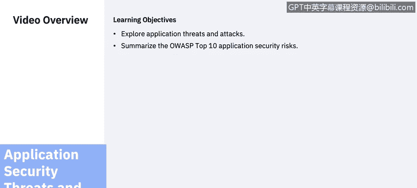
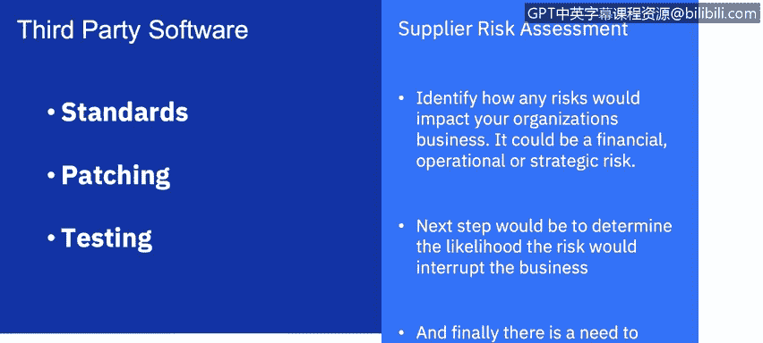
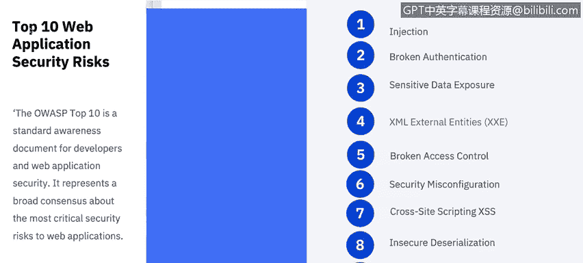

# 课程6：《网络威胁情报课程（IBM）》：22：应用安全威胁和攻击

在本节课中，我们将要学习应用安全威胁和攻击，并总结OWASP十大应用安全风险。

## 供应商风险评估

上一节我们讨论了内部开发的应用程序，本节中我们来看看第三方应用程序。在组织选择任何第三方软件（尤其是关键任务软件）之前，应用安全专业人员应评估风险，并询问有关软件开发所用安全标准的问题。了解安全补丁和第三方使用的任何测试标准也很重要。

对获取第三方软件给组织业务带来的风险进行正式分析的过程，称为供应商风险评估。

以下是供应商风险评估的关键步骤：
1.  识别风险将如何影响组织的业务。这可能是财务、运营或战略风险。
2.  确定风险中断业务的可能性。
3.  识别风险将如何影响业务。

某些风险可能过高，以至于可能需要改变业务流程或评估其他软件。

## Web应用防火墙

应用安全的另一个重要组成部分是安装Web应用防火墙。

Web应用防火墙过滤、监控和阻止进出Web应用程序的HTTP流量。

WAF与常规防火墙的区别在于，WAF能够过滤特定Web应用程序的内容，而常规防火墙则通过检查HTTP流量充当服务器之间的安全网关。通过检查HTTP流量，它可以防止源自Web应用程序安全漏洞的攻击，例如：
*   **SQL注入**
*   **跨站脚本**
*   **文件包含**
*   **安全配置错误**

## 常见威胁与攻击

那么，应用程序有哪些最常见的威胁和相关攻击呢？以下是主要类别：

**输入验证**：攻击者修改现有应用程序的运行时行为以执行未经授权的操作，通过二进制修补、代码替换或代码扩展进行利用。
*   常见攻击包括**跨站脚本**（我们将在后续课程中深入探讨）。
*   **SQL注入**（我们在之前的课程中探讨过）。
*   **缓冲区溢出**。

**身份验证**：验证个人身份的过程。
*   常见攻击包括**暴力破解攻击**、**凭据窃取**和**网络窃听**。

**授权**：指定对资源的访问权限和特权的功能。
*   一种非常常见的授权攻击是**权限提升**。我们将在下一节关于数据泄露的课程中看到几个例子。

**配置管理**：典型的配置管理攻击包括：
*   未经授权访问管理界面。
*   未经授权访问配置存储。
*   检索客户端配置数据。
*   缺乏个人问责制。
*   进程和服务帐户权限过高。

**异常管理威胁**：例如**拒绝服务攻击**，这是一种网络攻击，攻击者试图通过暂时或无限期地中断连接到互联网的主机服务，使目标机器或网络资源对其预期用户不可用。

**审计与日志记录**：是应用程序的另一个常见威胁。
*   一些攻击包括：用户否认执行了操作、攻击者利用应用程序而不留痕迹，或攻击者掩盖其踪迹。

## OWASP十大应用安全风险

在应用安全领域工作时，应参考许多行业资源。让我们简要了解一下OWASP十大Web应用安全风险。

**1. 注入**
当不可信的数据作为命令或查询的一部分发送给解释器时，就会发生注入漏洞。攻击者的恶意数据可以欺骗解释器执行意外命令或在未经适当授权的情况下访问数据。

**2. 失效的身份认证**
与身份认证和会话管理相关的应用程序功能通常实施不正确，允许攻击者破坏密码、密钥或会话令牌，或利用其他实施缺陷暂时或永久地冒充其他用户身份。

**3. 敏感数据泄露**
许多Web应用程序和API未能妥善保护敏感数据，如财务、医疗和个人身份信息。攻击者可能窃取或修改此类保护薄弱的数据以进行信用卡欺诈、身份盗窃或其他犯罪。敏感数据如果没有额外的保护（如静态或传输中的加密），在与浏览器交换时可能需要特殊预防措施，否则可能会被泄露。

**4. XML外部实体**
许多旧版或配置不当的XML处理器会评估XML文档中的外部实体引用。外部实体可用于通过文件URI处理器披露内部文件、内部文件共享、内部端口扫描、远程代码执行和拒绝服务攻击。

**5. 失效的访问控制**
对已认证用户允许执行的操作的限制通常没有得到正确执行。攻击者可以利用这些缺陷访问未经授权的功能和/或数据，例如访问其他用户的帐户、查看敏感文件、修改其他用户的数据或更改访问权限。

**6. 安全配置错误**
安全配置错误是最常见的问题。这通常是默认配置不安全、不完整或临时配置、开放的云存储、配置错误的HTTP标头以及包含敏感信息的详细错误消息的结果。不仅所有操作系统、框架、库和应用程序必须安全配置，而且必须及时打补丁和升级。

**7. 跨站脚本**
每当应用程序在没有适当验证或转义的情况下将不可信数据包含在新网页中，或使用可以创建HTML或JavaScript的浏览器API，用用户提供的数据更新现有网页时，就会发生XSS漏洞。XSS允许攻击者在受害者的浏览器中执行脚本，从而可以劫持用户会话、篡改网站或将用户重定向到恶意网站。

**8. 不安全的反序列化**
不安全的反序列化通常会导致远程代码执行。即使反序列化漏洞没有导致远程代码执行，它们也可用于执行攻击，包括重放攻击、注入攻击和权限提升攻击。

**9. 使用含有已知漏洞的组件**
库、框架和其他软件模块等组件以与应用程序相同的权限运行。如果易受攻击的组件被利用，此类攻击可能导致严重的数据丢失或服务器被接管。使用含有已知漏洞的组件的应用程序和API可能会破坏应用程序防御，并引发各种攻击和影响。

**10. 不足的日志记录和监控**
不足的日志记录和监控，加上与事件响应缺失或无效的集成，使得攻击者能够进一步攻击系统、维持持久性、横向移动到更多系统，以及篡改、提取或销毁数据。大多数数据泄露研究表明，检测到漏洞的时间超过200天，通常是由外部方而非内部流程或监控发现的。

## 总结

本节课中我们一起学习了应用安全的核心威胁与攻击。我们首先探讨了第三方软件的供应商风险评估流程，然后介绍了Web应用防火墙的作用。接着，我们梳理了输入验证、身份验证、授权等关键领域的常见攻击类型。最后，我们详细解读了行业权威的OWASP十大应用安全风险，涵盖了从注入、失效身份认证到不足的日志监控等关键漏洞。理解这些威胁是构建安全应用程序和有效防御的基础。