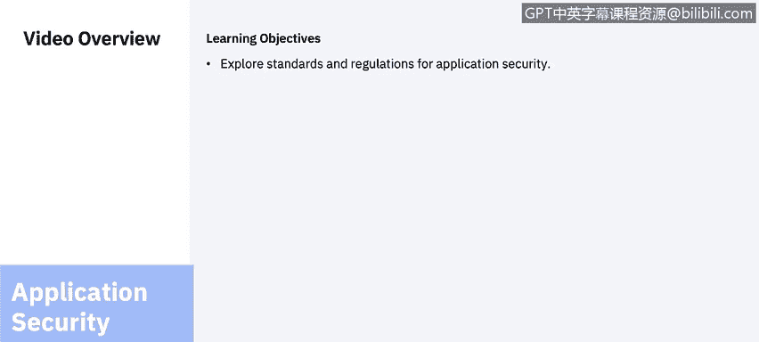
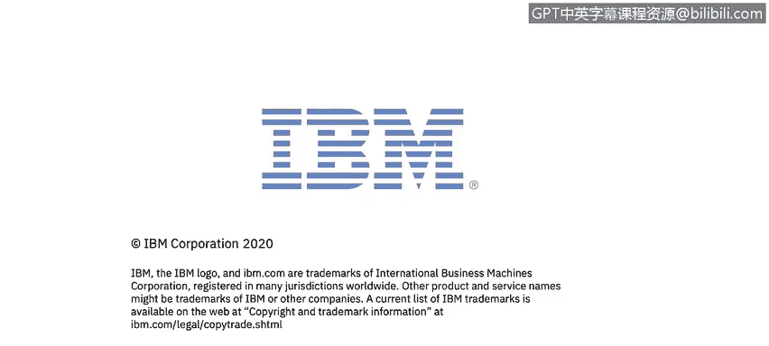

网络威胁情报课程：6：应用安全标准和规范

在本节课中，我们将要学习应用安全领域的相关标准和规范。我们将首先探讨威胁建模的概念与方法，然后深入了解一系列重要的安全标准和法规，最后回顾一些关键的合规性要求。

在开始标准和合规性审查之前，我们先花几分钟了解一下威胁建模。

威胁建模是一个系统性的过程，用于识别、列举潜在威胁（如结构性漏洞或缺乏适当防护措施），并确定缓解措施的优先级。其目的是根据系统性质、可能的攻击者画像、最可能的攻击向量以及攻击者最想获取的资产，为防御者提供关于需要包含哪些控制或防御措施的分析。

有多种威胁建模方法可供实施。通常，威胁建模采用以下四种方法之一：独立资产中心法、攻击者中心法或软件中心法。

以下是几种最著名的方法论介绍。

**STRIDE** 威胁建模方法由微软于1999年提出，为开发人员提供了一个用于发现产品威胁的助记符。微软还开发并发布了其他威胁建模方法，如 STRIDE 模式和实践以及资产入口点分析。

**PASTA** 代表攻击模拟与威胁分析过程，这是一种七步式的以风险为中心的方法论。它提供了一个七步流程，用于协调业务目标和技术要求，同时考虑合规性问题和业务分析。该方法旨在提供一个动态的威胁识别、列举和评分过程。威胁模型完成后，安全领域专家会对已识别的威胁进行详细分析，最终列举出适当的安全控制措施。此方法旨在提供应用程序和基础设施的攻击者中心视图，以便防御者能据此制定资产中心的缓解策略。

接下来，**Trike** 方法论的重点是将威胁模型用作风险管理工具。在此框架内，威胁模型用于满足安全审计流程。威胁模型基于需求模型建立，需求模型则定义了利益相关者为每类资产设定的可接受风险水平。对需求模型的分析产生威胁模型，从中列举威胁并分配风险值。完成的威胁模型用于构建基于资产、角色、行动和计算风险敞口的风险模型。

最后，**VAST** 是可视化、敏捷和简单威胁建模的缩写。该方法论的基本原则是，有必要将威胁建模过程扩展到整个基础设施和软件开发生命周期，并无缝集成到敏捷软件开发方法中。它旨在为不同利益相关者（如应用架构师、开发人员、网络安全人员和高级管理人员）的独特需求提供可操作的输出。该方法论提供了一种独特的应用程序和基础设施可视化方案，使得创建和使用威胁模型不需要特定的安全领域专业知识。

---

在讨论了威胁建模之后，我们来看看具体的应用安全标准和法规。安全标准在所有安全领域都很重要，但对于阻止组织内部的攻击而言，可能是最重要的。

以下是作为分析师或任何网络安全专业人士应该熟悉的一些额外标准。

**CERT C 编码标准** 是针对 C 编程语言的软件编码标准，由 CERT 协调中心开发，应用于提高软件系统的安全性、可靠性和安全性。

**CWE**，即通用缺陷枚举，是一个软件缺陷和漏洞的分类系统。它是一个由社区项目维护的项目，目标是理解软件中的缺陷，并创建可用于识别、修复和预防这些缺陷的自动化工具。该项目由美国国家网络安全 FFRDC（联邦资助的研发中心）赞助，由 MITRE 公司运营，并得到美国 CERT 和美国国土安全部国家网络安全部门的支持。

**DISA STIG**，即国防信息系统局安全技术实施指南，是一套网络安全方法，用于标准化网络、服务器、计算机和逻辑设计中的安全协议，以增强整体安全性。实施这些指南可以增强软件、硬件、物理和逻辑架构的安全性，从而进一步减少漏洞。

另一组应用安全标准来自**国际标准化组织**，是整体信息安全管理标准的一部分。特别是 **ISO 27034**，它描述了当应用安全控制所要求的活动被预应用安全理由取代时的最低要求。映射到 PSR 的 ASC 定义了后续应用程序的预期信任级别。以及 **ISO 24772**，这是一项关于信息技术和编程语言的标准，它通过语言选择和使用为如何避免编程语言中的漏洞提供了指导。

另一个金融行业标准是 **PCI DSS**，即支付卡行业数据安全标准。该标准由卡品牌强制要求，但由支付卡行业安全标准委员会管理。制定该标准是为了加强对持卡人数据的控制，以减少信用卡欺诈。

最后，**NIST SP 800-53** 为所有美国联邦信息系统（国家安全相关系统除外）提供了安全和隐私控制目录。它由美国国家标准与技术研究院发布，该机构是美国商务部的一个非监管机构。

---

合规性控制与测试在应用安全中也扮演着重要角色。我将回顾一些作为网络安全专业人士应该了解的监管法规，其中大部分可能是复习，但值得再次提及。

**GLBA**，即格雷姆-里奇-比利雷法，也称为 1999 年金融服务现代化法案。在 GLBA 于 1999 年成为法律之前，金融机构之间存在严格的政府界限。银行、保险公司和信用卡提供商在可提供的服务以及彼此之间可共享的信息方面受到严格限制。GLBA 在一定程度上放松了这些规定，但这种增加的灵活性引发了人们对可能产生深远影响的隐私问题的担忧。因此，该法案对即使在同一公司的子公司之间可以交换的信息类型也包含了许多限制。

**HIPAA**，即 1996 年健康保险流通与责任法案，主要旨在实现医疗保健信息流的现代化，规定如何保护医疗保健和医疗保险行业维护的个人可识别信息免受欺诈和盗窃，并解决医疗保险覆盖范围的限制问题。

**SOX**，即 2002 年萨班斯-奥克斯利法案，是一项美国联邦法律，为所有美国上市公司董事会、管理层和公共会计师事务所制定了新的或扩展的要求。该法案的若干条款也适用于私营公司，例如故意销毁证据以妨碍联邦调查。

所有这些法规，都是我们在早期课程的合规部分已经涵盖的法规之外的补充。

---

本节课中，我们一起学习了应用安全的核心组成部分。我们首先介绍了威胁建模的概念及其主要方法论（如 STRIDE、PASTA、Trike 和 VAST），它们为系统化分析安全威胁提供了框架。接着，我们探讨了关键的安全标准和规范，包括 CERT C、CWE、DISA STIG、ISO 27034/24772、PCI DSS 和 NIST SP 800-53，这些是构建安全应用的基石。最后，我们回顾了重要的合规性法规 GLBA、HIPAA 和 SOX，它们从法律层面规定了特定行业的数据保护要求。可以看到，基于安全指南进行开发以及满足合规性要求，都是应用安全不可或缺的重要部分。