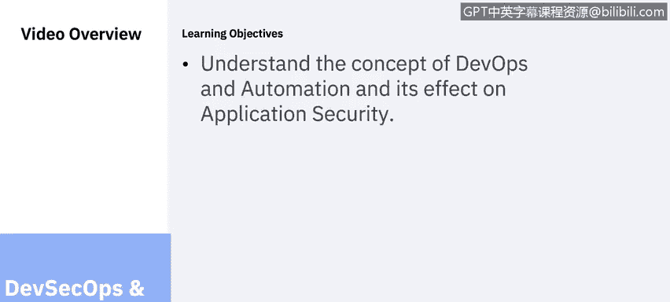
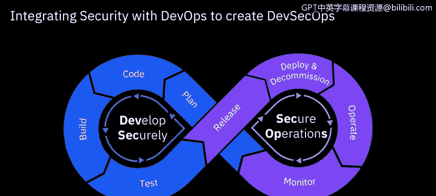
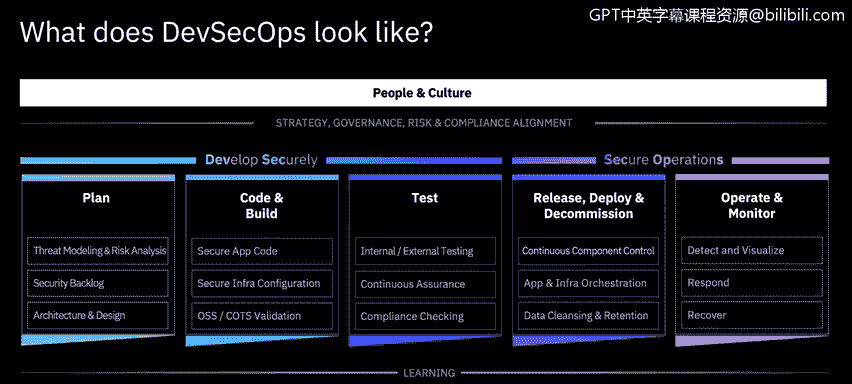
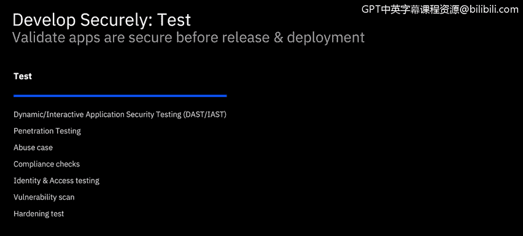
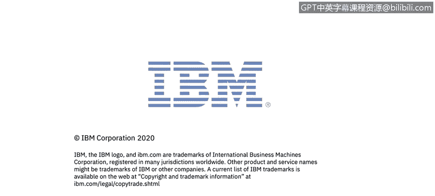

# 课程6：《网络威胁情报课程（IBM）》：24：23_DevSecOps概述

在本节课中，我们将要学习DevSecOps和安全自动化的概念，了解DevOps与自动化如何影响应用安全，并探讨如何将安全实践无缝集成到快速开发和部署流程中。

---

随着云计算的普及，人们对创新和资源供给速度的期望也随之提高。传统的安全检查与测试流程通常被视为会降低这种速度。因此，组织现在必须寻找方法，在确保部署安全的同时，不抑制快速的创新。

为了促进快速开发、创新和资源供给，安全实践必须跟上云时代的敏捷步伐。规划周期变得更短，部署更频繁，迭代次数也根据需要而增加。部署本身变得更小，并通过一致的流水线遵循更标准化的方法。自动化和自助服务正在缩短从构建到部署的时间。团队被赋予了一定程度的自主权。

DevOps的出现，源于开发团队和运维团队的不同关注点。开发团队主要专注于快速生产新系统、应用和功能，并尽快交付给用户。而运维团队则从完全不同的角度出发，他们的首要任务是确保系统的响应性和稳定性。

DevOps理念弥合了这一差距，它促进集成、协作与沟通，以确保在开发速度与质量之间取得平衡。开发工程师在快速、自主地开发，同时与运维工程师并肩工作，以确保部署的质量和无缺陷。

但是，应用的安全性和无漏洞性呢？如何确保遵守可能不断变化的法规？如何确保所有开发工作都能保护数据和知识产权，并提供相应的防护与问责？

无论是DevOps工程师还是安全工程师，都希望发布易于部署、无漏洞的版本。他们也希望通过自动化和集成来实现这一目标，同时将再培训需求和额外开销降至最低。这就是为什么DevOps需要演变为DevSecOps，其中安全集成与自动化是关键。

DevSecOps就是集成的、自动化的、持续的安全。

将安全与DevOps集成，就是DevSecOps。以下是一种实现方法。

IBM DevSecOps参考架构不仅仅是一个技术框架，它还涵盖了与战略、治理、风险和合规性相一致的人员心态和文化。该框架指导如何安全地开发和运行安全运维，通过嵌入安全和持续学习，将DevOps转变为DevSecOps。我们将在接下来的幻灯片中更深入地探讨该框架的每个要素。

战略与治理的协调在系统及其组件的设计中起着核心作用。可以设置检查点，以持续确保遵守各项要求。

风险是任何IT系统管理中的一个持续因素，因此需要建立管理风险的流程，并将其集成到运营流程中。

如果人员和文化与期望的工作方式不一致，成功将很困难。必须为团队提供培训和帮助，使其认识到安全的作用以及如何以无缝方式集成安全。他们需要理解其益处如何超过任何感知到的障碍。反过来，也需要证明这些障碍要么不再需要存在，要么可以最小化，或者在团队的能力范围内可以降低。团队需要自主权，而不是官僚主义。他们需要能够拥有解决方案的选择权，并具备考虑相关因素的知识。

持续改进有助于每个人表现得更好。我们从错误中学习，并因经历而变得更好。因此，应提供教育和学习机会，并将其视为系统和项目生命周期的一部分。

拥有不同技能的团队成员之间的协作对于提高学生自主权和确保安全部署至关重要。当确实发生故障时，无责复盘是在无威胁环境中吸取经验教训的关键。在一个鼓励创新和探索的、信任且安全的环境中，每个人的工作效率都会更高。

花时间根据已识别的威胁和风险来准备安全要求。构建系统以应对和克服这些威胁。安全需求应被视为一等公民，并添加到整体项目待办事项中进行跟踪。这与NIST框架的“识别”功能相一致。通过考虑威胁和风险，可以在设计系统时将其纳入考量。然后可以设置检查点来衡量设计的成功与否，并帮助确保合规性和安全性。随着GDPR等数据保护新法规的生效，企业需要规划如何保护自身及其用户的隐私权。

代码和构建阶段是安全与组件创建相结合的地方。正是在这里，采用“安全左移”策略、将安全视为代码的好处能够被真正体验到。在开发时获得关于漏洞和代码弱点的实时反馈，使开发人员能够做出明智的决策，并在代码提交前解决问题。安全工程师可以提供应用程序编码和基础设施配置的最佳实践指导，有助于减少缺陷，并采取补救措施来修复在后续测试阶段发现的错误。还应在生命周期早期检查即时代码和组件是否存在漏洞，以便能够快速、准确地进行补救。

“安全左移”是希望更早修复问题并降低修复成本的核心。应在提交代码前执行初步的漏洞检查。可以在构建时重新检查，并具备阻止使用存在严重漏洞组件的能力。还可以监控存储库中的发布组件，以更新其使用状态。根据需求，可以执行额外的测试，如我们在之前课程中讨论过的白盒测试或黑盒测试。

自动化安全检查应体现在测试和合规性检查中，并能够基于开发人员在本地和构建时执行的静态测试进行扩展。一套全面的集成自动化测试可以为流水线提供持续保证，促进持续确认系统变更没有影响系统满足其安全和合规要求的能力。这反过来降低了与部署中组件变更相关的风险，同时为风险管理者提供实时保证报告。

一套全面的自动化测试和检查将建立在开发人员在编码和持续集成期间执行的测试之上。

自动化测试应呈现出漏洞和缺陷发现数量下降的趋势，因为“安全左移”方法将使开发人员有能力在提交前发现并采取补救措施。自动化安全测试将减少手动渗透测试的需求。然而，在可预见的未来，创建安全系统的全面有效方法可能仍会包含手动渗透测试。

---

本节课中，我们一起学习了DevSecOps的核心概念。我们了解到，为了适应云时代的快速开发节奏，必须将安全实践深度集成到DevOps流程中，实现自动化和“安全左移”。IBM的DevSecOps参考架构提供了一个涵盖战略、人员、流程和技术的完整框架，旨在通过持续的安全集成与自动化，在保障应用安全的同时，不阻碍创新的速度。