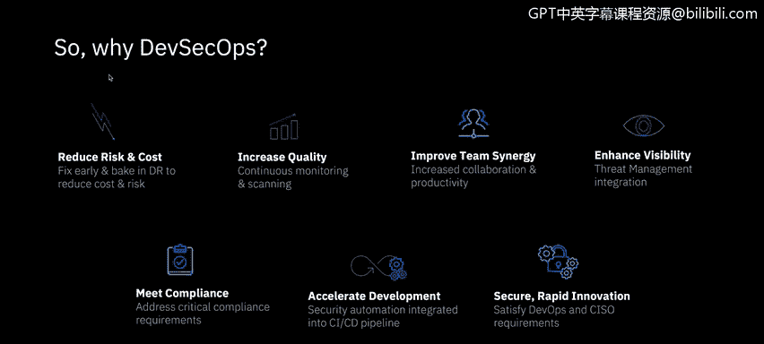
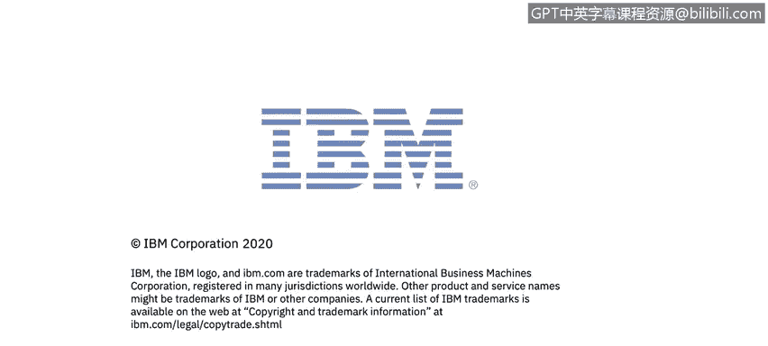

# 课程6：《网络威胁情报课程（IBM）》：25：24_DevSecOps部署

## 概述
在本节课中，我们将学习DevSecOps在部署与持续运营阶段的核心实践。我们将探讨如何通过自动化、持续监控和标准化流程，确保组件在发布后依然安全，并有效应对云环境的动态特性。

---

## 组件发布后的安全状态管理 🔄

组件在成功测试并发布后，其安全状态并非一成不变，可能随时间发生变化。

为了应对这种变化，持续监控机制使得程序能够响应安全状态的变更，并对未来的部署强制执行安全策略。

## 云环境的动态性与部署管理 ☁️

上一节我们介绍了组件安全状态的持续性，本节中我们来看看云环境的动态特性如何改变部署方式。

云环境的动态性改变了部署发生的方式，以及部署与退役的频率。虚拟环境可以在一天内被多次创建和销毁。

这些环境必须以受控、安全的方式创建和销毁。此过程必须考虑数据清理和保留策略。资产的销毁需要经得起审查，并应获得认证。

## 持续扫描与组件管理 🛡️

当组件经过成功测试并发布后，对程序注册表和仓库中的组件进行持续扫描，能够实现对漏洞和许可状态的最新评估。

这些信息使得部署决策可以基于组件的最新状态，并限制其未来的部署范围。

以下是持续扫描带来的关键优势：
*   注册表扫描的输出会告知团队是否需要采取补救措施，而无需等待在生产环境中进行漏洞扫描。
*   发布的组件会进行版本控制，这些详细信息存储在组件管理数据库（CMDB）中，以记录当前环境状态。这反过来可以用于报告和安全审计。

**核心概念**：`没有资产清单，就无法保护任何东西。你必须清楚资产清单里有什么。`

## 实现可控的部署流程 ⚙️

通过使用工具链作为唯一的部署机制，可以获得对部署过程的完全控制。

利用参数化的“基础设施即代码”模式，结合集中的键值（Kv）和密钥存储，确保创建和销毁过程是可重复的。

在云时代，组件应被视为“牲畜”而非“宠物”。我们根据需求销毁和创建可变的镜像，而非长期维护固定的个体。

身份和访问管理（IAM）控制有助于以受监管的方式控制谁或什么可以控制及构建服务。存储数据的SaaS服务提供商在数据处置方面可能有不同的程序需要考虑。

## 运营安全与可视化 👁️

安全与运营在“操作”和“监控”阶段紧密结合。对内部状态和组件的可视化增加了环境的上下文和清晰度，有助于威胁检测。

**核心概念**：`如果你无法检测到它，就无法修复它。`

与系统集成的运营安全有助于确保系统的安全健康状况尽可能良好，并基于最新信息。检测到问题时，可以利用“剧本即代码”来进行补救和报告。

这些剧本可以手动运行，目标是最终实现其对问题的自动化响应。标准化的剧本以受控、可衡量的方式驱动响应和恢复工作，以减少附带损害和潜伏的攻击向量。

有效的安全运营还应包括密钥轮换、凭证验证和资产清单维护。

在安全的“操作-监控”阶段，问题不在于“是否”会被黑客攻击，而在于“何时”会被攻击。

## 关键术语解析 📚

以下是本课程涉及的一些关键安全术语：

*   **RASP**：运行时应用程序自我保护。这是一种安全技术，利用运行时检测来发现和阻断计算机攻击。
*   **蓝队 vs. 红队 / 演练日**：蓝队成员是内部的网络安全人员，而红队则是试图侵入系统的外部实体。
*   **平均故障间隔时间与平均修复时间**：用于衡量系统可靠性和维护效率的指标。
*   **SOAR**：安全编排、自动化与事件响应。这是一个用于提升安全运营中心效率的技术栈。

## 总结

本节课中，我们一起学习了DevSecOps在部署与持续运营阶段的关键实践。我们了解到，让开发、运维和安全团队早期协同工作至关重要。实施DevSecOps可以降低风险和成本、提高质量、改善团队协同、增强可见性、满足合规要求、加速开发并保障快速创新的安全性。通过自动化工具链、持续监控、标准化流程（如“基础设施即代码”和“剧本即代码”）以及对云动态环境的适应，我们能够构建更安全、更具韧性的系统。