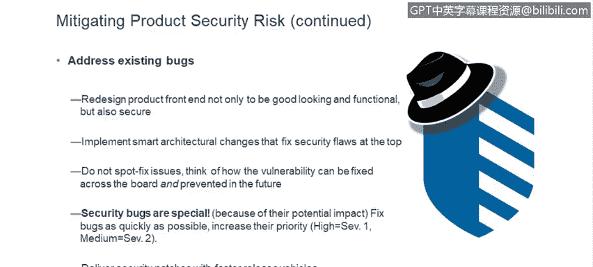

# 课程6：《网络威胁情报课程（IBM）》：26：应用安全缺陷编写安全代码

在本节课中，我们将探讨软件安全缺陷的严重性及其对企业和个人的影响，并学习如何通过编写安全代码来预防这些缺陷。我们将了解安全漏洞的发现、披露方式，以及开发者应如何转变思维，将安全融入开发流程。

## 如果您的安全缺陷变得众所周知会怎样？

从2014年的“心脏滴血”和“破壳”漏洞开始，安全漏洞获得专属网站、炫酷名称和大量媒体报道已成为常态。安全问题已成为董事会级别的议题，维基解密等事件也印证了这一点。安全研究领域正在迅速扩展。

对于安全研究人员而言，通过发现此类漏洞来获取名声是谋生的最佳途径。发现“心脏滴血”、“破壳”或近期“幽灵”与“熔断”漏洞的研究人员，都因此获得了经济保障。许多人试图以安全研究为基础创业，而首要途径就是在软件中发现安全漏洞。

安全研究人员的首要目标是，在知名安全厂商的旗舰产品中发现一个重大的安全漏洞，这足以奠定他们的职业生涯。这些漏洞具有轰动效应，给客户和我们自身带来巨大成本。此外，安全漏洞还可能导致法律诉讼。

需要提醒大家的是，美国联邦贸易委员会会监督任何对其软件安全性做出声明的公司。如果FTC认定公司夸大了其安全声明，他们将乐于下达所谓的“同意令”。自2000年以来，我已见过超过45起因安全实践不足而导致的同意令。最近，这些同意令的期限往往长达20年。

这意味着美国联邦政府将介入，并明确规定我们必须如何运行安全计划。可以想象，管理层非常不希望这种情况发生。因此，我们确保软件安全真实有效的方法之一，就是确保我们软件的安全性。

## 为何需要担忧？

您绝对应该担忧。这里有一些快速的事实：波耐蒙研究所每年都会进行研究，我手头最新的数据来自2017年。他们估计每次数据泄露的平均成本为每条记录141美元，总成本平均为362万美元。

您可能没有意识到的是，零日漏洞的黑市正在增长。这意味着在暗网上，有公司、个人和犯罪集团在监视和寻找漏洞。发现漏洞后，有两种选择：一是负责任地向供应商披露，让我们修复漏洞，并在修复完成后获得一些声誉；二是持有漏洞，并将其出售给敌对国家。

几周前我们了解到的一个漏洞，其售价在5000到25000美元之间。因此，如果您选择不负责任的披露而非负责任地披露，确实可以赚取可观的收入。我们都听说过这些数据泄露事件，但问题是我们是否真的吸取了教训。

这里有几个简单的例子：趋势科技是另一家网络安全供应商。有两位研究人员决定专注于研究其安全产品，并在六个月内发现了223个漏洞。事实上，曾经担任我这个职位的人认为这是一个挑战，于是去帮助趋势科技，试图提高意识，确保他们的开发人员能够产出安全的软件。

别忘了Equifax事件，它影响了众多美国人。那只是一个开源软件包中相对较小的漏洞。我们广泛使用开源软件，本应扫描其中的已知漏洞，而那个漏洞是已知的。但负责应用补丁的人员没有及时处理，他们计划在下个季度初解决。不幸的是，黑客在此期间搜索具有该漏洞的网站，并找到了Equifax。结果，其CEO、CIO和首席安全官全部离职。由此可见，这确实是一件大事。

我希望您已经相信，避免安全漏洞是一件非常重要的事情。

## 本系列课程将涵盖的内容

在本系列课程中，我们将处理多种不同类型的安全问题。我想花点时间解释一下我们选择这些内容的原因。

跨站脚本攻击在漏洞数量上占绝大多数，因此我们首先讨论这个话题。在云端应用中，跨站脚本攻击也确实是主流问题。您还会看到加密漏洞、操作系统命令注入、SQL注入等。尽管后几类漏洞数量较少，但严重性极高，是非常严重的问题。下一次关于注入攻击的演示将在七月进行。

## 编写安全软件为何困难？

现在大家可能感到有些沮丧，但编写安全软件确实不是一项容易的任务。我在开发领域工作了30年，我们经常面临巨大的时间压力。需要实现大量功能，但时间有限，因此我们专注于完成被分配的功能特性。

不幸的是，黑客可能有的是时间，他们可以坐下来研究、分析，寻找那一个漏洞，或者将几个小漏洞串联起来，造成真正的损害。正如我所说，我们的重点通常是必须完成的功能，安全往往不是首要关注点。而黑客则在寻找那个漏洞。

在动机和资源方面，开发人员负责产品的主要功能，但他们个人通常不直接受产品成败的影响。而黑客和安全研究人员则不同，他们的动机可能来自炫耀的权利、声誉、赚取巨额金钱，有时甚至是政治目的，并且可能得到国家层面的支持，背后资源丰富。

我认为不能完全责怪一些国家采取这种策略，因为从时间和金钱投资的角度看，投资30年于大学和研究项目来开发所需技术，远比雇佣一些顶尖黑客去窃取技术要花费更长的时间和更多的金钱。因此，我们必须警惕这一点。

当然，我们要求开发人员学习一些安全知识，足以避免引入问题。但黑客是安全领域的专家，他们深入研究安全。不过，通过良好的安全教育和设计实现实践，情况并非一片黯淡。

## 如何预防新的漏洞？

我们有以下几种方法：

**预防新漏洞**：开发人员能做的最好的事情之一就是了解OWASP Top 10（注：原文为SANS 25，此处根据常见安全课程内容调整为OWASP Top 10，但保留原文提及的“每年复习”概念）。它被列在网站上，并以三四种不同的方式呈现，以适应不同的学习方式和记忆习惯。建议每年复习，以提醒自己需要注意哪些问题。

**像黑客一样思考**：这也是本次演示的原因之一。不仅要考虑您的用例，还要考虑滥用案例，即针对您的应用程序可能实施的恶意行为，以及攻击者能借此达成什么目的。

**在软件中构建防御机制**：关键措施包括输入验证、输出净化、强加密以及强身份验证和授权。如果您能处理好这些，我认为90%的问题都会消失。

很多时候，我看到团队苦苦挣扎，可能是因为他们选择了一个在安全方面声誉不佳的框架。因此，他们不得不不断地修补一个又一个跨站脚本漏洞，而不是选择一个能为应用程序提供跨站脚本保护功能的框架。如果您试图自己处理所有安全细节，难免会遗漏一些东西，而别人可能会发现您遗漏的问题。

另一件需要记住的事情是：不要以为不面向互联网就没有风险。大多数数据泄露仍然来自内部人员。因此，位于防火墙后或内部网络内并不能提供防御，因为有时攻击者就在内部。对于文件和数据库也是如此，不能因为它们是本地的就意味着不需要保护。

## 如何解决现有漏洞？

**确保解决现有漏洞**：有时，重新设计产品前端、选择新技术可能是合理的。例如，所有使用Struts 1的人都必须迁移到其他版本，有些人选择不升级到Struts 2，而是转向其他技术。值得花时间研究您所用技术的安全特性，并查看它们的历史记录。

**实施架构性变更**：如果可能，在顶层添加一个进行验证的层，这样，即使有人在其他地方忘记对某个特定参数进行验证，情况也会好得多。这比依赖并指望每个人在每次编写代码时都能考虑到所有情况要可靠。同样，不要仅仅零散地修复问题，要看看能做些什么。

**认识到安全漏洞的特殊性**：是的，它们是软件缺陷，是软件错误。但它们会危及客户数据，具有轰动性，可能出现在新闻报道中，并可能引发真正严重的问题。许多团队喜欢说“我们下个季度再交付，所以我们需要豁免或延期”。对于安全漏洞，您真的需要仔细审视并慎重考虑，这样做可能并不明智。Equifax就是前车之鉴。

## 总结

本节课中，我们一起学习了软件安全缺陷的严重现实及其广泛影响。我们了解到安全漏洞可能带来声誉和经济上的双重打击，甚至引发法律监管。编写安全的软件充满挑战，源于时间压力、动机差异和资源不对等。

然而，通过系统的方法，我们可以有效应对：持续学习主流安全威胁清单（如OWASP Top 10），培养“攻击者思维”，在设计中内置输入验证、输出净化等核心防御机制，并认识到内部环境同样需要保护。对于现有漏洞，应考虑架构级解决方案而非零散修补，并始终将安全漏洞视为需要优先处理的特殊风险。

记住，安全不是可选项，而是开发生命周期中不可或缺的一部分。通过将安全实践融入日常开发工作，我们可以显著降低风险，保护用户数据，并维护企业的声誉与信任。