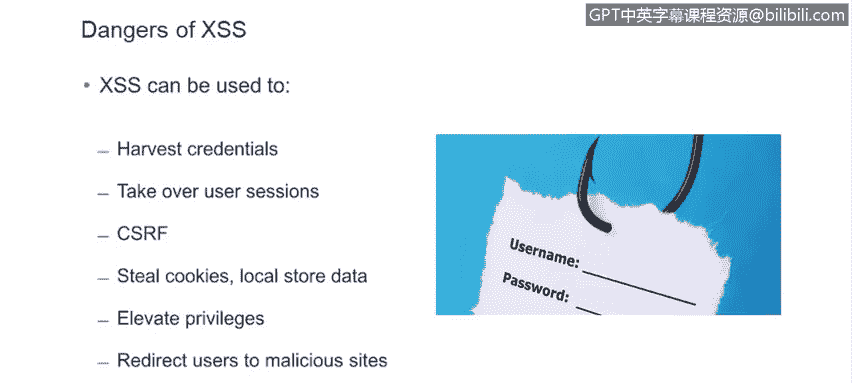
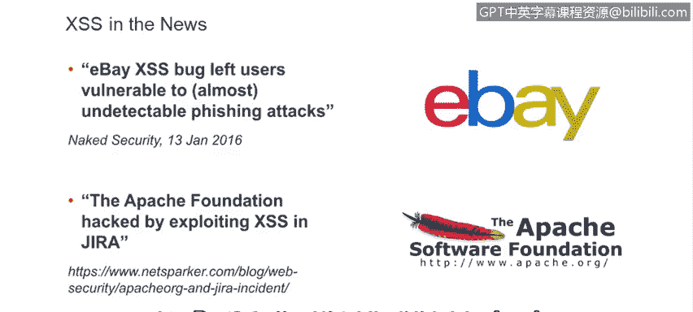
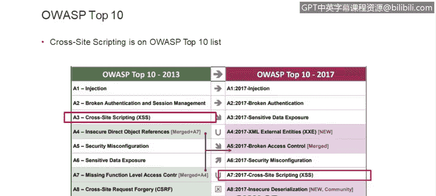
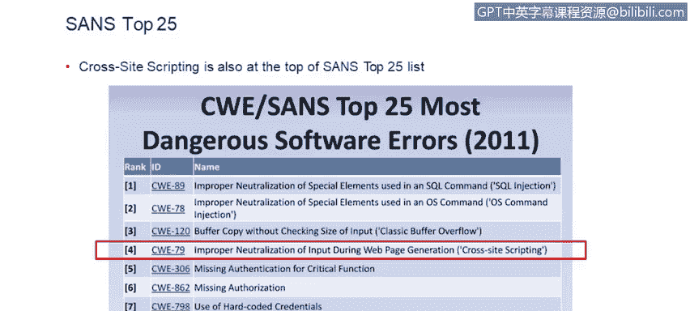
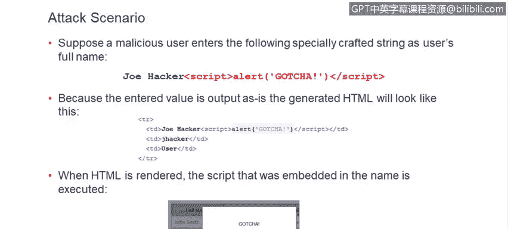
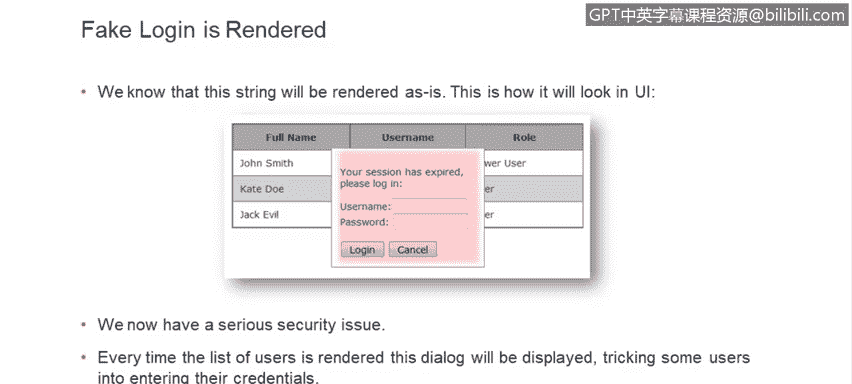

# 课程6：《网络威胁情报课程（IBM）》：27：跨站点脚本常见攻击 🎯

在本节课中，我们将要学习跨站点脚本攻击。这是一种非常常见且危险的网络应用安全漏洞。我们将了解它的定义、危害、实际案例以及攻击原理，帮助你理解为何开发者必须重视并防范此类攻击。

## 什么是跨站点脚本？🤔

跨站点脚本是一种安全漏洞，它允许未经授权的个人向你的网络应用中注入客户端脚本。这些恶意脚本可以来自任何地方。

最常见的情况是，当用户在网站上填写表单时，它们作为HTTP参数的一部分被提交。但它们也可能来自其他来源，例如HTTP头部和Cookie。它们可以隐藏在前后端交换的JSON和XML文件中，也可以嵌入到用户上传的数据库或其他类型的文件中。

因此，你必须警惕这些攻击，并准备好应对来自任何用户可控来源的脚本。

正如Ron之前提到的，跨站点脚本是我们最常看到的安全漏洞类型。

## 跨站点脚本的危害 ⚠️

跨站点脚本可被用于大量恶意目的，其危害性极大。

以下是其主要危害：
*   **窃取凭证**：攻击者可以获取用户的登录凭据。
*   **劫持用户会话**：攻击者可以接管用户的会话。
*   **辅助跨站请求伪造**：可用于发起跨站请求伪造攻击。
*   **窃取Cookie或本地数据**：可以盗取存储在用户本地的Cookie或其他数据。
*   **权限提升**：可用于提升攻击者在应用中的权限。
*   **重定向至恶意网站**：可以将用户引导至恶意网站。

由此可见，跨站点脚本能造成巨大的破坏。

## 跨站点脚本的普遍性 📊

跨站点脚本漏洞普遍存在于各类产品中。从图中可以看到两个著名的产品——WordPress和Drupal，统计数据表明跨站点脚本是这两款产品中出现频率最高的安全漏洞。

几年前，Risk Based Security公司进行了一项研究，分析了最常见的漏洞类型。研究基于一个存储已知漏洞信息的互联网数据库——VDB。从图中的蓝色条形图可以看出，在2007年至2015年的大部分季度里，跨站点脚本漏洞在所有类型产品中的发现频率都是最高的。

## 实际攻击案例 🚨

跨站点脚本漏洞不仅被质量保证团队或渗透测试团队发现，实际上也正被攻击者积极利用。

有两个近期的著名案例：
1.  eBay曾遭受基于跨站点脚本的网络钓鱼攻击。
2.  Apache基金会曾被黑客入侵，在其攻击链中，第一步就是利用Jira中的跨站点脚本漏洞。

此外还有许多其他案例。因此，这种漏洞出现在OWASP十大Web应用安全风险榜单上并不令人意外。如果你不熟悉这个榜单，强烈建议你查看OWASP（开放式Web应用程序安全项目），这是一个专注于Web应用安全的在线社区。作为开发者，你应该了解这个列表，并时常参考，以确保你的代码不会引入这些漏洞。

Ron提到的另一个列表——SANS Top 25，跨站点脚本也位列第四。这充分说明了它的危险性。

## 跨站点脚本攻击原理 🔍

现在，让我们看看跨站点脚本攻击是如何实际运作的。我们将使用一个你正在开发的、具有简单数据录入功能的应用作为例子。在这个例子中，我们录入用户信息。

假设我们有一个非常简单的表单，用于填写用户名、密码和角色。已录入的用户会显示在一个简单的表格中。本例中我们将使用Java服务器页面，但实际上，几乎任何技术或框架都可能存在跨站点脚本漏洞。

如果渲染代码很简单，没有任何额外的检查，只是简单地反射回用户输入的任何数据，那么输出将不受保护。我马上会演示这一点。

### 正常数据输入

正常的用户数据输入不会引起任何问题。用户输入姓名、用户名等信息，生成的HTML页面会原样反射回输入的内容。我们假设这个应用背后有某种数据库，数据存储在那里。每次你访问用户列表时，都会得到一个格式良好的HTML页面。到目前为止一切正常。

### 恶意数据输入

假设有一个恶意用户决定输入一些不仅仅是用户名本身的东西。例如，他们输入了一个HTML标签，在这里是一个`<script>`标签和一段JavaScript代码。由于我们的应用在输入和输出端都没有任何特殊的防御措施，输入的数据将原样存储在数据库中，并且在渲染用户列表时也会被原样渲染。

因为没有进行特殊处理，输入的`<script>`标签将被浏览器原样解释为一个脚本标签。因此，在页面底部你会看到实际的例子：因为这是一个脚本标签，脚本会执行，并弹出一个对话框。这绝对不是应用开发者想要的结果，但却是用户能够做到的。

### 攻击的严重性

这看起来像是一个有趣的小把戏，可以展示给朋友看，但它真的无害吗？不幸的是，它非常危险。仔细想想，这本质上是在允许未经授权的人向你的应用中注入功能，而这个功能可以是任何东西，很可能不像上一张幻灯片展示的那么无害。

另一个危险在于，你的客户在使用你的应用时信任它，而这种信任现在自动延伸到了第三方注入的这段代码上。

一旦记录被添加（在这个特定案例中），它将被存储在数据库中。每次渲染用户列表时，这个对话框都会弹出。这实际上是**存储型跨站点脚本**的一个例子，与反射型跨站点脚本相比，这是一种更危险的变体。存储型跨站点脚本会被应用保留，通常会影响多个用户。

这里增加的危险是，受此恶意脚本影响的其他用户可能是应用管理员。你实际上可能因此获得权限提升，有人可能接管一个管理员账户。

**反射型跨站点脚本**的危险性稍低。它通常作为电子邮件的一部分或嵌入在恶意链接中发送，通常只影响一个用户。

## 一个更险恶的例子 🕵️

让我们看一个更险恶的例子，看看跨站点脚本实际上能做什么。假设恶意用户输入了他的名字，但同时添加了这段包含HTML、样式表和JavaScript的代码。看看它实际上会在客户端应用中如何渲染。

当用户列表被渲染时，现在会弹出一个对话框，提示会话已过期，并要求用户输入他们的凭据。现在我们面临一个非常严重的安全问题。如果攻击者精心调整样式表，使其与应用的整体外观和感觉完全匹配，许多用户可能会真的认为“是的，我的会话过期了，最好重新登录”，然后输入他们的用户名和密码。这些信息随后会被攻击者获取并利用。

首先，攻击者可以用这些凭据登录应用，冒充你。其次，正如我们所知，用户会在多个网站和应用中重复使用他们的登录凭据。因此，这种凭证窃取实际上可能被用于其他地方，比如你的银行应用或你生活中的任何重要应用。

由此可见，这已经演变成一个非常危险的局面，必须加以缓解。

## 总结 📝

本节课中，我们一起学习了跨站点脚本攻击。我们了解了它的定义，认识到它是一种允许攻击者向Web应用注入恶意脚本的严重漏洞。我们探讨了其广泛的危害性，包括窃取凭证、劫持会话等，并通过实际数据和案例看到了它的普遍性与现实威胁。通过分析攻击原理，特别是存储型与反射型XSS的区别，以及一个模拟的凭证窃取案例，我们深刻理解了为何必须对用户输入进行严格的验证和输出编码，以防止此类攻击，保护应用和用户的安全。