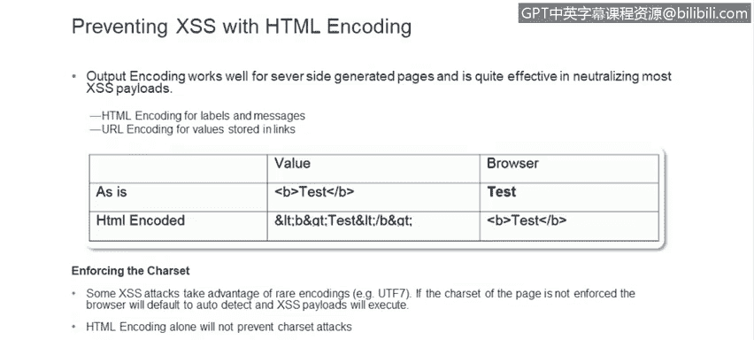
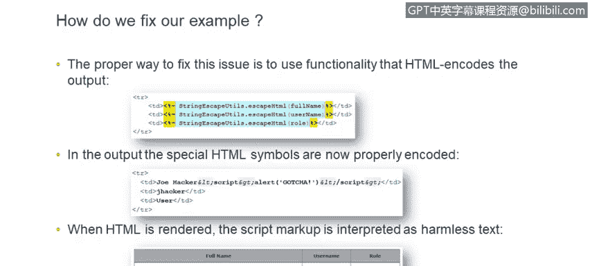
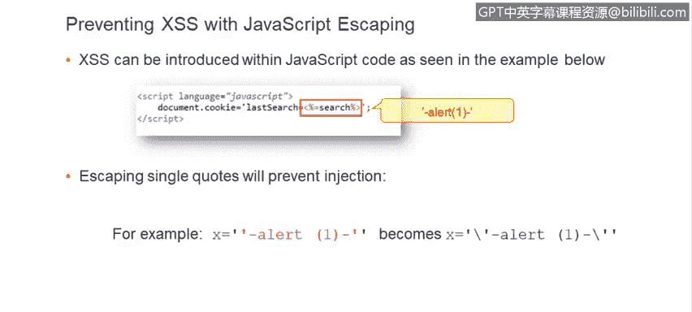
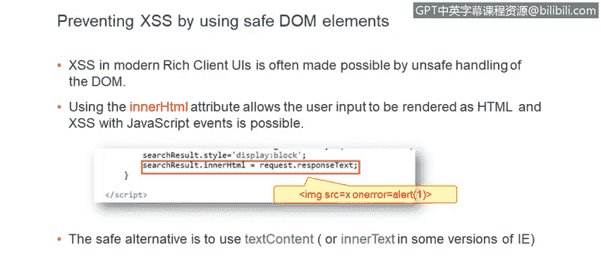
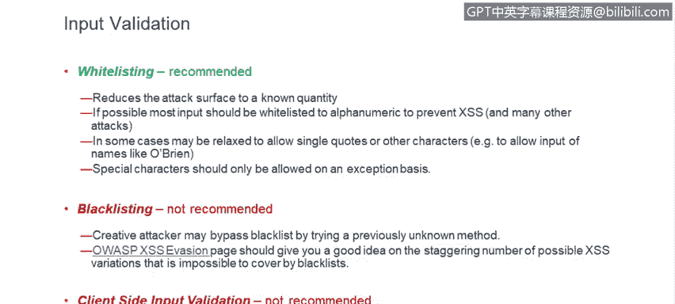
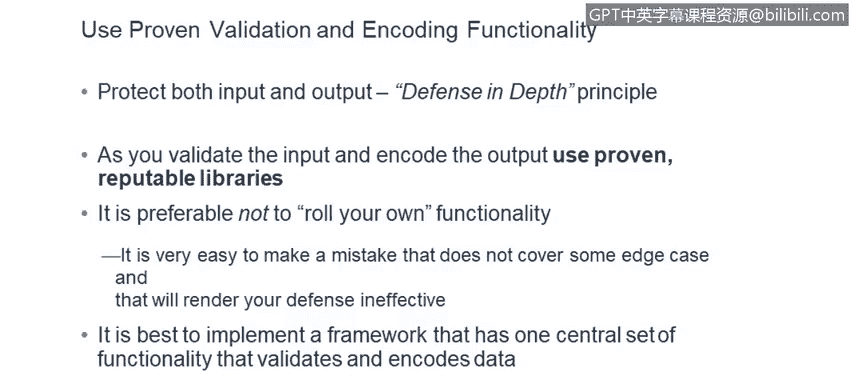
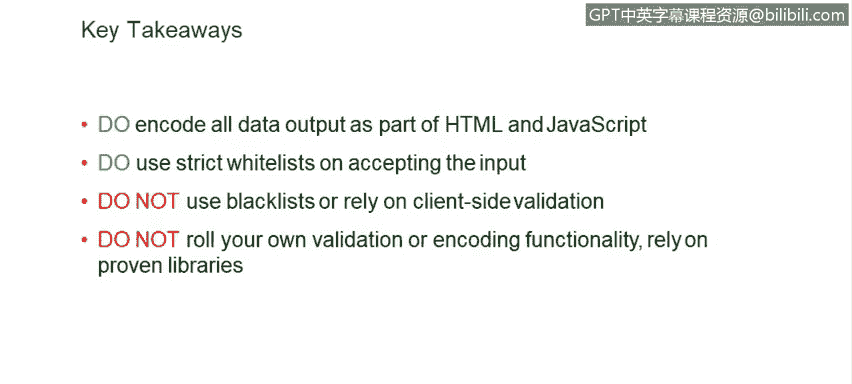
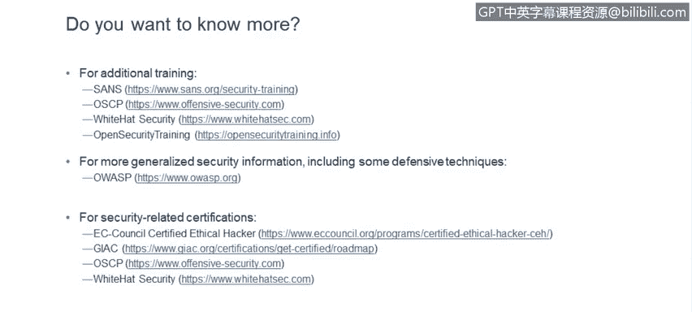
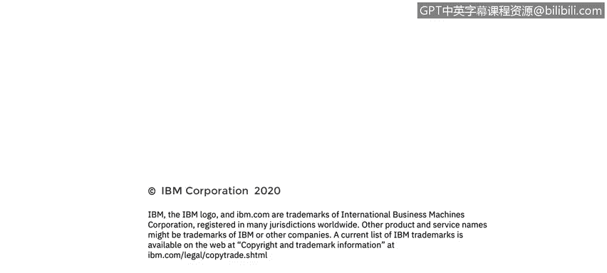

# 课程6：《网络威胁情报课程（IBM）》：28：跨站点脚本有效防御 🛡️

在本节课中，我们将学习如何有效防御跨站点脚本攻击。跨站点脚本是一种常见的网络攻击手段，但通过一些关键的编码和验证技术，我们可以有效地防止它。我们将探讨输出编码、输入验证等核心防御策略，并了解在开发过程中应避免的常见错误。

## 概述

跨站点脚本攻击的防御并不困难，关键在于开发代码时的谨慎处理。输出编码是一种非常有效的方法，特别是在处理HTML和URL时。通过将用户输入中的特殊字符转换为安全的格式，可以防止恶意代码被浏览器执行。

## 输出编码



上一节我们介绍了防御XSS的基本思路，本节中我们来看看具体的防御技术——输出编码。输出编码的工作原理是，将数据中可能被解释为代码的特殊字符进行转义，使其以纯文本形式安全地显示。

### HTML编码

在HTML上下文中，输出编码通过将特殊字符替换为HTML实体来实现。例如，尖括号 `<` 和 `>` 会被分别替换为 `&lt;` 和 `&gt;`。



**公式示例**：
- 原始输入：`<b>test</b>`
- 编码后：`&lt;b&gt;test&lt;/b&gt;`

当浏览器遇到编码后的字符串时，它会将其渲染为无害的文本“`<b>test</b>`”，而不是将其解释为HTML标签并加粗显示“test”。



以下是实现HTML编码的步骤：
1.  识别所有来自用户或不可信来源的数据。
2.  在将这些数据输出到HTML页面之前，使用专门的函数对其进行编码。
3.  确保编码覆盖所有可能的输出点。

**代码示例（Java）**：
```java
import org.apache.commons.lang3.StringEscapeUtils;
String userInput = "<script>alert('xss')</script>";
String safeOutput = StringEscapeUtils.escapeHtml4(userInput);
// safeOutput 现在是：&lt;script&gt;alert(&#x27;xss&#x27;)&lt;/script&gt;
```

### JavaScript上下文编码



有时，用户输入会作为动态生成的JavaScript代码的一部分。在这种情况下，仅进行HTML编码是不够的，还需要对JavaScript上下文中的特殊字符进行转义。

**代码示例**：
假设我们有一段动态生成的JS代码：
```javascript
var searchTerm = ‘USER_INPUT’;
```
如果`USER_INPUT`是`’; alert(‘xss’);//`，那么未转义的代码将变成：
```javascript
var searchTerm = ‘’; alert(‘xss’);//’;
```
这将执行`alert`函数。为了防止这种情况，需要对单引号等字符进行转义：
```javascript
var searchTerm = ‘\’; alert(\‘xss\’);//’;
```

### 安全的DOM操作

在现代富客户端应用中，经常使用`innerHTML`属性来动态更新页面内容。然而，直接向`innerHTML`插入未经验证的数据是危险的，因为它会将其内容解析为HTML并执行其中的JavaScript。

**代码示例（不安全）**：
```javascript
document.getElementById(‘myElement’).innerHTML = userControlledData;
```

**代码示例（安全）**：
应使用`textContent`或`innerText`属性来安全地设置纯文本内容。
```javascript
document.getElementById(‘myElement’).textContent = userControlledData;
```

### 避免危险的函数

`eval()`函数会将其字符串参数当作JavaScript代码来执行，极其危险。应尽量避免使用。如果必须使用，必须对输入进行极其严格的审查和清理。

**代码示例（危险）**：
```javascript
eval(userSuppliedString); // 永远不要这样做！
```

## 输入验证

输出编码是解决方案的一部分，另一个重要部分是输入验证。目标是阻止恶意数据进入系统。

### 白名单验证



我们推荐的方法是白名单验证。这种方法只接受预定义的、有限的合法字符或字符串集合，拒绝其他所有输入。

以下是实施白名单验证的原则：
1.  为每个输入字段定义明确的、尽可能严格的合法字符集（例如，姓名字段只允许字母和空格）。
2.  在服务器端实施验证。
3.  拒绝任何不符合白名单规则的输入。

### 应避免的方法

*   **黑名单验证**：试图列出并拒绝所有已知的恶意输入模式。这种方法效果不佳，因为攻击者总能找到新的绕过方式。OWASP XSS过滤绕过手册展示了大量绕过黑名单的技巧。
*   **仅客户端验证**：在浏览器中使用JavaScript进行验证。这虽然能提升用户体验，但无法提供安全保护，因为攻击者可以直接向服务器发送请求，绕过客户端检查。

## 深度防御与最佳实践

在实施输入验证和输出编码时，应采用深度防御原则。这意味着部署多层安全机制，即使其中一层存在缺陷，其他层也能提供保护。

以下是关键的开发最佳实践：
1.  **不要重复造轮子**：避免自己编写复杂的编码或验证函数。很容易遗漏边缘情况。应使用经过社区广泛测试和验证的安全库（如OWASP ESAPI、Java的`StringEscapeUtils`、.NET的`AntiXSS`库等）。
2.  **集中化安全处理**：将输入验证和输出编码的逻辑集中在框架或少数几个工具类中。这比在代码各处分散地进行检查更安全、更易于维护，能降低因开发者疏忽而引入漏洞的风险。
3.  **结合多种防御**：同时实施严格的服务器端白名单输入验证和适当的上下文相关输出编码。



## 总结



本节课中我们一起学习了防御跨站点脚本攻击的核心方法。
*   请对所有输出到HTML或动态JavaScript中的数据**进行编码**。
*   在接受输入时，请使用**严格的白名单**进行验证。
*   我们不推荐使用黑名单或仅依赖客户端验证，这些方法效果有限。
*   最后，请尽量**依赖成熟的安全库**，而不是自己编写安全功能。





当然，这只是XSS防御的入门知识，这是一个更广泛的主题，涉及许多细节。在课程幻灯片中，我们列出了一些链接，供您进一步学习。