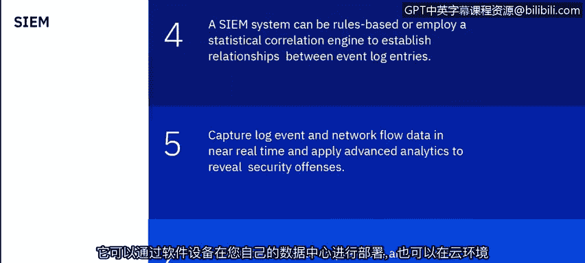

# 课程6：《网络威胁情报课程（IBM）》：29：28_SIEM概念和优势

## 📖 概述
在本节课中，我们将学习安全信息与事件管理系统的核心概念、优势及其在现代安全运营中心中的关键作用。我们将探讨SIEM如何收集、处理和分析数据，以帮助识别潜在的安全威胁。

---

## 🎯 学习目标
本节课有三个学习目标：
1.  探索并理解SIEM的关键术语。
2.  探索SIEM在网络中的角色。
3.  理解SIEM在现代安全运营中心中的作用。

---

## 🔍 SIEM是什么？
安全信息与事件管理系统本质上是一个数据聚合、搜索和报告系统。它从您的网络环境中收集大量信息，将这些数据整合并转换为易于人类访问和阅读的格式。SIEM会对数据进行分类，使其一目了然，便于理解。

以下是围绕SIEM讨论的一些关键术语：**日志收集**、**规范化**、**关联**、**聚合**和**报告**。在SIEM的上下文中考虑这些术语非常重要。

SIEM主要收集日志和其他安全相关文档进行分析。日志是设备（如防火墙、网络代理或任何提供网络安全的设备或应用程序）上发生的信息记录。任何应用程序通常都有一个日志文件，用于记录日志中发生的具体事件。

SIEM的核心功能是通过监控网络流和事件来管理您的网络安全。事件是应用程序或硬件设备内发生的事情。SIEM会整合这些日志事件和网络流数据，从成千上万的不同设备（如终端、应用程序、网络硬件等任何连接到网络的设备）中提取信息，然后使用高级分析技术对这些数据进行规范化和关联，以帮助识别可能需要调查的安全违规行为。

SIEM主要采用两种不同的方法：基于规则的方法或采用统计关联来建立日志条目之间的关系。它会近乎实时地捕获日志事件和网络流数据，并对其应用分析，以揭示网络中的安全违规行为。

SIEM可以通过几种不同的方式部署或使用：
*   可以通过软件或设备在您自己的数据中心内部署。
*   可以部署在云环境中，通过网页浏览器登录到托管环境。
*   可以由托管安全服务提供商提供，他们为特定公司托管SIEM，允许您登录，类似于云环境。

---

## 📊 事件与流
上一节我们介绍了SIEM的基本概念，本节中我们来看看SIEM处理的两类核心数据：事件和流。

事件通常是特定操作的日志记录。例如，用户登录、防火墙在特定时间允许或拒绝访问等操作都会被记录为事件。该设备或应用程序随后会将此事件推送到SIEM，SIEM将处理该事件，判断其是正常行为还是异常行为。

流是两个主机之间网络活动的记录。这种连接（或会话）可以持续几秒钟或几天，具体取决于会话内的活动。例如，传输大文件会比发送即时消息或电子邮件等短暂的通信持续更长时间。

当我们提到“主机”时，网络活动可能指您网络上的PC与托管机器（如您访问的网页）通信，或者您将文件上传到云服务（如Dropbox或Box）。任何此类主机间的网络通信都属于流的范畴。其他例子包括下载多个文件、图像、视频，这可能持续5到10秒；或者观看Netflix电影，这可能持续几个小时。这些都是网络会话，而流就是捕获的这些会话中两个主机之间传输的数据量和时间记录。

---

## 📥 数据收集
了解了事件和流之后，我们来看看SIEM如何收集这些数据。

在SIEM的上下文中，数据收集是指从不同来源收集这些流和日志，并将其放入一个公共存储库（即SIEM将分析的数据库）的过程。SIEM通过分析这些数据来判断某些行为是正常还是异常。

数据收集可以通过将原始数据直接发送到SIEM来完成，也可以通过外部设备从源收集日志数据，进行聚合，然后按计划或根据SIEM操作员的要求将其传输到SIEM。

坦率地说，如果数据是实时的，SIEM数据的价值会高得多。如果数据在发生时直接从设备提取到SIEM，您将获得更好、更快的信息，从而使分析能够实时进行，并为SOC分析师提供判断行为是否异常所需的数据。

关于提取多少数据以及提取频率的考虑，主要受几个因素制约：
*   分配给SIEM应用程序的CPU资源，或者如果您使用SIEM设备，则是该设备的资源。
*   SIEM的内存和存储容量。
*   与您的SIEM相关的许可证也很重要。大多数SIEM的许可是基于**EPS**或**FPM**的概念。

**EPS**代表每秒事件数，**FPM**代表每分钟网络流数。大多数SIEM提供商或系统根据每秒事件数和每分钟网络流数来许可其SIEM。当然，被提取到SIEM中的源数量也很重要。您引入的源越多，消耗的EPS和流也就越多。因此，在确定分配给SIEM的资源大小时，这些都是需要考虑的因素。

---

## 🔧 规范化与许可
上一节我们讨论了数据收集，本节我们将探讨SIEM如何处理这些原始数据，以及相关的许可机制。

规范化是将原始数据转换为SOC分析师可读格式的过程。这包括IP地址、队列标识等任何能提供可用信息的数据。它涉及解析原始事件数据并准备数据以供显示，使其更具可读性，并实现所有记录的可预测和一致存储。因此，无论数据来自哪个系统，它都会被规范化为可读的格式，以便分析师可以查看IP地址、机器名（如果可用）、用户名（如果可用）等信息，从而更全面地了解环境中发生的情况。

另一个需要讨论的概念是许可和许可限制。如前所述，大多数SIEM根据EPS数量和流数量进行许可。许可限制会监控传入事件的数量，并管理输入队列，以适应EPS或流许可。如果超过许可阈值，传入的事件可能会被限制或排队，直到低于许可阈值；或者在一次性事件过多的情况下，它们可能被直接丢弃并放入存储，或者完全丢弃。这都取决于系统及其监控方式。因此，在考虑引入多少数据源时，这些都是需要考虑的因素。

---

## 🧩 事件合并
在SIEM中，我们讨论的另一个概念是**合并**。合并事件被解析，然后根据事件间的共同属性进行合并。QRadar是IBM的SIEM产品，因此本演示中使用的示例都基于QRadar。

事件合并发生在10秒内发现三个具有匹配属性的事件之后。例如，如果发现来自同一台机器的三个事件，SIEM会将它们合并为一个事件，将这三个不同的属性整合到同一个事件中。这样处理是为了规范化数据，并防止系统显示过多信息，从而更难以排序和分析。

当我们讨论合并以及如何组合事件时，有五个属性是关键。如果这五个属性匹配，并且在10秒内有三个事件，它们都将归入同一台机器和同一个事件。这五个属性是：
1.  **队列标识**
2.  **源IP地址**
3.  **目标IP地址**
4.  **目标端口**
5.  **用户名**

这些是构成QRadar中事件合并的要素。更详细地说，这些事件被解析，当我们发现这些事件之间的共同属性时，我们会将数据规范化为这些字段。我们得到的数据将不仅仅是屏幕上显示的这五个属性，但它们是构成合并的属性。因此，当我们在10秒内有三个事件，并且这五个属性（队列标识、源IP、目标IP、目标端口和用户名）都匹配时，它们将被合并为一个事件，供SOC分析师查看和理解。

---

## ⚠️ 违规行为
现在，我们来谈谈什么是**违规行为**。违规行为是系统视为异常的行为，即系统认为“这不合逻辑或超出常规，可能需要查看一下”。这些数据点可以来自许多不同的来源，例如：
*   安全设备
*   服务器和大型机
*   网络活动
*   数据活动（如访问数据库）
*   应用程序活动（如使用聊天应用程序或Microsoft Office 365）
*   系统配置信息
*   漏洞和威胁数据（这对SIEM非常重要）
*   用户和身份信息

一个可能的异常例子是：用户在极短的时间内从多个位置登录。您可能会看到某个用户ID试图在几秒钟或几分钟内从美国、印度、罗马尼亚登录。这显然是异常行为，因为逻辑上不可能发生。这些情况可能会转化为我们所说的违规行为。

所有这些信息都会被纳入事件关联中，例如日志、流、IP地址和地理位置（如前面的例子）。然后，该活动会与基线进行比较以寻找异常，这些异常将被归类为违规行为。违规行为是SOC分析师需要查看的内容，以判断是否需要对此进行进一步调查。

一个好的SIEM会努力过滤掉误报或并非真正问题的异常行为所产生的噪音，并提供我们所说的**真实违规行为**，即可以且应该被调查的行为。许多组织在使用SIEM时面临的挑战是，他们获取了所有这些数据，但过滤出了太多并非真实违规的“违规行为”，导致无法及时调查。不幸的是，SIEM最终变成了环境中的噪音。因此，SIEM的总体目标是进行良好的调优，以便分析师能够查看所有传入的数据，并有效地进行调整，从而只关注那些真正需要调查的真实违规行为。

---

## 📝 总结
在本节课中，我们一起学习了安全信息与事件管理系统的核心概念。我们探讨了SIEM作为数据聚合和分析工具的角色，理解了它如何通过收集事件和流、进行数据规范化与合并来识别网络中的异常行为。我们还了解了SIEM的不同部署方式、数据收集的考量因素，以及如何通过调优来聚焦于真实的违规行为，从而在现代安全运营中心中发挥关键作用。掌握这些概念是有效利用SIEM进行威胁检测和响应的基础。