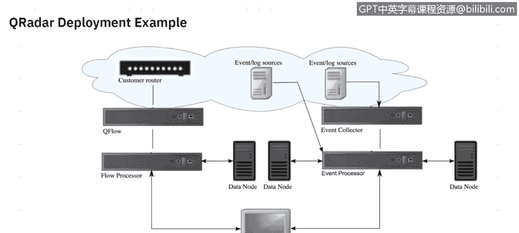
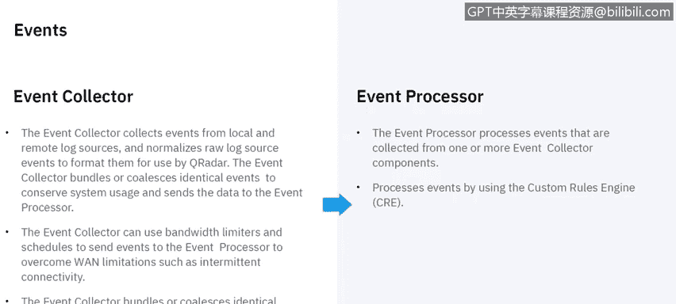
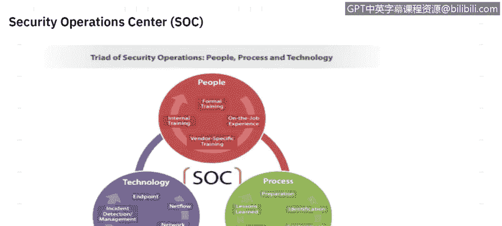
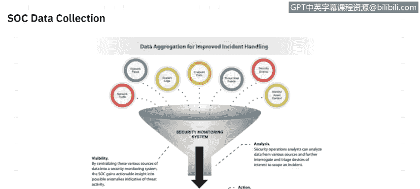
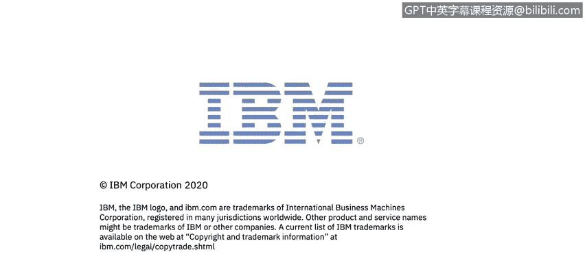

# 课程6：《网络威胁情报课程（IBM）》：30：29_SIEM部署

## 概述

在本节课中，我们将要学习安全信息与事件管理系统的部署。我们将探讨部署SIEM时需要考虑的关键因素，并通过一个具体的部署示例来理解其架构和工作流程。最后，我们将了解SIEM如何融入安全运营中心，并提升事件处理能力。

---

## 部署SIEM的考量因素

在部署SIEM时，有几个关键因素需要考虑。

首先是合规性。企业需要遵守各种法规和合规性指标，例如欧盟的《通用数据保护条例》、美国的《健康保险携带和责任法案》以及支付卡行业数据安全标准。SIEM可以帮助企业衡量和满足这些要求。

其次是成本效益分析。投资任何新技术时，都需要评估其带来的效益和商业价值。

最后是网络安全方面。随着技术日益普及，恶意行为者可能为了经济利益或其他不良目的，在环境中制造问题。因此，保护环境中的数据安全是至关重要的考虑因素。

---

## SIEM部署架构示例

上一节我们介绍了部署SIEM的宏观考量，本节中我们来看看一个具体的部署架构示例。

我们将以IBM QRadar为例进行说明。实际上，市场上任何SIEM的部署方式都与此非常相似。

在典型的部署场景中，数据流从网络源（如SPAN端口、网络分路器或路由器）进入。这些数据流被转换为QRadar可以读取的格式，即QFlow，然后发送给流处理器。这些组件可以是硬件设备，也可以是软件。处理后的数据最终会呈现在控制台上，供安全运营中心的分析师查看。

事件和日志源的处理方式完全相同。它们被发送到事件收集器，然后由事件处理器处理，最后进入控制台。

在较小的环境中，所有这些功能可以整合到一台设备中。这意味着一个小型部署可能只需要一台设备来完成图中所示的所有工作。

---

## 事件收集与处理详解

了解了整体架构后，让我们更深入地探讨事件收集器和事件处理器。

事件收集器从本地和远程日志源收集事件，并将这些日志源事件规范化为QRadar可以读取的格式。事件收集器通常用于远程位置。例如，如果你有多个办公地点或多个数据中心，你可以在每个数据中心部署一个事件收集器，它们将数据馈送到一个事件处理器。

事件处理器，顾名思义，处理来自一个或多个事件收集器的事件。它使用自定义规则引擎来处理这些事件。规则引擎本质上是我们用来判断行为是否异常的方式。事件经过处理，通过自定义规则引擎，如果有人发现“这个行为看起来不对劲”，就会将其标记为违规事件。这个过程就发生在事件处理器上。

---

## 网络流数据处理

与事件处理类似，网络流数据也以相似的方式处理。

流收集器从数据包中收集流数据。这些数据可以从监控端口（如SPAN端口或网络分路器）或会话中收集。也可以从NetFlow、sFlow或JFlow等源收集。收集到的数据被转换为QRadar的专有格式QF，然后发送到流处理器进行处理。

与事件收集器类似，流收集器也会被放置在远程数据中心。根据你的数据中心架构，你可能需要多个流收集器。例如，你可能在一个城市有一个数据中心，在另一个城市有另一个，那么你可以在每个数据中心部署事件和流收集器，然后将数据馈送到主数据中心的流处理器。具体部署取决于组织的规模、数据源数量以及地理分布。

当我们规划SIEM规模时，流处理器会对来自不同流收集器的相同源数据进行去重。它还会执行非对称流重组，即当数据以非对称方式提供时，将流的两侧信息组合成一条记录。然而，有时你可能无法获得流的双向数据，可能只获得了流向特定网络主机的信息，而没有返回的信息。但当我们获得双向数据时，系统可以识别这两个不同的流并将它们合并。

---

## 从一体机到分布式架构

前面我们提到了“一体机”部署，即使用单一设备进行QRadar部署。但在某些情况下，可能需要转向分布式架构。

以下是需要考虑的因素：

*   **数据收集需求**：如果你的数据收集需求超过了一体机的收集能力。
*   **地理位置与吞吐量**：如果你想从不同位置收集事件和流数据，并且直接连接到一体机的吞吐量不佳。
*   **基于数据包的流源监控**：如果你监控基于数据包的流源，可能需要添加流收集器。
*   **工作负载增长**：随着部署规模扩大，你的工作负载可能最终会超过一体机的能力。
*   **搜索速度**：如果你有更多分析师需要同时执行搜索，而一体机无法处理这种并发搜索需求，这会导致你需要更分布式的架构，而不是将所有工作都放在单一设备上。
*   **数据保留期**：许多组织对数据需要保留多长时间有强制要求。如果你的数据保留期所需的存储要求对单一设备来说太大，可能需要部署多台设备。
*   **团队规模与搜索性能**：随着团队成长，你可能需要更好的搜索性能。

所有这些因素都可能导致从单一设备部署转向多设备部署。

---

## SIEM在安全运营中心中的角色

现在，让我们看看SIEM如何融入安全运营中心的概念。

安全运营中心，顾名思义，包含人员、流程和技术三个部分。SIEM显然属于技术部分。技术部分还包括端点安全、网络监控、事件取证和威胁情报等。

人员可能是SOC中最重要的组成部分，因为他们负责处理SIEM提供的数据，并围绕这些数据提供情报，以判断某个事件或违规是否需要更详细的调查。这包括正式培训、内部培训以及在岗经验。如果你使用了特定供应商的工具，接受该供应商的培训也很重要。

流程是融入SOC的另一个关键部分。这指的是当事件转化为违规，以及该违规需要被调查时，你所遵循的步骤。这本质上是一个闭环过程：从准备到识别，再到如何遏制、清除、恢复，最后总结经验教训，并将经验反馈回准备阶段。因此，流程也是SOC组件中非常重要的一部分。

---

## SOC数据收集以改进事件处理

最后，我们来谈谈如何通过SOC数据收集来改进事件处理。

我们希望提高可见性，因为我们将所有数据源集中到SIEM或安全监控系统中。通过收集网络流量、系统日志、端点数据、外部威胁情报源和事件等信息，并全部输入SIEM，我们可以确保环境中的所有情况都可见。我们应尽可能多地将数据源输入SIEM，以获得对整个环境的全面可见性。当然，许可证考虑和预算等因素会限制我们能引入SIEM的数据源数量。

当我们确定了所有要引入SIEM的数据源后，我们依赖监控系统或SIEM进行分析。我们希望SIEM能提供尽可能多的数据和相关情报，以便安全分析师在分析时能够过滤掉所有噪音，只关注那些应该且需要被调查的事项。

接下来是行动阶段。一旦我们有了发现，并确定了正确的调查流程和补救措施（无论是打补丁、修改防火墙规则、隔离系统以进行进一步调查，还是甚至可能重新安装系统），行动就是我们将采取的措施，以解决在分析和调查过程中发现的问题。

---

## 总结

本节课中，我们一起学习了SIEM部署的核心知识。我们探讨了部署前需要考虑的合规性、成本效益和网络安全等因素。通过IBM QRadar的示例，我们了解了SIEM的基本架构，包括事件/流收集器、处理器以及一体机与分布式部署的区别。我们还明确了SIEM作为技术核心，如何与人员、流程共同构成安全运营中心，并通过集中数据收集和分析来提升安全事件的处理能力与效率。