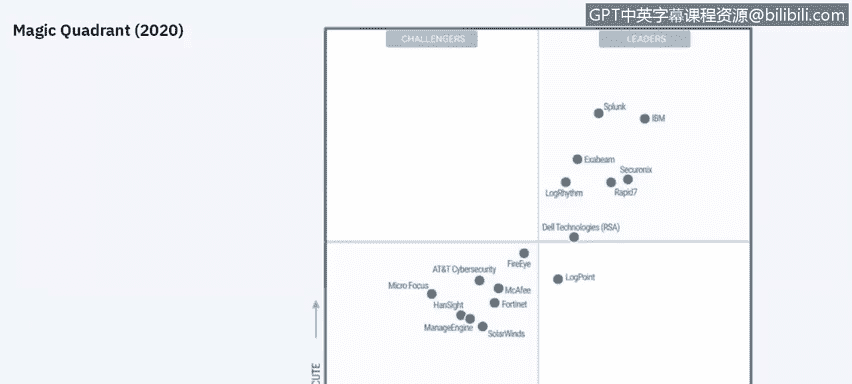
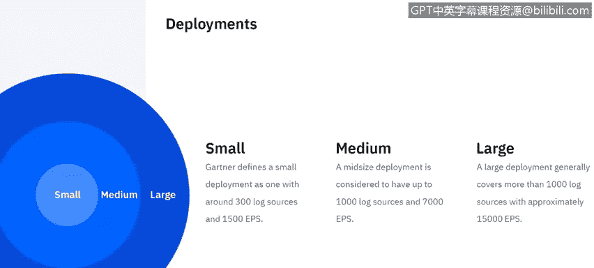
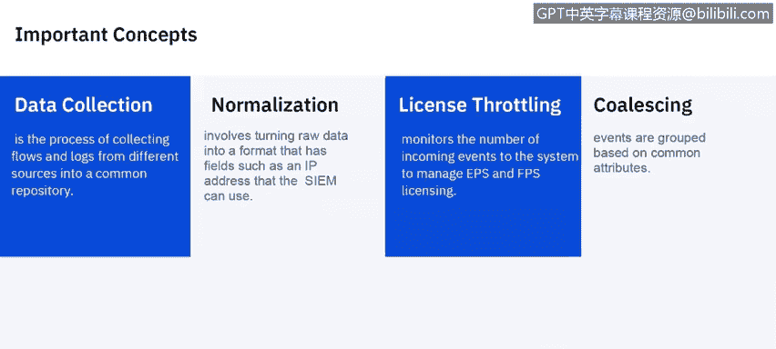
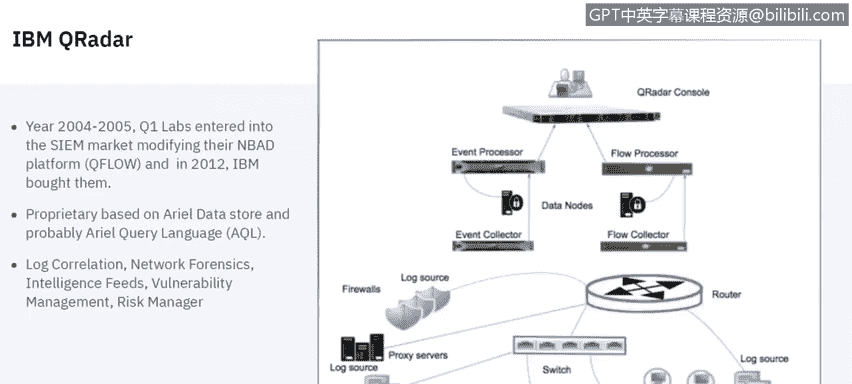
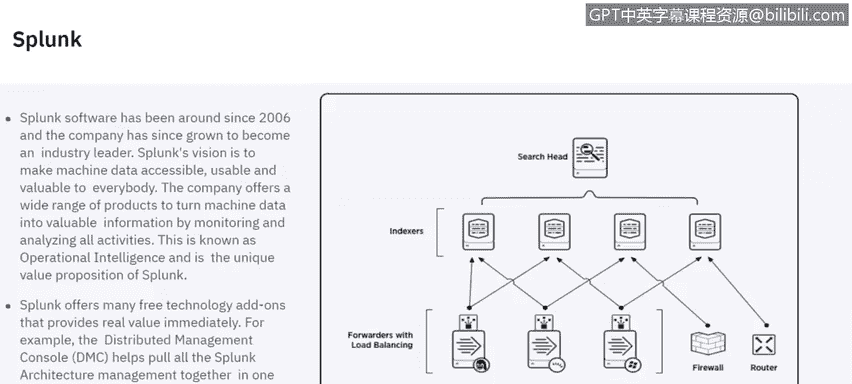
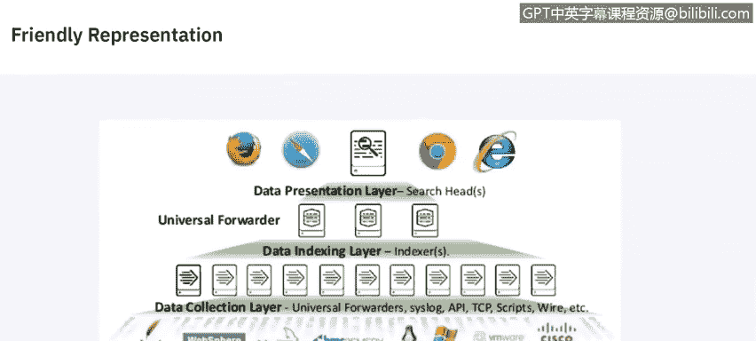
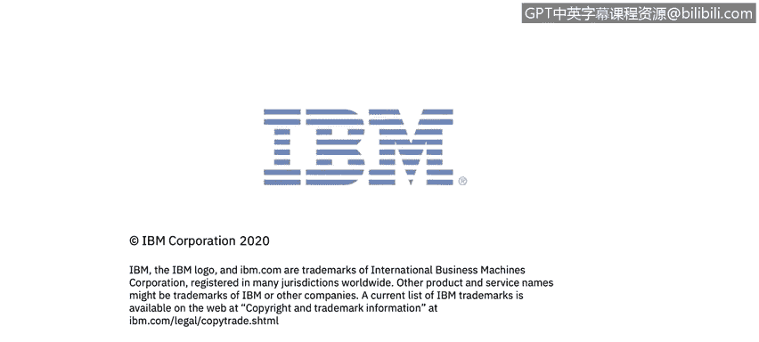

# 课程6：《网络威胁情报课程（IBM）》：31：30_SIEM解决方案供应商

你好，我是Jude Lancaster。今天，我们将讨论市场上不同的SIEM解决方案，关注其中的几家供应商。

## 概述
在本节课程中，我们将探索不同的SIEM供应商及其解决方案的各个组成部分。我们将了解SIEM市场的基本定义、核心概念，并重点介绍IBM QRadar、Splunk和LogRhythm等主流供应商。

## SIEM市场定义
安全信息和事件管理市场由客户对实时分析安全事件数据的需求所定义。这种需求支持对攻击和漏洞的早期检测。SIEM解决方案负责收集、存储、调查安全数据，并支持缓解措施和报告生成，以用于事件响应、取证和法规遵从。

我们将主要讨论Gartner魔力象限中包含的供应商。这些供应商为此目的设计了产品，并积极向各行业的客户销售。

## Gartner魔力象限
这是Gartner的魔力象限图，许多人可能熟悉它。显然，位于右上角是技术的理想位置。你会看到IBM和Splunk处于非常高的位置，还有Exabeam、LogRhythm和Rapid7等其他技术。此外，还有一些更偏向特定功能的解决方案，它们在市场上的普及度不如魔力象限中的那些。今天我们将重点讨论IBM QRadar、Splunk和LogRhythm。

## 部署规模概念
现在我们来谈谈部署规模。Gartner将小型部署定义为拥有约300个日志源，即300个不同的设备或软件向SIEM提供数据，以及大约1500 EPS。EPS是每秒事件数，这是SIEM解决方案通常的衡量和许可方式。中型部署约为1000个日志源和7000 EPS。大型部署约为1000个日志源和15000 EPS。这张幻灯片没有讨论网络流，即网络上设备之间的通信记录，但网络流也非常重要。并非每个SIEM解决方案都收集网络流，但它们是整体安全策略的一个重要方面。网络流能告诉你网络上的端点与外部端点（如网页或服务器）之间正在发生什么通信。

## 核心概念解析
上一节我们了解了部署规模，本节中我们来看看SIEM的核心概念。理解这些概念对于掌握SIEM的工作原理至关重要。

以下是SIEM中的一些关键概念：
*   **SIEM**：安全信息和事件管理工具，提供对网络硬件和应用程序生成的警报的实时分析。
*   **规则**：一种试图将这些事件关联成报告或事件的程序，以便你能看到环境中发生的情况。
*   **规则阈值**：触发规则并生成关联事件的点。
*   **事件阈值**：在触发规则阈值之前，事件必须发生的次数。
*   **规则动作**：当所有规则条件和阈值设置都满足时发生的程序，即当上述情况发生时将要执行的操作。
*   **趋势**：定义如何以及在多长时间内聚合和评估数据趋势的资源。趋势在定义的时间表和持续时间上执行指定的查询。
*   **事件**：特定用户操作（如登录、防火墙放行）的实际日志。它发生在特定时间，并在该时间被记录。
*   **网络流**：与事件同等重要的网络活动记录。根据会话内的活动，它可以持续数秒、数分钟、数小时甚至数天。例如，发送电子邮件可能是一个持续几秒的流，而下载大文件可能持续数小时甚至数天。
*   **数据收集**：从不同来源收集网络流和日志的过程，这些数据通常进入某种公共存储库，如SIEM内置的数据库。
*   **规范化**：将原始事件转换为具有用户可读字段（如IP地址、机器名）的格式的过程，这有助于用户查看这些原始事件。
*   **许可和许可限制**：监控进入系统的事件和网络流数量以管理你的许可。大多数SIEM都以这种方式许可，无论是每秒事件数、每秒网络流数还是两者的组合。
*   **合并**：基于共同属性组合事件。如果我们短时间内看到一个端点的多个操作，这些操作通常会被合并为一个单一事件。

## 主流SIEM供应商介绍
了解了基本概念后，我们来看看市场上几个主要的SIEM供应商及其解决方案。

### IBM QRadar
我们将讨论的第一个技术是IBM QRadar。IBM QRadar于2005年推出，最初名为Q1 Labs。它的起点与大多数SIEM略有不同，因为它始于网络流分析。QRadar关注网络行为异常，其NBAD平台源自Q网络的网络行为异常检测平台。IBM于2012年收购了它，此后它一直是IBM安全业务的支柱。它基于专有的Ariel数据存储和专有的Ariel查询语言，使用Ariel数据库来存储进入系统的数据和事件、网络流。它执行日志关联、网络取证，利用威胁情报源，进行漏洞管理，并包含一个风险管理组件。

QRadar有几个组件，虽然不是全部，但以下是最受欢迎的：
*   **漏洞管理器**：发现并感知网络设备和应用程序，然后提取安全漏洞信息，并提供相关上下文，以便优先修复这些特定设备。它是IBM安全QRadar平台的一个附加组件。
*   **用户行为分析**：由于用户（无论是通过恶意活动还是仅仅因为错误或偶然活动）确实是漏洞和风险发生的主要来源，UBA正变得越来越受欢迎。QRadar的用户行为分析是一个免费附加组件，用于分析用户活动，可以检测内部恶意行为、用户凭据是否被盗用，并可根据用户的风险活动对其进行优先级排序。
*   **网络洞察**：利用网络流数据，这是QRadar与市场上其他SIEM的一个主要区别点。大多数其他SIEM本身不原生引入网络流数据，有些会将网络流数据作为事件引入，但这并不能提供实际发生情况的完整图景。网络洞察可以实时引入网络数据，真正洞察环境中发生的情况，因为黑客或攻击者要做的第一件事就是关闭日志记录，如果日志被关闭，就会隐藏进入SIEM的信息。然而，网络不会说谎，你无法关闭网络上正在发生的信息，这就是为什么网络流如此重要，因为你可以检测到网络钓鱼电子邮件、恶意软件数据外泄、环境内的横向移动以及其他应用使用和合规性差距。

### Splunk
Splunk已经存在了大约10年，最初并不是作为SIEM起步的，但在这个领域获得了很大的普及。Splunk的目标是让机器数据对每个人来说都易于访问、可用且有价值。其核心目标是从多个不同来源获取信息，并将其合并到一个单一的数据存储中，以便可以在一个统一的视图中查看这些数据，这就是Splunk的操作智能，也是其独特的价值主张。他们还有几个免费的技术附加组件，可以提供一些额外的价值。分布式管理控制台将所有Splunk架构管理集中在一组仪表板中。如前所述，Splunk并非始于SIEM，但已将其产品扩展到非常强大的SIEM解决方案。

这是Splunk架构的一个示意图。它有一个数据收集层，转发诸如CIS、API、脚本等数据，然后将其提供给数据索引层，再进入数据呈现层，即Web浏览器通过其可见性呈现给最终用户的部分。

### LogRhythm
最后我们来谈谈LogRhythm。他们也拥有一个强大的安全智能平台，同样位于Gartner魔力象限中。该平台支持LogRhythm实施的集中管理。
以下是其关键组件：
*   **平台管理器**：执行LogRhythm实施的集中管理。
*   **数据处理器**：执行日志收集和管理，即实际拉取不同日志收集的硬件部件。
*   **数据索引器**：索引你的数据和元数据。
*   **AI引擎**：提供关联和分析能力的人工智能引擎，负责所有日志事件的关联，将其整合在一起，并提供有关规则和分析的信息。
*   **一体化设备**：为小型实施提供将所有上述解决方案结合到单一设备中的选项，该设备还可以进行一些网络监控，对网络流量内容进行深度分析。
*   **数据收集器**：从远程系统收集日志数据，然后准备传输到集中的LogRhythm平台实施。如果你有不同的地点，可以在那里放置数据收集器，它会将数据转发到主LogRhythm实施。

## 总结
本节课中，我们一起学习了SIEM市场的基本定义和核心概念，包括事件、网络流、规则、阈值等。我们重点介绍了三家主流的SIEM供应商：IBM QRadar、Splunk和LogRhythm，了解了它们各自的特点、架构和关键组件。理解这些不同的解决方案有助于你在实际环境中根据需求选择和评估合适的SIEM工具。