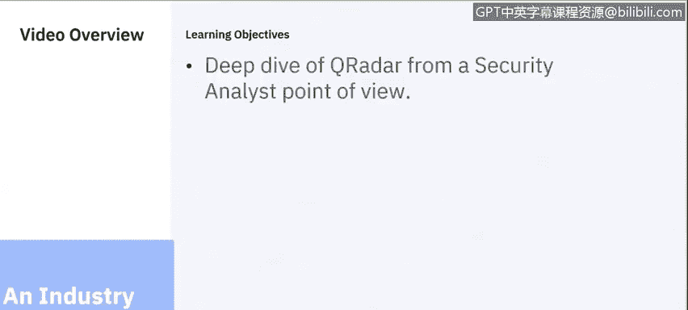
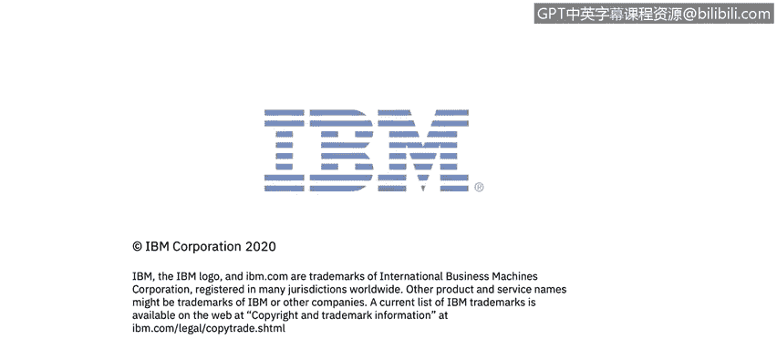

# 课程6：《网络威胁情报课程（IBM）》：32：31_QRadar SIEM行业示例

在本节课中，我们将通过一个行业示例，了解IBM QRadar安全信息与事件管理平台的核心功能。我们将从安全分析师的角度出发，探讨QRadar如何帮助组织应对现代安全挑战。

## 概述：QRadar的设计目标与核心价值

QRadar，即IBM安全智能平台，旨在解决一系列关键的安全挑战。其核心设计目标包括检测高级威胁、识别内部威胁，以及保护云资源。随着越来越多的公司将工作负载迁移到云端，保护这些数据和确保云上工作负载的安全变得至关重要。

QRadar能够帮助客户保护其关键数据，例如数据库、客户数据、患者数据或政府数据。无论数据位于云端还是本地，QRadar都能提供保护，并在检测到事件时有效响应。此外，它还能帮助组织优先处理和管理风险，并在许多情况下证明其合规性。

## 应对合规性要求

许多组织必须遵守合规性指令。在美国，有支付卡行业数据安全标准，适用于接受信用卡的组织；还有健康保险流通与责任法案，用于保护患者数据。在欧洲，通用数据保护条例也变得非常重要。QRadar可以帮助组织保护数据，以满足这些合规性要求。

更重要的是，QRadar使组织能够从被动响应转向主动防御。它可以帮助客户主动搜寻威胁、更快地响应，并通过提供有关环境中威胁的指标和信息，持续改善组织的安全态势。

## 扩展功能：安全应用交换中心

QRadar的一个显著优势是其强大的可扩展性。通过安全应用交换中心，目前有超过220个应用程序可以添加到QRadar中。这些应用程序大多免费，由IBM的合作伙伴或IBM自身开发，旨在增强QRadar的功能性和可用性。

其中一个我们将深入探讨的应用程序是用户行为分析应用，这将在另一个演示中详细介绍。这些应用程序为QRadar平台提供了无缝集成，根据您使用的硬件或网络设备，引入额外的信息和洞察。

## 自动化与智能：Watson的集成

QRadar致力于通过提供自动化分析，来增强提供给安全运营中心分析师的情报。当我们谈论自动化和人工智能时，核心是IBM的Watson平台。

Watson会在互联网上搜寻安全信息，包括结构化和非结构化数据，并在QRadar客户需要调查威胁时提供这些信息。例如，如果在QRadar控制台中发现异常情况，可以要求Watson提供更多详细信息。Watson会与X-Force Exchange（互联网上仅次于Google和Bing的第三大网络爬虫）配对，自动识别和评估QRadar所发现威胁的严重性。这为调查已检测到的威胁提供了大量资源。

## 全面的环境可见性

由于QRadar能够保护云资产和云数据，它可以提供对整个环境的可见性。无论我们关注的资产是在云端、在您自己的数据中心，还是员工通过VPN连接，所有这些资产都可以被QRadar识别和保护。

## 灵活的部署与消费模式

客户可以通过多种不同的方式使用QRadar：
*   可以在自己的数据中心作为硬件设备或软件运行。
*   可以作为服务从IBM或其合作伙伴处以软件即服务模式消费。
*   甚至可以由他人为您管理，您只需消费其提供的内容。
*   可以在公共云上运行，例如AWS、IBM Cloud或Google Cloud。
*   可以采用混合模式，部分解决方案在本地，部分以服务或基础设施即服务的形式提供。

## 总结

本节课中，我们一起学习了IBM QRadar SIEM平台的核心功能与行业应用。我们了解到QRadar如何帮助组织检测威胁、保护数据、满足合规要求，并通过应用扩展和Watson人工智能实现自动化智能分析。其全面的环境可见性与灵活的部署模式，使其成为应对现代复杂安全挑战的有力工具。