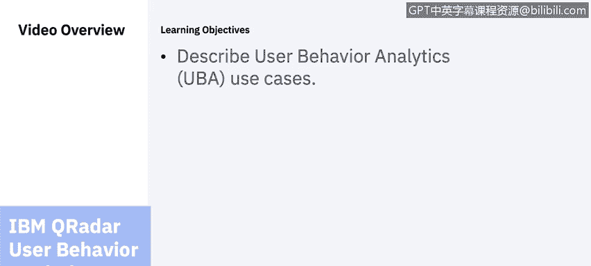
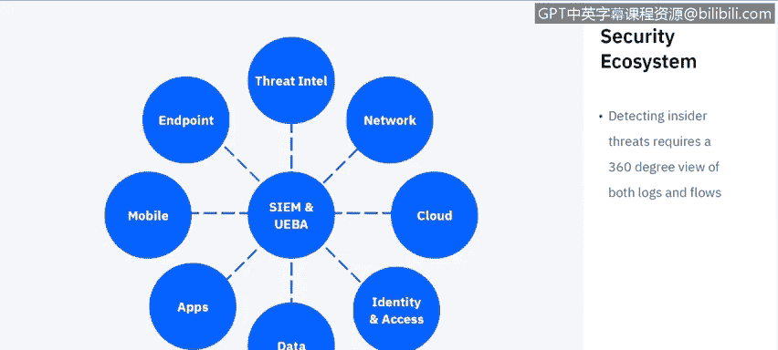
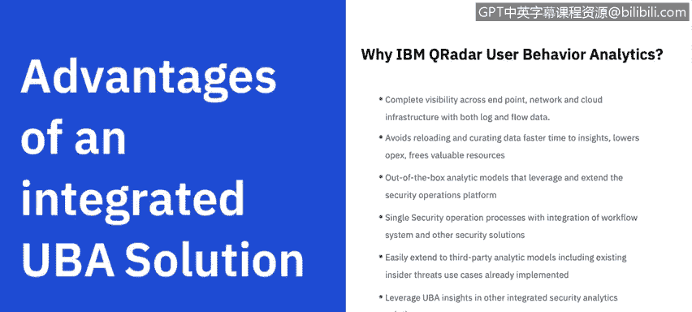
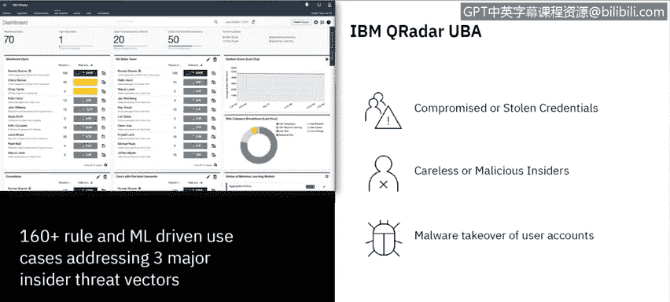
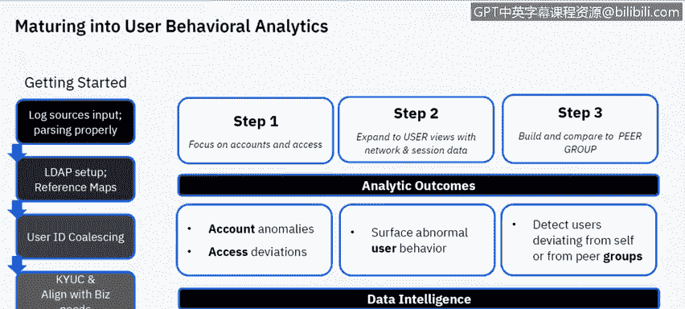
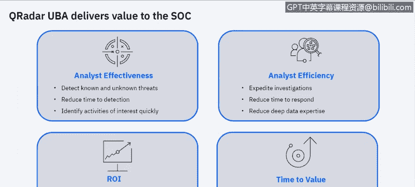
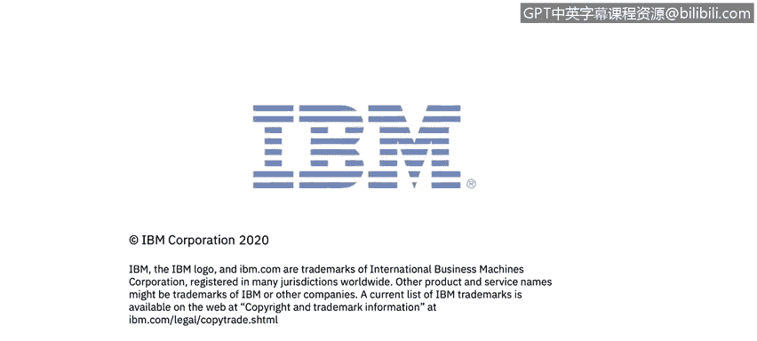

# 课程6：《网络威胁情报课程（IBM）》：33：32_用户行为分析

在本节课中，我们将学习IBM QRadar的用户行为分析应用。我们将探讨用户行为分析如何与安全信息与事件管理协同工作，并了解一些具体的用户行为分析用例。

## 概述

用户行为分析是网络安全领域的关键组成部分，它通过分析用户和实体的行为模式来识别潜在威胁。本节将介绍UBA的核心概念、优势及其在IBM QRadar平台中的具体实现。

## UBA与SIEM的协同工作

上一节我们介绍了UBA的基本概念，本节中我们来看看UBA如何与SIEM系统协同工作以提供全面的安全监控。

UBA或UEBA（用户与实体行为分析）本质上都依赖于SIEM系统。SIEM是所有安全数据的汇聚点，UBA则从用户和实体的角度对这些数据进行二次分析，评估风险。数据来源包括：
*   **威胁情报源**：例如IBM X-Force。
*   **网络基础设施**：防火墙、交换机、路由器等设备。
*   **云系统**：云环境中的各类系统。
*   **身份与访问管理系统**：用于追踪特权账户访问和登录行为，这对UBA至关重要。
*   **数据源**：数据库及重要的客户数据。
*   **应用程序**：自研应用或存储数据的应用。
*   **移动设备**：随着远程办公的普及，移动设备成为重要监控对象。
*   **终端**：用户访问公司资源所使用的物理机器。

将所有这些日志源和流数据源整合到SIEM中，构成了保护组织的安全生态系统基础。

## 集成式UBA解决方案的优势

了解了UBA与SIEM的关系后，我们来看看集成式UBA解决方案，特别是IBM QRadar UBA，能带来哪些具体优势。

集成式UBA解决方案提供多项优势：
*   **全面的可见性**：它通过日志和流数据，提供跨终端、网络和云基础设施的完整可见性。恶意攻击者入侵后常会关闭日志记录，导致安全团队“失明”。但网络数据不会说谎，通过分析网络流量，即使日志被关闭，也能洞察入侵行为和数据外泄等通信模式。
*   **更快的洞察速度**：QRadar UBA能加速获得安全洞察，并将宝贵的资源从常规调查中解放出来，用于其他更深入的调查。
*   **集成的分析模型**：它提供利用安全运营平台的分析模型。由于与QRadar深度集成，它使用相同的工作流和管理界面，并能利用QRadar Advisor的人工智能能力。
*   **第三方模型兼容**：它可以帮助整合基于现有内部威胁用例的第三方分析模型，与组织内已部署的其他工具和用例模型集成。

## QRadar UBA的核心用例

现在，让我们聚焦于IBM QRadar用户行为分析应用本身，探讨其针对的三个核心内部威胁向量。

以下是QRadar UBA主要应对的三种威胁用例：
1.  **凭证泄露或被盗**：攻击者通过钓鱼等手段获取合法用户的登录凭证。
2.  **粗心或恶意的内部人员**：其活动模式可能相似，但动机不同（无意疏忽 vs. 故意破坏）。
3.  **恶意软件接管用户账户**：恶意软件利用用户账户进行非法活动。

QRadar UBA内置超过160条规则和机器学习驱动的用例，专门用于应对上述三大内部威胁向量。

## 检测机制与数据源

为了更具体地理解UBA如何工作，本节我们将以检测凭证泄露为例，看看QRadar UBA如何映射到MITRE ATT&CK攻击框架并进行检测。

QRadar UBA通过映射MITRE ATT&CK框架来检测凭证泄露等威胁。例如：
*   **钓鱼攻击**：相关用例包括“访问风险IP地址”和“下载恶意软件”。帮助识别此类行为的数据源可能包括防火墙和Web网关日志。
*   **命令与控制**：相关战术可能是“与C2服务器的出站通信”。网络流量数据是检测此类活动的关键。

UBA能够帮助组织防护从钓鱼攻击到数据外泄的整条攻击链上的威胁。

## 恶意内部行为的识别

除了外部攻击，内部威胁同样危险。本节我们来看看UBA如何识别可能表明恶意内部行为的异常活动。

恶意内部行为难以追踪，因其形式多样。UBA可以监控以下异常活动：
*   **VPN访问异常**：使用他人VPN证书登录。
*   **异常登录时间**：在非工作时间或从异常地理位置登录。例如，短时间内从相距千里的两个地点登录，这在物理上不可能。
*   **异常文件访问和下载**：下载行为模式突变，如下载量激增。
*   **权限提升尝试**：尝试获取更高系统权限的活动。
*   **过度打印**：将大量文件发送到打印服务器，可能为后续数据外泄做准备。
*   **活动量骤降**：文件、电子邮件或网页访问活动异常减少。
*   **访问求职网站**：员工频繁访问求职网站可能预示离职风险。

UBA可以利用终端日志、打印服务器日志或数据防泄露解决方案的日志来监控USB设备插入及数据写入行为。

## 有效实施UBA的步骤

用户行为分析要发挥效力，需要组织具备一定的安全成熟度。本节将介绍成功部署和利用UBA的关键步骤。

成功实施UBA需要遵循以下步骤：
1.  **打好SIEM基础**：正确设置和调优SIEM系统，确保日志源正确输入和解析。
2.  **配置身份映射**：正确设置LDAP，完成用户与组织部门的参考映射，并解决同一用户拥有多个ID的用户ID合并问题。
3.  **对齐业务需求**：确保UBA的配置与组织的具体业务需求保持一致。
4.  **系统调优**：配置和调优系统，确保获取正确数据并尽量减少误报。

在利用UBA时，无论是IBM QRadar UBA还是其他方案，都应：
*   **聚焦账户与访问**：首先关注账户及其访问权限。
*   **结合网络会话数据**：利用网络会话数据扩展用户行为视图。
*   **建立同侪比对**：通过机器学习，将用户行为与组织内职责相似的“同侪组”进行比对。

分析结果可能包括账户异常、访问偏差、异常用户行为（如数据下载量剧增）以及检测到用户行为偏离其个人常态或同侪组常态。这些都需要进一步调查。

## 总结与价值

在本节课中，我们一起学习了IBM QRadar用户行为分析的核心概念、用例和实施方法。

QRadar UBA为安全运营中心提供了显著附加价值：
*   **提升分析师效率**：帮助分析师检测已知和未知威胁，缩短检测时间，更快识别需调查的活动。
*   **投资回报率高**：作为QRadar的免费附加功能，每个QRadar客户都可以从IBM App Exchange下载并安装。它部署配置快速，易于调优，实现价值的时间很短。
*   **增强检测能力**：启用机器学习后，它能追踪特定用户和组的行为模式，并在行为偏离常态时帮助识别异常，从而提供更深入的洞察。

---

**本节课中我们一起学习了：**
1.  UBA如何与SIEM协同构建安全生态系统。
2.  集成式UBA解决方案，特别是IBM QRadar UBA的四大优势。
3.  QRadar UBA针对的三大核心内部威胁用例。
4.  UBA如何利用MITRE ATT&CK框架及多源数据检测威胁。
5.  识别恶意内部行为的关键异常指标。
6.  有效实施UBA所需的组织成熟度及具体步骤。
7.  QRadar UBA为安全运营带来的具体价值和快速部署特性。