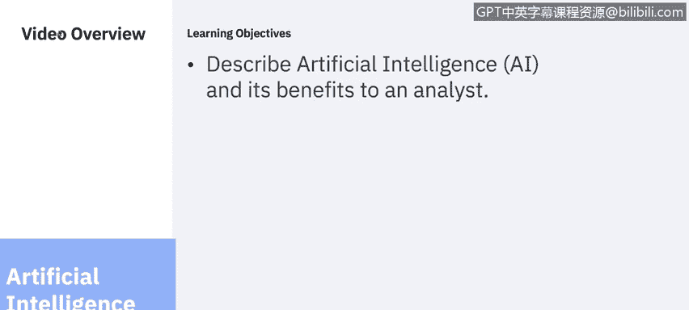
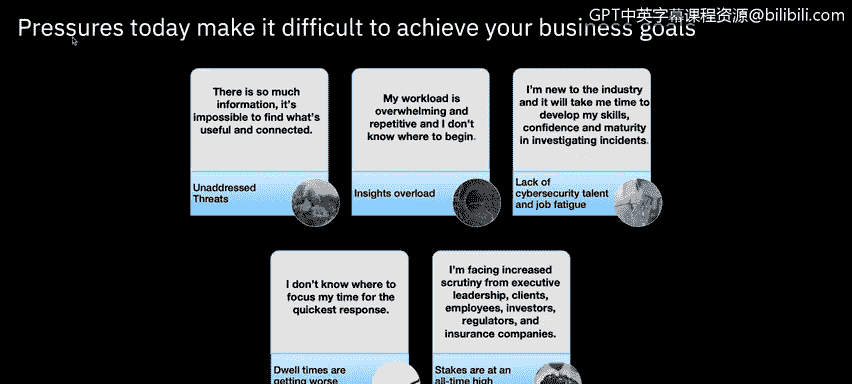
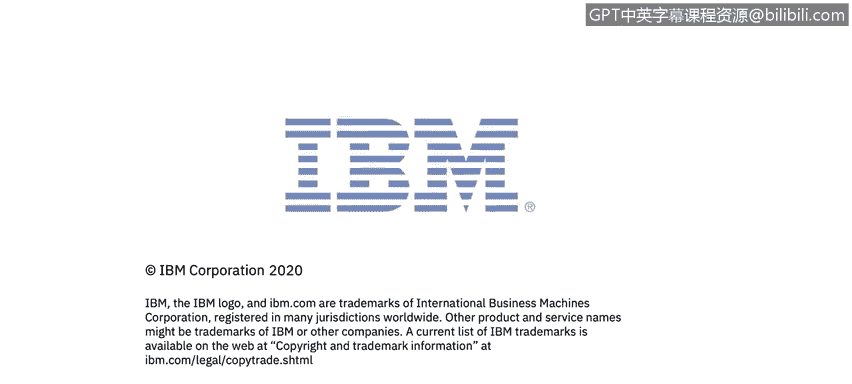

# 课程6：《网络威胁情报课程（IBM）》：34：人工智能与SIEM

在本节课中，我们将学习人工智能（AI）的概念，并探讨它如何为安全分析师带来益处。我们将了解现代安全团队面临的挑战，以及AI如何与分析师协作，共同提升安全防御的效率和效果。

## 概述：现代安全分析师的挑战

无论您身处2人还是100人的安全团队，目标都是确保业务蓬勃发展。这意味着保护系统和数据以保持合规性、阻止威胁并领先于网络犯罪。然而，现代安全运营的压力使得实现这些目标变得困难。

以下是当今安全分析师普遍面临的五大挑战：

1.  **信息过载**：存在大量信息，难以找到有用且相互关联的内容。
2.  **工作负荷过重**：工作量大且重复，不知从何入手。
3.  **技能发展需求**：行业新人需要时间发展技能、建立信心。
4.  **工作优先级模糊**：不清楚应将时间重点放在何处。
5.  **外部审查压力**：面临来自高管、客户、员工、投资者和监管机构日益增加的审查。

## 挑战的深入剖析

上一节我们概述了主要挑战，本节中我们来看看这些挑战的具体表现。

为了阻止不断演变的新威胁，企业采用了比以往更多的单点解决方案。信息过载的一个简单原因是，作为分析师，您可能不知道信息之间如何关联。这导致难以发掘可操作的见解。因此，分析师可能只选择处理自己有把握的案例，这可能导致错过某些调查，并使组织面临风险。

需要分析的信息量、种类和速度之大，使得您难以确定工作的优先级并找到根本原因。这对各种规模的公司都是如此，不仅仅是大型企业。没有分析师知道从何处开始拼凑本地背景信息，以帮助他们快速有效地识别当前问题。

有时，重复性工作和疲劳会使您不堪重负，导致流程崩溃，并大大增加事件发生并使组织面临风险的可能性。

## 衡量成功的标准：驻留时间

那么，安全专业人员如何知道自己在保护和防御数据方面是成功的呢？可以使用多种指标，但其中一个非常流行且常用的是**驻留时间**。

**驻留时间** 基本上是指威胁行为者在网络中未被发现的访问持续时间，直到其被完全清除。

## 分析师的核心职责

每当与安全分析师交谈时，他们最常用来描述工作的词是“过度工作”、“人手不足”和“不堪重负”。当分析师通常是行业和职场新人时，他们需要时间才能真正发展调查技能、建立信心并走向成熟。

大多数分析师必须处理大量的内部来源，并可能在任意给定时间从多个来源收到警报。

以下是分析师的核心职责列表：

*   **快速理解威胁背景**：无论警报来自何处，您都需要快速理解潜在威胁的背景，并关联不同来源之间的趋势、异常域名和IP地址。Jude在SIEM概述中详细介绍了许多相关内容。
*   **保持信息更新**：必须及时了解针对特定商业行业和地理区域的网络攻击，并利用本课程模块一中学到的外部研究。
*   **确定优先级并验证**：必须对可能产生严重业务影响的潜在恶意活动进行优先级排序和验证。
*   **理解系统行为**：必须理解预期的系统行为，以识别偏离的实际系统行为。
*   **报告与分享**：必须向适当的团队报告有效的威胁以进行补救，并与其他分析师分享知识。
*   **建立个人声誉**：最重要的是，您必须提供可靠的信息来建立个人声誉。

可以想象，这个过程极其耗时。

## 解决方案：分析师与技术的伙伴关系

但一定有更简单的方法。这里的主要启示是，需要在分析师与其技术工具之间建立伙伴关系。

它们并非相互排斥。各自都有优势，例如人类的常识，以及AI在消除偏见和权衡分析方面的能力。但当它们作为一个团队聚集在一起时，可以更好地阻止威胁并减少驻留时间。

同时，您作为安全分析师也扮演着关键角色。请记住，AI会学习您的环境，并根据您输入的数据提供可操作的智能。因此，如果您没有向AI提供可靠的数据，您很可能不会信任AI为您做出的决策。

## 总结

本节课中，我们一起学习了人工智能（AI）如何辅助安全分析师应对信息过载、工作负荷过重等现代挑战。我们了解了衡量安全防御效果的关键指标——**驻留时间**，并回顾了分析师的核心职责。最重要的是，我们认识到**分析师与AI技术应建立伙伴关系**，结合人类智慧与机器效率，共同提升安全运营水平，更有效地保护组织免受威胁。