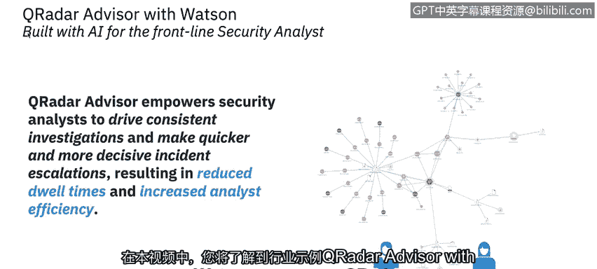
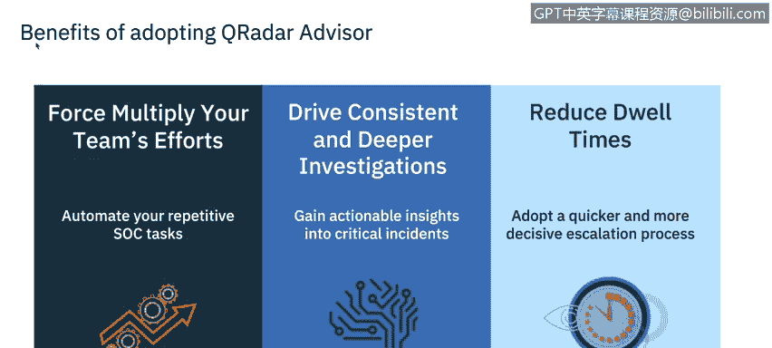
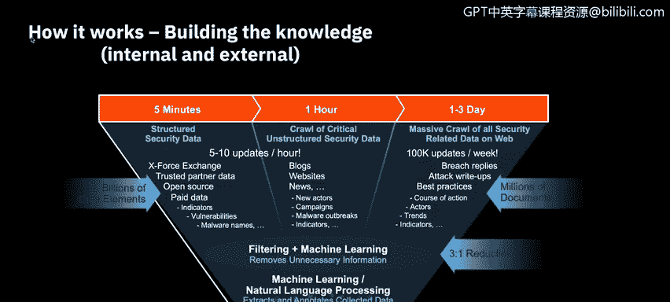

# 课程6：《网络威胁情报课程（IBM）》：35：人工智能与SIEM行业示例

## 概述
在本节课程中，我们将学习一个由IBM提供的行业示例：人工智能与SIEM。我们将重点了解QRadar Advisor with Watson的功能与特性，并探讨它如何帮助安全分析师提升调查效率与一致性。

---

## QRadar Advisor with Watson 简介
QRadar Advisor with Watson 能够赋能安全分析师，驱动一致的调查流程，并做出更快速、更果断的事件升级决策。这最终减少了事件处理时间，并提升了分析师的工作效率。

上一节我们介绍了该工具的基本定位，接下来我们具体看看它带来的主要优势。

## 核心优势
以下是QRadar Advisor with Watson的三个核心优势：

1.  **提升分析师效率**：它不会浪费人力资源在常规分析上，而是自动化重复的SIEM任务，让分析师能更专注于调查中更重要的环节。
2.  **驱动一致且深入的调查**：无论是周五下午4点还是周一上午10点，Advisor都能增强分析师的人工智能，确保每一次调查都保持一致性和彻底性。
3.  **减少事件处理时间**：通过更快速、更果断的升级流程，它有助于缩短事件响应周期。同时，通过将攻击映射到MITRE ATT&CK模型，它能自信地确定根本原因并规划后续步骤。

了解了核心优势后，我们来看看它在实际调查中是如何工作的。

## 工作原理
当调查一个事件时，QRadar Advisor遵循以下流程：

1.  **收集上下文信息**：首先，通过挖掘QRadar中可用的本地数据，获取关于该事件的更广泛背景信息。
2.  **咨询Watson进行外部发现**：然后，它就其对事件所做的离散观察，咨询Watson for Cybersecurity，以执行外部知识和威胁发现。
3.  **交付解决方案**：最终，它通过由Watson for Cybersecurity驱动的IBM Security App Exchange，提供一个可快速部署、易于使用的解决方案，从而改变安全运营模式。

这个工作流程释放了大量的安全知识。接下来，我们深入看看它如何处理数据。

## 数据处理与洞察生成
QRadar Advisor with Watson 通过以下步骤处理数据并生成洞察：

*   **审视多源数据**：它查看结构化数据、关键安全信息、非结构化数据以及互联网上的安全相关数据。
*   **清理与提取**：随后，它移除不必要的信息，并对收集到的数据进行提取和注释。
*   **生成调查洞察**：最终结果是实现快速且全面的调查洞察。

数据处理完成后，工具会进行深入分析。以下是其核心分析步骤。

## 攻击链分析与调查管理
QRadar Advisor通过以下步骤将事件与攻击链对齐：

1.  **评估攻击阶段**：确认威胁在每个攻击推进阶段的完成度。
2.  **可视化攻击过程**：可视化攻击是如何发生并推进的。
3.  **预测潜在战术**：揭示哪些攻击战术仍有可能发生。

此外，在调查管理方面，它具备以下功能：

*   **自动关联调查**：通过关联的可观察指标自动链接相关调查，避免重复劳动。
*   **扩展调查范围**：将调查范围扩展到当前事件之外。
*   **识别配置问题**：在因同一事件触发多个重复调查时，判断是否需要进行额外的规则调优。

基于对本地环境的分析，Advisor会推荐哪些新调查应该被升级，以协助分析师工作。

## 环境准备与评估
根据最佳实践和配置评估，QRadar Assistant可以快速扫描您的本地环境，并确定您是否已准备好充分利用Advisor with Watson的全部功能。

---

## 总结
在本节课中，我们一起学习了IBM QRadar Advisor with Watson这一行业示例。我们了解了它如何通过自动化重复任务、提供一致的调查框架、关联分析以及映射MITRE ATT&CK模型，来显著提升安全运营中心的分析效率和效果。您将有机会在虚拟实验室中应用所学的关于人工智能和SIEM的知识。