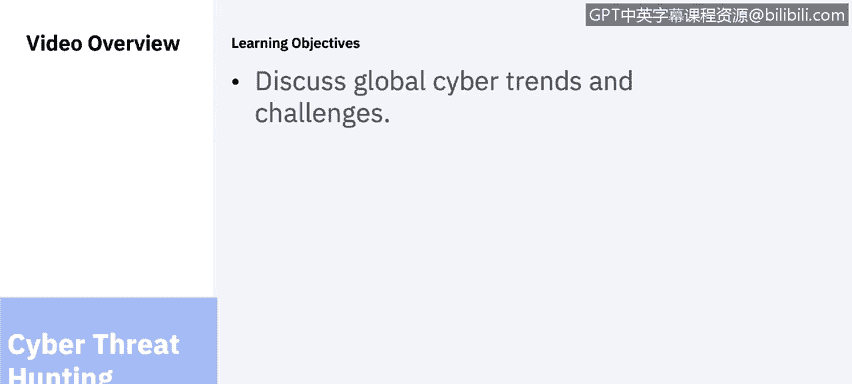
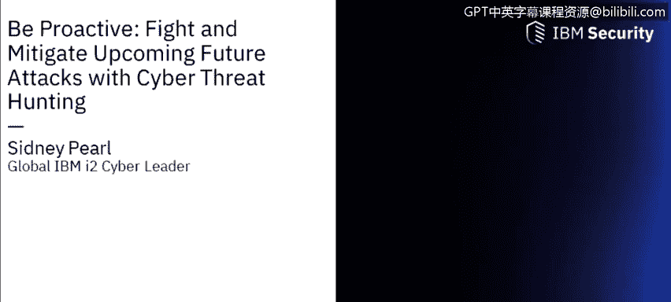
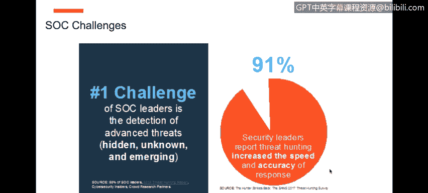
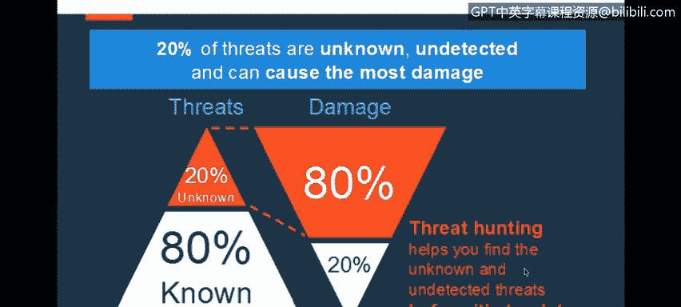
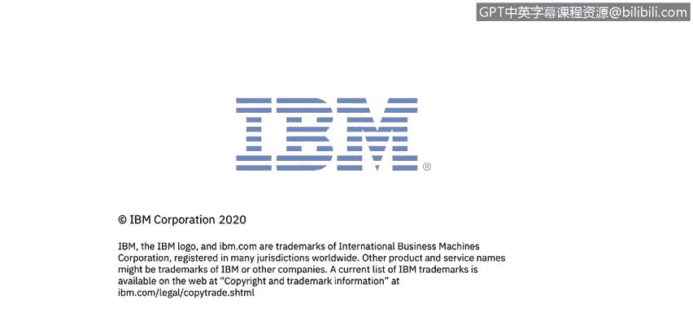

# 课程6：《网络威胁情报课程（IBM）》：36：通过网络威胁狩猎打击和缓解未来攻击

## 概述
在本节课中，我们将学习如何通过主动的网络威胁狩猎来打击和缓解未来的网络攻击。课程将讨论全球网络趋势与挑战，并介绍如何将威胁狩猎整合到安全运营中，以应对日益复杂的威胁环境。

## 全球网络趋势与挑战
网络威胁的形式多种多样，攻击方法也各不相同。为了应对这些来自不同来源的威胁，组织需要情报来强化自身，以抵御来自内部和外部的威胁。在事件发生后，组织可以识别和调查攻击。所有获得的洞察都将成为组织网络安全战略和战术的一部分，从而形成一种智能的网络安全方法。

接下来的三节视频是IBM网络安全专家悉尼·珀尔向全球观众展示的网络研讨会回放。

大家好，下午好。感谢大家今天抽出时间。很高兴与各位交流。

我先简单介绍一下自己。除了担任IBM全球I2网络威胁情报负责人之外，我的背景还包括在美国海军服役12年，从事现役、预备役以及特种作战的情报和通信工作。我曾与许多组织合作过。

除了军旅生涯，我还在UNIC公司担任过执行架构师，在其全球八个安全运营中心工作。我也曾担任UNIC公司的网络情报与分析执行负责人，这是我离开并加入IBM之前的最后一个职位。

我加入IBM是为了领导IBM I2技术的网络威胁狩猎计划。我拥有的其他能力和背景包括：我还担任位于佛罗里达州NASA肯尼迪航天中心的追踪与反贩运信息共享分析组织的执行主任，同时也担任志愿首席网络情报官。

因此，我不仅涉足传统的网络攻防安全领域，还结合了从军旅生涯到与执法部门合作，再到在网络安全行业工作多年的情报经验，总计超过12年。

基于这些经验，我今天想与大家探讨我们正在目睹的一些全球网络趋势和挑战。好消息是，我已经与世界各地的许多组织交流过，到访过18个国家，并向这些国家的众多客户提供了网络威胁狩猎研讨会。我可以肯定地告诉大家，从全球系统集成商到托管安全服务提供商，再到跨行业的客户、合作伙伴和服务提供商，都认识到主动的网络威胁狩猎需要整合到当今的安全运营中。

因此，我们可以得出结论，网络犯罪已经改变了公民、企业、政府、执法部门等的角色。网络触及我们所做的一切，我们不能对此视而不见。以医疗保健行业为例，假设你因为心脏问题而使用除颤器。所有这些设备都被我们定义为物联网设备，并且这些设备正逐渐转向无线、Wi-Fi和IP连接的状态。

在未来五年，随着物联网持续发展并定义我们的全球文化和路径，你将看到一个明确的趋势。随着更多此类技术的普及，自然也会带来一系列不同的网络安全挑战。但核心是，网络今天触及一切。我们可以称之为网络、互联网，或者任何我们想要定义的电子通信形式。但底线是我们都相互连接，而这种连接带来了诸多挑战。

在这些挑战中，许多数据泄露当然是由非恶意的和犯罪的行为活动引起的。许多组织正面临来自网络领域的众多挑战，特别是网络技能短缺。我们甚至还没有具体谈论网络损害和网络安全，以及我们在部署和支持此类解决方案时，为填补这些职责和技能所面临的网络技能空间挑战。

现在，这里有一个非常重要的关键点，即我们所谓的“驻留时间”。这是指漏洞或威胁在未被识别和发现的情况下，存在于你的网络或其他网络中的平均时间。这个平均驻留时间大约是191天。当然，这因组织而异。底线是，当今所有组织和行业在如何识别威胁、在其真正成为问题之前发现它，以及识别其复杂程度方面都面临挑战。

随着威胁的不断发展，我们知道威胁行为者，无论是跨国犯罪组织、犯罪地下世界，还是国家间的对抗，他们实际上拥有高度资源。这意味着他们比我们拥有更多的时间、金钱和资源。他们在所做的事情上也高度复杂。我的意思是，他们实际上在运营一项业务。你可以看到这里发生在美国的攻击类型示例，当然这并不局限于美国，但这些是很好的例子。

这些例子显示了攻击在组织中被发现之前存在的时间长度，以及实际造成的损害程度。因此，当我们谈论复杂性时，这些跨国犯罪分子、犯罪地下活动和国家行为者拥有更多的时间、金钱和资源。这意味着，例如，他们可以运营像“勒索软件即服务”、“恶意软件即服务”这样的业务。

这些无疑都是挑战。但我们可以看到，威胁在网络中的驻留是一个挑战。你如何在威胁成为实际问题之前识别它们？这些是我们当前面临的其他挑战示例。

在我与世界各地的多位首席信息安全官交流时，他们来自多个行业，包括军事、政府、执法、金融服务、保险、医疗保健等。对我而言，数据就是数据，犯罪活动就是犯罪活动。例如，我过去的一些工作涉及帮助收集关于国际逃犯、刑事逃犯的信息，这些人是司法逃犯，已经转移和重新安置到世界不同地点。我帮助收集和提供的一些信息和情报，当然是为了帮助定位并掌握这些人的位置，以便他们能被抓获并引渡回原籍国。

所以对我来说，数据就是数据。无论你谈论的是网络犯罪分子、恐怖组织还是金融犯罪，数据就是数据。关键是如何识别这些数据。现在，CISO们表示，从目标战争和恐怖主义行为，到间接犯罪活动，再到目标数据、间谍活动、黑客行动主义团体，现实是威胁向量也是多维的。

它们来自各种环境和活动，从零日威胁到勒索软件，再到恶意软件，所有这些类型的威胁都给我们自身以及我们的客户带来了挑战。自然地，安全运营中心和安全服务组织必须明白，如果你继续玩“保护-防御”的游戏——这无疑极其重要，保护-防御至关重要——然而，我们也需要进化到下一个层次，即进行更主动的网络威胁狩猎。

因此，当我们审视一些安全运营中心面临的挑战时，我们发现，在与多位SOC运营总监、全球系统集成商、托管安全服务提供商交流后，当前市场的一个趋势和需求是提高响应的速度和准确性。

那么如何做到这一点呢？我们无法洞察隐藏的、未知的和新出现的威胁。如何知道如何提高响应的速度和准确性？现实是，在传统的SOC中，第一层、第二层系统、终端系统、防火墙，以及作为SIEM的第二层系统，它们当然在履行职责，但它们只会发现80%的已知威胁。

挑战在于，那20%的未知威胁造成了80%的最大损害。因此，当你观察这个金字塔时，你会发现它实际上是倒置的：已知威胁占80%，未知威胁占20%，而这20%却造成了最大比例的损害。你可以从这里看到，在你开始将SOC演进到下一代能力之后，这意味着我们现在需要开始引入和整合情报主导的分析，以及我们称之为“情报主导的认知型SOC”。

## 总结
本节课中，我们一起学习了全球网络威胁的趋势与核心挑战，认识了威胁驻留时间的概念及其危害，并了解了将主动威胁狩猎整合到安全运营中以应对未知高级威胁的重要性。通过向情报主导的认知型安全运营中心演进，组织可以更有效地提前发现和缓解攻击。