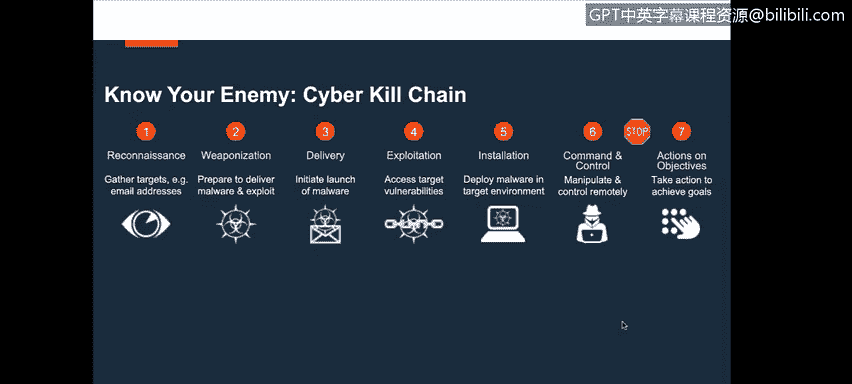
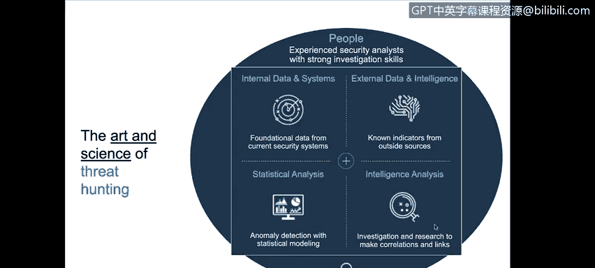
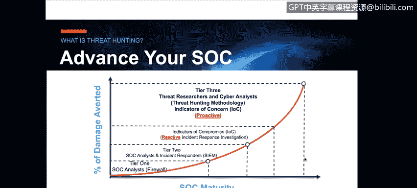
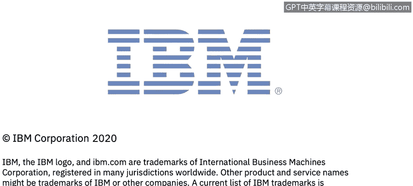

# 课程6：《网络威胁情报课程（IBM）》：37：36_SOC网络威胁狩猎

## 🎯 概述
在本节课中，我们将学习安全运营中心（SOC）面临的挑战，并深入探讨如何从传统的、反应式的安全运营模式，演进到由情报驱动的、主动的“网络威胁狩猎”模式。我们将明确威胁狩猎的定义、核心流程、所需技能，以及它与传统网络取证调查的根本区别。

---

## 🔍 传统SOC的挑战与演进方向
由IBM带来的SOC网络威胁狩猎课程。在本视频中，Sydney将描述当今安全运营中心（SOC）面临的网络挑战，以及由情报驱动的认知型SOC。

“下一代”和“由情报驱动的SOC”这些术语可能听起来很复杂，但我们可以将其简化为：由情报驱动、主动进行网络威胁狩猎，这最终是我们需要达到的目标。

正如我之前在介绍中提到的，我在SOC环境中工作多年。我在Unisys公司工作了十年，与那里的SOC以及客户进行交互与合作。作为执行架构师，我的首要任务是理解客户的需求。无论我们是内部支持还是外部服务，都必须理解我们希望通过当前状态的防护和防御操作以及传统SOC操作实现什么目标。

然而，我们发现，许多客户、全球系统集成商（GSI）和管理安全服务提供商（MSSP）都认识到，必须找到一种方法，在这些威胁成为实际问题之前就开始领先于它们。

因此，我们今天要介绍的是如何真正开始做到这一点。

---

## 🧠 威胁狩猎的核心：人的因素
我将回溯我在人类情报和情报领域的经验。我们面临的一个挑战是：在SOC中，从一级到四级的分析师和工程师在他们需要工作的脚本化环境中非常出色。

毫无疑问，三级和四级调查员（实际上是分析师）正在进行网络取证调查。但需要明确的是，这并非真正的主动网络威胁狩猎，而是反应式的网络取证调查。我们将讨论什么是真正的主动网络威胁狩猎。

我想与大家分享的是，在我们所做的所有与情报、威胁和威胁向量相关的事情中，无论是网络威胁、物理威胁、恐怖主义还是国家行为体，所有这些领域的共同点是：**这一切都是由人驱动的、以人为导向、由人发起的**。

因此，当你开始研究如何主动识别威胁向量、理解跨国犯罪分子及其运作方式时，你就需要开始制定如何进行主动网络威胁狩猎的策略。

---

## 📖 网络威胁狩猎的定义
首先要明确的是，如何定义真正的网络威胁狩猎。IBM在使用I2（情报分析平台）的背景下将其定义为：**主动且积极地识别、拦截、追踪、调查并消除对手的能力，目的是在对手对您的组织或客户构成问题之前完成这些工作**。

这是我们讨论的大方向，即下一代SOC，也就是我们所说的由情报驱动的认知型SOC。这当然需要与网络杀伤链联系起来，从而帮助你理解技术、技巧和程序（TTPs），这是我们在情报世界中定义的术语，也广泛用于情报和执法领域。

因此，作为其中的一部分，理解什么是网络威胁狩猎至关重要。

---

## ⚖️ 威胁狩猎 vs. 取证调查
再次澄清，网络取证调查是当今传统SOC中三级、四级分析师所做的工作，但它是反应式的，是你正在进行的取证调查。你可能会争辩说，如果一个威胁已经发生，漏洞已被利用，我们现在需要进行调查，你是在“狩猎”那个威胁吗？当然是。但这是在网络取证调查的背景下进行的。

而我们所说的网络威胁狩猎，是**主动且积极地识别、拦截、追踪、调查并消除此类威胁的能力，目的是在它们成为问题之前完成这些工作**。

这又回到了我们之前所说的：在传统的防护和防御环境中，你如何识别那80%的已知威胁？你如何演进到下一代SOC的主动网络威胁狩猎水平？

---

## 👥 威胁狩猎所需的技能与团队构成
当你审视SOC内部的技能组合时，从一级到四级的安全分析师，你会发现进行这类工作真正需要的是什么，以及如何构建一个网络威胁狩猎团队。

实际上，这需要一个具备情报技能的人员。而今天在技能组合上存在差距。GSI和MSSP可以组建团队来做这类工作，但这在很大程度上是一种不同的技能组合、一个不同的团队。

一个网络威胁狩猎团队通常包括网络威胁情报分析师、威胁狩猎人员、红队成员等，其目标和宗旨是驱动可操作的情报，这正是主动网络威胁狩猎设计的意图。

---

## 🗺️ 威胁狩猎的起点：从全局到局部
如果你不知从何开始，也不知道如何开始进行主动威胁狩猎，你可以从一个全球威胁态势视图开始。

以下是构建威胁情报视图的步骤：
1.  **全球视图**：了解全球威胁态势。
2.  **区域视图**：将范围缩小到区域，包括北美及其他地区。
3.  **行业视图**：根据行业定制我们正在识别的威胁情报、威胁向量、威胁行为者等。
4.  **组织视图**：具体到实际组织本身。

作为GSI、MSSP和IBM安全销售方，我们与客户合作时，会跨越这些不同的行业。关键是理解与此相关的变量，然后进一步细化。

这包括：你如何了解自己？世界如何看待你？你如何了解你的敌人？你如何了解你的员工、供应商和客户？这些都是组织需要考虑的变量。如果你想帮助这些组织超越防护和防御阶段，这些都是你必须在环境中考虑的因素。

---

## 🔗 理解网络杀伤链：从侦察开始
要了解你的敌人，你必须理解网络杀伤链。当然，首先要从与侦察相关的部分开始。

“侦察”意味着这些威胁行为者，无论是跨国犯罪分子还是国家行为体，正在对组织进行侦察，以确定他们想要攻击的目标焦点。你可能是一个被选中的目标，也可能是一个机会目标。但无论如何，他们正在进行侦察，收集关于组织（可能是你的客户）、你的行业的信息。

理解他们的“侦察”时，他们谈论的是高管、运营时间、业务地点、最容易的入侵方式等等。在我们深入探讨如何武器化、投递、利用、安装、建立命令与控制并最终执行其行动和目标的所有技术方面之前，第一步就是侦察。

正如我之前所说，他们拥有大量的时间、金钱和资源来做这件事，他们有全世界的时间。

一个例子是智利一家银行遭受的Swift攻击，损失了1000万美元。实际上，同一家银行还遭受了另一次攻击，损失了4.75亿美元。他们在环境中采用了“低而慢”的策略，因为他们能够通过侦察找到弱点，部署恶意软件，执行那些基于规则的系统永远无法识别的低额交易。

因此，在这个过程中理解网络杀伤链极其重要。

---

## 🧩 威胁狩猎的非线性过程与数据整合
如果你看这张可视化图表，请理解这里的**关键驱动因素是人类因素，是人，是威胁狩猎的艺术与科学**。

围绕内部/外部数据、统计分析和情报的所有这些因素，都必须由分析师来驱动和管理。这位分析师需要是一名具备强大安全背景的情报分析师，他理解情报流程，并能将其与所有这些变量联系起来。

为什么这很重要？如果你不了解他们是谁、在做什么、如何运作、来自哪里，如果你不知道如何提出这类与进行网络威胁狩猎相关的问题，你将如何定义数据源应该来自哪里？无论是来自深网、暗网、开源、社交媒体的外部数据源，还是来自你的SIEM、终端日志等的内部数据源，你如何将所有数据整合在一起？

如果你没有理解威胁向量、威胁行为者、他们是谁、在做什么以及如何运作的大局观的技能，那么对你来说，提出正确的问题并产出高质量的情报是具有挑战性的。

所以，你需要一个起点，这个起点就是你的技能组合。

---

## ⚡ 立即行动：从IoC到IoA的转变
在这张幻灯片中，我想明确的是，我们想向你们展示：**这不是一个线性的过程**。

我经常听到组织说：“在我进入第三级高级网络威胁狩猎之前，我真的希望能够让我的SOC成熟起来。”我要非常明确地告诉在座的各位：这是一个成熟度层面的现实，但你等不起。

如果你等待你的SOC成熟，等待你的一级、二级系统达到完美状态，然后继续在基于入侵指标的反应式领域工作（我们确实会继续这样做），但如果你等待开始进行主动网络威胁狩猎，请理解这是你正在承担的风险。因为威胁行为者和威胁向量在不断演变，他们在很多情况下已经领先我们很多年了。

那么，你如何开始拉平竞争环境？事实是，你现在真的需要开始积极进入这个网络威胁狩猎方法论领域。

需要非常明确：入侵指标是反应式的。我们都熟悉IoC，IoC是反应式的入侵指标。我们在这里介绍的是一种不同类型的IoC，称为**关注指标**，它是主动的。

我看到各种形式的情报，让我相信我的组织可能遭受攻击。作为一名威胁狩猎者，我建议我的组织或客户采取以下类型的行动和步骤。这就是你开始使组织成熟的方式。

---

## 📝 总结
在本节课中，我们一起学习了：
1.  **传统SOC的局限性**：主要基于脚本和反应式取证调查。
2.  **主动网络威胁狩猎的定义**：在威胁造成损害前，主动识别、追踪并消除对手。
3.  **核心区别**：威胁狩猎是**主动的、前瞻性的**，而取证调查是**被动的、回溯性的**。
4.  **关键技能**：威胁狩猎需要结合**安全技术**与**情报分析思维**，理解“人”这一核心因素。
5.  **实施路径**：从全球威胁态势入手，逐步细化到组织自身，并深刻理解网络杀伤链，特别是侦察阶段。
6.  **行动号召**：组织不应等待完全成熟后再开始威胁狩猎，而应并行发展，从关注反应式的**入侵指标**转向关注主动式的**关注指标**。

通过向主动威胁狩猎模式演进，安全团队才能更好地应对不断演变的威胁，保护组织资产。