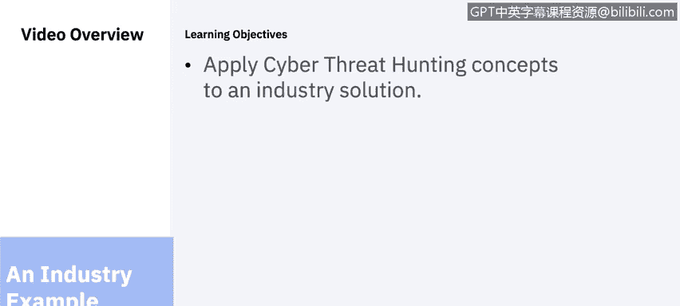
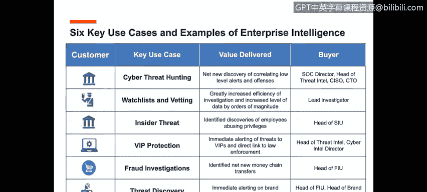
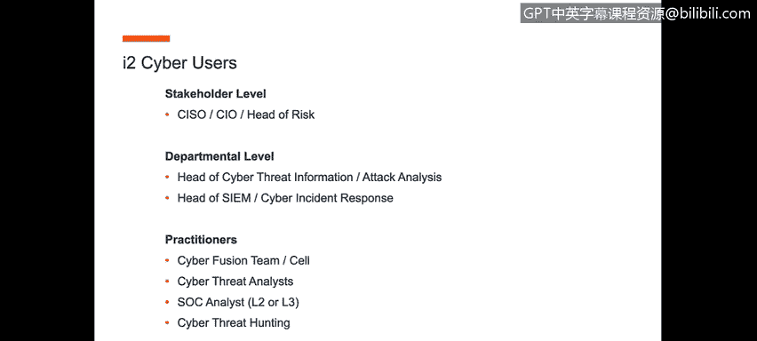

# 课程6：《网络威胁情报课程（IBM）》：38：37_网络威胁狩猎行业示例.zh

## 🎯 概述
在本节课程中，我们将学习如何将网络威胁狩猎的概念应用于一个行业解决方案。我们将通过一个具体的例子，了解威胁狩猎团队的结构、运作方式以及所需的技术工具。

## 🏢 网络威胁狩猎团队架构
上一节我们介绍了网络威胁狩猎的基本概念，本节中我们来看看一个行业内的具体团队架构示例。

一个网络威胁狩猎团队通常独立于传统的安全运营中心之外运作。如图所示，威胁狩猎团队位于网络情报组织的中心位置。

*   其右侧是传统的SOC运营，包含安全信息与事件管理平台、端点保护环境、安全设备管理等。
*   其左侧是各种数据源，包括开源情报、深网、暗网、非结构化数据、开源情报网络等。

威胁狩猎团队负责主动进行网络威胁狩猎，它需要从上述所有环境中获取数据，并以集中的方式整合这些信息，从而在问题发生前做出更明智的决策。这种模式能促使红队（攻击模拟）和威胁狩猎团队与蓝队（防御，即SOC）共享信息，从而形成一个持续演进、成熟的流程，最终打造一个更高效、更成熟的SOC环境。

## 🛠️ 如何构建威胁狩猎团队
理解了团队架构后，我们来看看如何具体构建一个网络威胁狩猎团队。

构建威胁狩猎团队的关键在于，它应独立于传统的SOC。SOC的职责是提供7x24小时的运营保障，这一点保持不变。在此基础上，引入一支由兼具安全和情报背景的专业人员组成的先进威胁狩猎团队。这个团队的基础通常包括：
*   **网络威胁情报分析人员**
*   **网络红队**，负责模拟对组织的攻击
*   **网络威胁狩猎团队**，负责主动识别威胁

威胁狩猎团队将发现的威胁信息共享给SOC内的蓝队，蓝队可以利用这些信息在其SIEM平台中制定更好的规则，改进安全设备管理，从而提升整体防护能力。因此，威胁狩猎团队是SOC的下一代演进，旨在为组织提供更好的防御。

## 💡 威胁狩猎的应用场景
了解了团队构成，接下来我们探讨威胁狩猎可以应用在哪些具体场景。

以下是威胁狩猎分析在SOC环境中的几个应用案例：
*   **网络取证调查**：通过帮助SOC分析师快速有效地洞察事件本质，可以减少SIEM平台产生的事件告警数量，降低误报率。
*   **欺诈检测**：能够有效减少发生的欺诈行为数量。

这些案例表明，威胁狩猎能够将信息转化为可操作的洞察，应对从网络钓鱼、高级持续性威胁到内部威胁等多种挑战。

## 🔧 支撑技术：I2企业情报分析
那么，要建立威胁狩猎团队并使其有效运作，需要哪些技术支持呢？I2企业情报分析平台正是为此而设计。

I2企业情报分析平台的核心价值在于，它能够促进网络取证调查和主动网络威胁狩猎，从而将你的SOC、GSI、MSSP或内部SOC运营提升到认知分析的新高度。该平台能够整合内外部数据源，在一个统一的环境中梳理数据，通过实体-链接-属性模型连接线索，真正厘清事件脉络。

该平台的价值主张包括：
1.  **优化运营**：作为力量倍增器。
2.  **预测与识别**：主动在威胁演变成实际问题前识别它们。

## 👥 平台用户与价值延伸
最后，我们来看看哪些人会使用这类平台，以及它带来的延伸价值。

在网络世界中，该平台的典型用户包括安全分析师、威胁狩猎员、取证调查员和事件响应人员。I2企业情报分析的价值在于，它能整合所有不同的内外部数据源，并将形成的智能报告提交给CISO、CIO或风险主管。

此外，I2平台已被全球执法部门用于起诉多项犯罪活动，其证据在包括荷兰海牙国际法庭在内的法律程序中均被采信。这意味着，该技术不仅可用于传统的安全调查和威胁狩猎，还能支持涉及犯罪意图的调查，并与总法律顾问、法律和执法机构合作，提供法庭可采信的证据。

## 📝 总结
本节课中，我们一起学习了网络威胁狩猎的行业实践。我们探讨了威胁狩猎团队独立于SOC的架构模式，了解了其构建方法和成员组成，并通过案例看到了它在减少误报和欺诈等方面的实际应用。最后，我们介绍了I2企业情报分析平台如何作为关键技术，整合数据、连接线索，并将信息转化为可行动的情报，甚至支持法律程序，从而全面提升组织的主动安全防御能力。