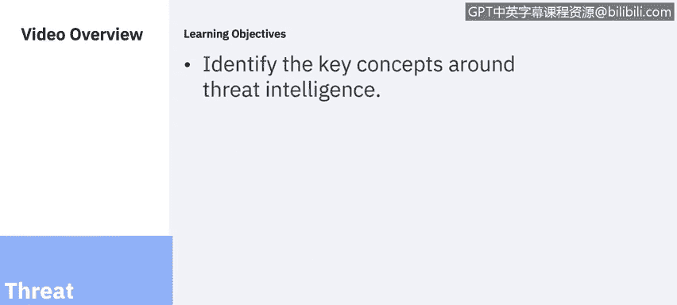
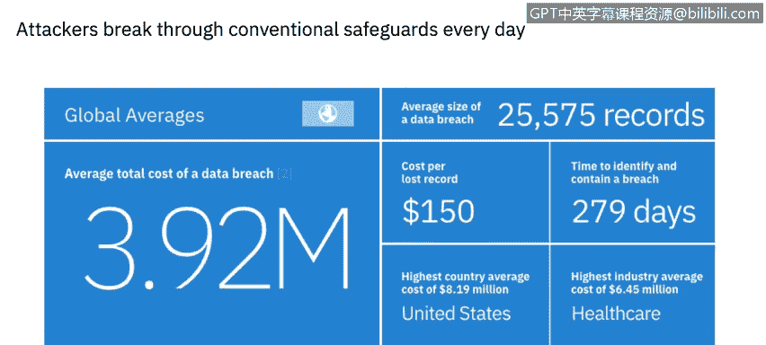
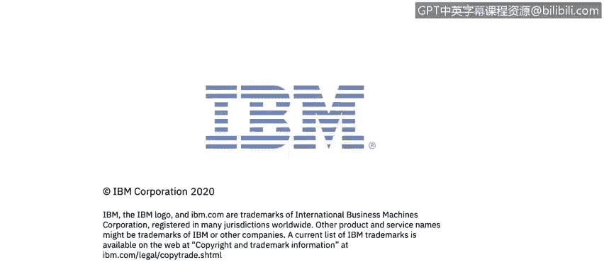

# 课程6：《网络威胁情报课程（IBM）》：39：0_01_威胁情报概述

## 概述

在本节课中，我们将学习网络威胁情报的核心概念。我们将了解威胁情报的定义、其带来的益处，并分析当前网络安全领域面临的主要挑战和驱动因素。

## 课程内容

欢迎来到由IBM带来的网络威胁情报课程。

在本课程中，你将学习识别威胁情报的关键概念，描述网络防御策略的示例，探讨数据丢失防护和端点保护的概念与工具，探索一款数据丢失防护工具并学习如何在数据库环境中对数据进行分类，描述安全漏洞扫描技术与工具，识别应用安全威胁和常见漏洞，并探索一款SIEM产品，审查可疑警报以及学习如何采取行动。

我是Corine Ricecamp，IBM安全学习服务团队的一名网络安全专家。我将作为本课程的一部分，为大家呈现多个课程模块。

在本系列视频中，你将听到来自IBM内部多位主题专家的讲解。你还将有机会通过多个虚拟实验来应用所学知识。

让我们开始吧。欢迎来到由IBM带来的威胁情报课程。在本视频中，你将学习识别威胁情报的关键概念。

网络威胁情报是关于威胁和威胁行为者的信息，这些信息有助于减轻网络空间中的有害事件。

网络威胁情报提供诸多益处，包括赋能组织建立主动的网络安全态势，推动建立可预测的网络安全态势，提升威胁检测能力，并在检测到网络入侵期间及之后为更好的决策提供信息。

当今每个组织在IT安全方面都面临着相似的挑战。IT解决方案需要易于使用和访问，但对于几乎每个行业而言，保护数据资产和网络访问都至关重要。

让我们看看一些最普遍的驱动因素。以下是来自多份研究2019年网络安全趋势报告中的几个关键数据点。

**数据泄露记录**：2019年泄露记录数量显著增加，超过85亿条记录被暴露，是2018年的三倍多。记录暴露数量显著上升的首要原因是配置错误，其数量同比增长了近十倍。这些记录占2019年受损记录的86%。

**人为错误**：占31%。网络钓鱼是2019年用于初始访问的最常见媒介，但与2018年相比有所下降，当时它占了总数的近一半。

**物联网创新**：针对物联网设备的攻击包括企业领域，预计到2020年将有超过380亿台设备连接到互联网。物联网威胁态势已逐渐演变为一种能够影响消费者和企业级操作的威胁媒介，其使用相对简单的恶意软件和自动化的、通常是脚本化的攻击。在用于感染物联网设备的恶意代码领域，IBM X-Force研究追踪了2019年的多个恶意软件活动，这些活动已显著从针对消费电子产品转向同时针对企业级硬件，这是我们在2018年未观察到的活动。😊，具有网络访问权限的受感染设备可被攻击者用作潜在的支点，试图在组织内建立立足点。

**成本放大器**：云迁移、IT复杂性和第三方违规是所研究的26个因素中的成本放大器，这些因素导致了数据泄露的成本。其中贡献成本最大的五个因素是第三方参与、合规性失效、大规模的云迁移、系统复杂性和运营技术。如果涉及第三方，数据泄露的成本会增加超过37万美元，调整后的平均总成本达到429万美元。在发生泄露时正在进行重大云迁移的组织，其成本增加了30万美元，调整后的平均成本为422万美元。系统复杂性使泄露成本增加了29万美元，平均成本为421万美元。

最后，**技能差距**：最近发布的2019年(ISC)²网络安全劳动力研究指出了网络安全专业人员的严重短缺。该研究首次估计，全球目前有280万熟练专业人员在该领域工作，还需要额外的407万人来保卫组织。😊。

当今的威胁在数量和规模上持续上升，因为复杂的攻击者每天都在突破传统的防护措施。犯罪分子、黑客活动分子、政府和对手受到经济利益、政治动机和恶名的驱使，攻击你最宝贵的资产。他们的行动资金充足且像商业活动一样，攻击者会根据潜在的投入和回报耐心地评估目标。😊，他们的方法极具针对性。他们利用社交媒体和其他入口点追踪有访问权限的人员，利用信任并将其作为漏洞进行利用。与此同时，疏忽的员工会因人为错误无意中将企业置于风险之中。更糟糕的是，过去的安全投资可能无法抵御这些新型攻击。

从这份2019年数据泄露成本报告中可以看出，数据泄露的平均总成本现在是392万美元。每次数据泄露的平均规模超过25000条记录。

导致泄露给组织造成如此高成本的主要原因之一是识别和遏制泄露所需的时间。在2019年，这个时间的平均值是279天。我们将在本课程中探索更多威胁情报数据。

在这项研究的背景下，内部威胁的发生源于以下原因：疏忽或无意造成问题的员工/承包商、犯罪或恶意的内部人员、或凭据窃贼。

关键要点是，每次事件成本最高的内部威胁是凭据盗窃。这些事件的发生频率和成本都显著增加。事实上，自2016年以来，每家公司的事件频率已从平均1起增加到3.2起，增加了两倍多；平均成本从49.3万美元增加到2019年的超过87.1万美元。从年度来看，组织在处理内部人员疏忽方面花费更多，但每次事件的成本要低得多。

## 总结

本节课我们一起学习了网络威胁情报的基本定义及其重要性。我们探讨了威胁情报如何帮助组织建立主动防御，并分析了当前网络安全面临的主要挑战，包括数据泄露、内部威胁、物联网风险以及技能差距等驱动因素。理解这些基础概念是构建有效威胁情报能力的第一步。