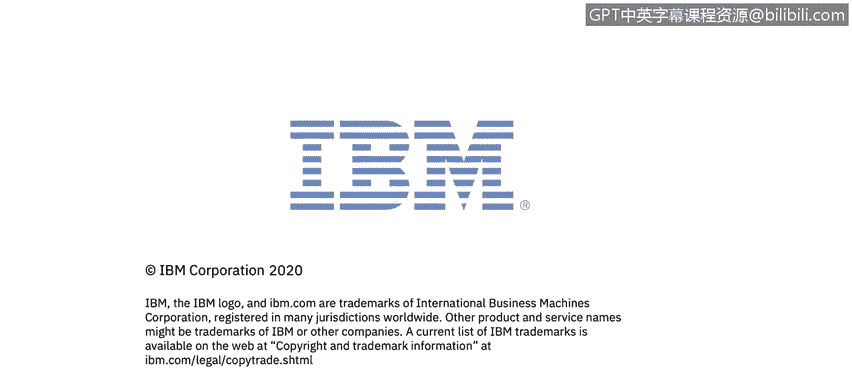

# 课程6：《网络威胁情报课程（IBM）》：40：1_04_威胁情报战略与外部来源

## 📚 课程概述

在本节课中，我们将学习如何识别威胁情报的外部来源，并理解组织如何战略性地运用威胁情报。我们将探讨威胁情报从收集到分发的完整流程，并介绍一些关键的外部情报资源。

---

## 🔍 威胁情报战略流程

上一节我们介绍了课程背景，本节中我们来看看威胁情报的战略性应用。威胁情报不仅仅是数据，它是一个完整的流程。下图源自Derrick Brink的白皮书《威胁情报战略地图：从技术活动到商业价值》，它描述了这一过程。

该流程包含四个主要阶段：**收集**、**处理**、**分析**和**分发**。在整个课程中，我们将多次涉及这些元素。

### 1. 收集阶段

基于组织所需的相关信息，必须识别多个来源，以发现可能危及组织高价值资源的各种威胁、漏洞和攻击。换句话说，需要保护组织资产的**机密性**、**完整性**和**可用性**。

一旦识别，就需要从多个来源收集数据，包括外部和内部来源。本模块将重点介绍外部来源，而课程后续部分将探讨来自网络扫描、数据保护和终端安全工具的内部来源。

### 2. 处理阶段

从系统工具或外部资源收集到威胁情报数据后，必须对其进行处理。处理可能包括**数据规范化**、**关联分析**、**验证**和**优先级排序**。这个过程必须利用自动化和编排技术，以应对信息的复杂性和高容量。

### 3. 分析阶段

接下来，必须对威胁情报进行分析，以揭示当前和未来可能对组织构成威胁的情况。我们将探讨安全信息与事件管理系统如何帮助分析师分析系统和网络中正在发生的事情，并制定建议的行动方案。

### 4. 分发阶段

最后，作为分析师，你必须将信息分享给组织内的不同人员。沟通内容需要根据组织的不同层级进行定制，具体取决于漏洞或攻击是正在影响组织，还是该信息应用于教育组织了解行业内可能或大概的威胁，例如勒索软件对地方政府和组织日益严峻的挑战。

---

## 🎯 情报的分层沟通

上一节我们了解了情报流程，本节中我们来看看如何将情报有效地分发给不同层级的受众。沟通方式需要根据接收者的角色和需求进行调整。

以下是针对不同层级的沟通重点：

*   **一级分析师**：沟通需要支持安全运营中心进行的实时监控、检测、初步调查和事件升级。
*   **二级和三级分析师**：需要支持事件响应团队进行深入的优先级排序、调查、遏制和补救工作，以及威胁狩猎和反欺诈团队专家的主动防御工作。
*   **运营领导者**：例如，需要帮助安全运营和IT运营的领导者指导和优先安排其各自技术人员的日常行动和活动。
*   **战略领导者**：需要帮助首席信息安全官或其他高级领导者分配资源，并就如何将网络安全相关风险控制在可接受水平做出更明智的商业决策。

---

## 🧩 威胁情报的三个层面

CrowdStrike公司也从三个层面来看待组织（以及作为安全分析师的你）应关注的情报领域。

他们将情报领域分为三种方式：**战术**、**操作**和**战略**。

*   **战术层面**：侧重于执行恶意软件分析和信息丰富化。
*   **操作层面**：侧重于理解对手的能力、基础设施和战术、技术与程序，然后利用这种理解进行更有针对性和优先级的安全操作。
*   **战略层面**：侧重于理解高层趋势。

---

## 📈 战略威胁情报资源

上一节我们区分了情报的层面，本节中我们来看看可用于洞察战略威胁情报计划的当前趋势和预测出版物。每年，你都会发现各种研究报告，它们回顾12个月或更长时间，提供过去趋势的情报，并对未来做出预测。

以下是部分资源。你需要跟上最新信息，以帮助你了解哪些攻击已经或未来可能对你的行业影响最大。

*   **CrowdStrike《2020年全球威胁报告》**：指出2019年的破坏并非由单一的破坏性擦除器造成，而是受到持续运营目标和社会基础架构困扰。
*   **IBM《2019年数据泄露成本报告》**：探索了理解数据泄露原因和后果的几个新途径。
*   **M-Trends《2020年报告》**：已存在十多年，其目标始终如一：为安全团队提供防御当今最常用网络攻击所需的知识。
*   **X-Force《威胁情报指数》**：分析过去一年中，哪些重新出现的旧威胁正以新的方式被利用。该报告还按行业审视新兴威胁，并提供一些预防建议。

---

## 🗞️ 日常情报来源

作为分析师，你应该将查看全球新发生的漏洞、威胁和泄露事件作为每日例行工作的一部分。以下是作为一名网络安全专业人员，我定期查阅的部分资源。请注意，这只是可用资源的一小部分，未来你可能会发现更多专注于特定行业的资源，它们能更好地为你服务。

以下是部分推荐的外部情报来源：

*   **Bleeping Computer**：提供最新安全威胁和技术新闻的新闻出版物。你可以接收信息流或每日访问其网站。
*   **Dark Reading**：涵盖所有网络安全主题，并提供当前攻击和泄露信息。
*   **Infosecurity Magazine**：涵盖各类主题，还提供关于高级持续性威胁、网络犯罪等相关主题的网络研讨会和白皮书。
*   **Trend Micro**：帮助你了解特定行业和零日漏洞的漏洞和利用信息。
*   **Exploit Exchange**：既有研究板块，也提供早期预警和当前威胁信息。

在你的后续阅读中，请查看这些威胁情报来源，并审阅可能推荐的其他来源。

---

## 📝 课程总结

本节课中，我们一起学习了威胁情报的战略流程，包括收集、处理、分析和分发四个阶段。我们探讨了如何针对不同组织层级进行有效的情报沟通，并了解了威胁情报在战术、操作和战略三个层面的不同侧重点。最后，我们介绍了一些关键的年度趋势报告和可供日常查阅的外部威胁情报资源，这些将帮助你作为一名安全分析师，持续获取信息并保护组织免受威胁。