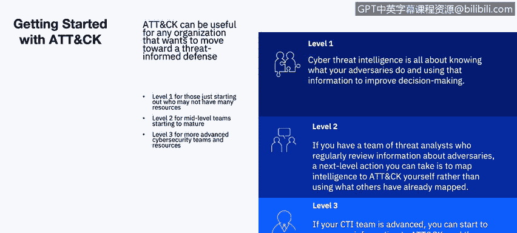
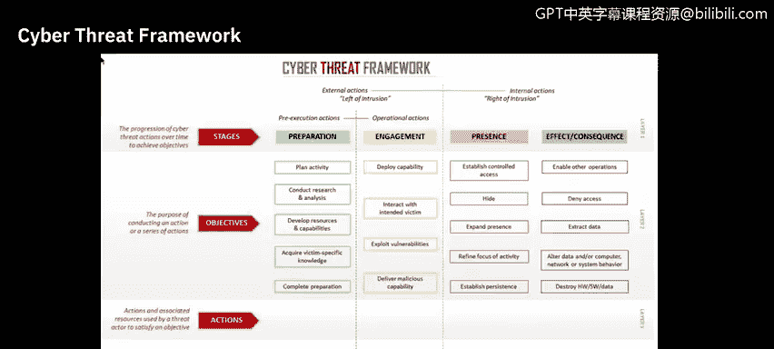
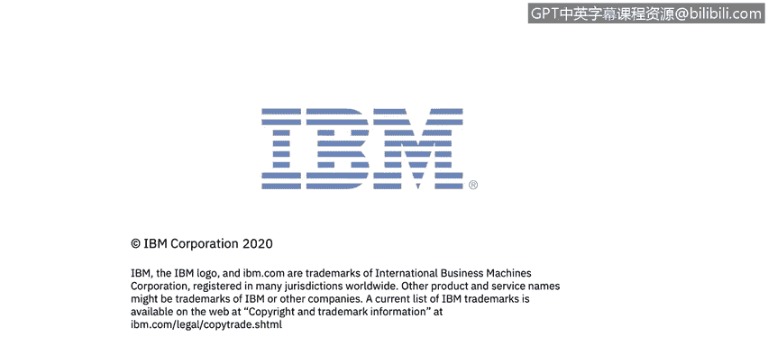

# 课程6：《网络威胁情报课程（IBM）》：42：3_01：威胁情报框架 🛡️

在本节课中，我们将要学习威胁情报的核心框架。这些框架为理解和分析网络威胁提供了结构化方法，帮助安全从业者从混乱的数据中提取有价值的见解。

## 概述：现代IT安全环境的挑战

上一节我们介绍了威胁情报的基本概念，本节中我们来看看组织在实践安全防护时面临的现实环境。

下图展示了典型IT安全环境的一个缩影，其中包含了安全运营中心（SOC）已部署的众多能力。这些技术往往是多年来为解决复杂环境中的各种挑战而零散采购的。

平均而言，一家企业会使用来自45个不同供应商的85种工具。虽然拥有这些工具，但关键问题在于：它们是否被集成？它们能否跨团队、位置和平台协同工作？还是仅仅增加了复杂性、风险和成本？这种技术上的分散状态可能导致网络可见性下降。当安全专业人员面对这种技术上的混乱局面时，他们如何获得有价值的洞察力并有效控制其安全环境？

## 威胁情报的基础模型

为了应对上述挑战，威胁情报的实践主要植根于以下三种基本模型：

*   **洛克希德·马丁的网络杀伤链**
*   **MITRE ATT&CK知识库**
*   **入侵分析的钻石模型**

我们在之前的课程中讨论过网络杀伤链。钻石模型类似于博弈论，在涉及两个参与者（受害者和对手）时是有效的。但是，如果对手的动机超出了社会政治或社会经济回报，或者对手是人工智能，该模型就可能失效。作为网络安全分析师，你应该经常使用MITRE ATT&CK知识库。

## 使用MITRE ATT&CK框架

现在，让我们具体谈谈威胁情报以及如何使用MITRE ATT&CK框架。

在**第一级**，网络威胁情报的核心是了解对手的行为，并利用这些信息改进组织的决策。对于一个只有几名分析师、希望开始使用ATT&CK进行威胁情报的团队，可以按以下方式起步：

以下是开始使用ATT&CK的一种方法：
1.  选择一个你关心的特定攻击组织。
2.  以结构化的方式，在ATT&CK框架下查看他们的行为。
3.  你可以从MITRE官网上已映射的攻击组织中选择，依据通常是他们先前攻击过的目标组织。
4.  或者，许多威胁情报订阅提供商也将其信息映射到ATT&CK，你可以使用他们的信息作为参考。

在**第二级**，如果你拥有一个定期审查对手信息的威胁分析师团队，可以采取的下一级行动是：自己将情报映射到ATT&CK，而不是使用他人已经映射好的信息。

如果你有一份关于你所在组织处理过的事件报告，这可以成为映射到ATT&CK的绝佳内部来源。或者，你也可以使用外部报告（如博客文章）来开始这项练习。你可以从单份报告开始。

以下是一个可以帮助你完成映射的流程：
1.  **理解ATT&CK**：熟悉ATT&CK的整体结构，包括**战术**（对手的技术目标）、**技术**（实现这些目标的方法）和**具体步骤**（技术的具体实现方式）。
2.  **发现行为**：以比单纯指标（如他们使用的IP地址）更宏观的方式思考对手的行动。
3.  **研究行为**：如果你不熟悉该行为，可能需要做更多研究。
4.  **将行为转化为战术**：考虑对手实施该行为的技术目标，并选择一个合适的战术。好消息是，在ATT&CK企业版中只有12种战术可供选择。
5.  **确定适用于该行为的技术**：这可能有点棘手，但凭借你的分析技能和ATT&CK网站上的示例，这是可以做到的。在ATT&CK网站上搜索特定战术并查看技术描述，你可能会找到该行为的归属。
6.  **将你的结果与其他分析师比较**：当然，你对某个行为的解读可能与其他分析师不同。这在网络安全团队中很常见。建议你将信息的ATT&CK映射结果与其他分析师进行比较，并讨论任何差异。

在**第三级**，如果你的团队比较高级，可以开始将更多信息映射到ATT&CK，然后利用这些信息来优先安排防御措施。

承接上述流程，你可以将内部和外部信息都映射到ATT&CK，包括事件响应数据、威胁情报订阅报告、实时警报以及你组织的历史信息。一旦映射了这些数据，你就可以比较不同攻击组织，并优先防御那些常用的技术。

## 网络威胁框架

除了行业框架，政府层面也有相关标准。网络威胁框架由美国政府开发，旨在实现对网络威胁事件的一致描述和分类，并识别网络对手活动的趋势或变化。

该框架适用于所有从事网络相关活动的人员，其主要好处是**为描述和传达网络威胁活动信息提供了一种通用语言**。该框架及其相关术语表提供了一种一致描述网络威胁活动的方法，从而实现高效的信息共享和网络威胁分析，这对高级政策决策者和注重细节的网络技术人员都很有用。

该框架捕捉了对手的完整生命周期，从能力准备和目标选择，到与目标的初始接触（或对手实施的临时非侵入性干扰），再到在目标网络上建立和扩大存在，最后到通过窃取、操纵或破坏产生效果和后果。

## 构建集成的安全生态系统

了解框架后，我们来看看如何将它们应用到更广泛的安全战略中。IBM鼓励组织以更有条理的方式思考其安全要务，围绕逻辑领域构建，并以安全分析为核心学科。

这个核心由认知智能驱动，该智能持续理解、推理和学习影响其环境的众多变量，并反馈给整个互联能力生态系统。不同层次的防御协同工作，以自动化策略并阻止威胁。这些层次负责理解威胁，并将数据上传至安全分析层，以收集信息、确定优先级并采取行动。

系统只有在与扩展的合作伙伴生态系统集成后，才算真正完全集成。这种集成使得跨公司和竞争对手的协作成为可能，以理解全球威胁和数据，并适应新的威胁。集成有助于提高可见性。

请注意能力是如何围绕其领域组织的。你将开始了解这个“免疫系统”是如何工作的：安全组合的不同部分协同运作。

## 最佳实践总结

回顾一下，网络攻击的成本正在增加，威胁不断升级并变得更加复杂。边界防御已不再足够，需要新的技术，如流量分析、异常检测和漏洞管理。

上述陈述定义了问题，并提供了一些可能有帮助的能力。但你具体能做什么？应该遵循哪些最佳实践？

以下是关键的安全最佳实践：
1.  **主动预防**：识别、预测并优先处理你的安全弱点，以便采取行动防止漏洞被利用。使用我们在前两课中讨论的资源来收集威胁信息，根据优先级和网络环境处理漏洞和风险，并管理设备配置以提高安全性。例如，你可以通过移除无效的防火墙规则并添加更有效的新规则来提高安全性。
2.  **检测与响应**：使用能够检测异常行为的工具。部署能够发现网络异常并根据前述原因提供网络流量可见性的解决方案。
3.  **安全智能与自动化**：使用通过集成、自动化和上下文来提供网络完整视图的安全智能解决方案。**自动化是关键**，以便你能更有效地利用现有人员，并将收集到的大量数据简化为少量可由现有安全人员处理的事件。

我们将在本课程后面深入回顾所有这些最佳实践。

## 总结

本节课中我们一起学习了威胁情报的核心框架，包括MITRE ATT&CK知识库和美国政府的网络威胁框架。我们探讨了如何利用这些框架从初级到高级逐步构建威胁情报能力，将零散的安全事件和行为转化为结构化的知识。同时，我们了解了构建一个以安全分析为核心、各层防御协同工作、并与外部生态系统集成的“免疫系统”式安全架构的重要性。最后，我们总结了主动预防、检测响应和智能自动化这三项关键的最佳实践，为应对日益复杂和昂贵的网络威胁提供了清晰的行动指南。掌握这些框架和理念，是成为一名有效的网络安全分析师的重要基础。