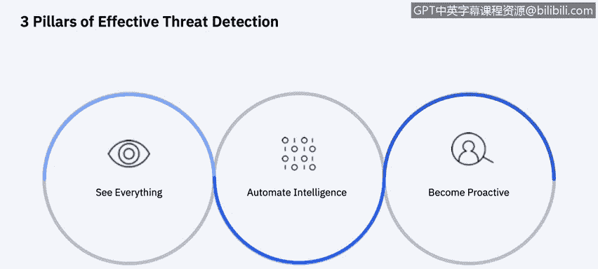
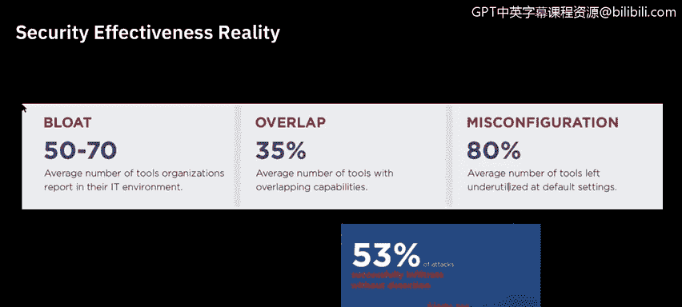
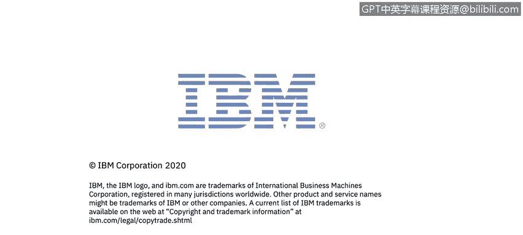

# 课程6：《网络威胁情报课程（IBM）》：43：4_02：安全情报概述 🛡️

在本节课中，我们将学习安全情报的概念、核心目标及其在组织风险管理中的关键作用。我们将探讨安全情报如何通过整合与分析各类安全数据，为组织提供可操作的洞察，从而提升整体安全效能。

---

## 安全情报的定义与目标

安全情报这一术语旨在描述组织通过处理和分析安全信息所获得的价值，其处理方式与对待市场营销等其他业务职能的产出类似。安全情报的目标是提供**可操作且全面的洞察**，以降低任何规模组织的风险与运营负担。

安全情报解决方案收集并存储的数据包括：
*   **日志与事件**
*   **网络流量**
*   **用户身份与活动**
*   **资产配置与位置**
*   **漏洞信息**
*   **外部威胁数据**

安全情报通过分析来回答风险管理与威胁管理**事前、事中、事后**全时间线的根本性问题。保护当今的企业和公共组织需要一种新方法，每个人都需获得贯穿整个安全事件时间线的洞察。

---

## 安全情报的两个特征

上一节我们介绍了安全情报的目标，本节中我们来看看它的两个核心特征。

首先，安全情报是分析技术进步的结果。它是通过审查每一个可用数据位，并进行**归一化、关联、索引和透视**所获得的智慧，旨在发现团队需要尽快调查的关键事项。

其次，安全情报也指通过持续调整系统分析与规则，以消除误报结果的迭代过程。通过在核心安全信息与事件管理引擎上增加风险经理、漏洞管理和事件取证功能，可以在从检测、防护到调查、修复的整个安全事件时间线中，提高准确性并提供更丰富的上下文。这些解决方案协同工作，有助于尽可能早地减少暴露面并识别攻击。在本课程后续部分，我们将更深入地探讨这些解决方案。

---

## 提升安全效能的三大支柱

为了有效检测威胁并改善现状，需要依赖三大支柱。以下是具体内容：

**第一，需要全局可见性。** 您需要从一个单一控制台获得对整个企业的可见性。将所有孤立的数据汇集到一个集中式解决方案中，从而获得涵盖本地环境、云环境甚至运营环境在内的整个环境安全状态的全面视图。

**第二，需要实现安全情报自动化。** 面对海量数据，必须实现智能洞察的自动化。通过在数据之上构建分析引擎，您可以获得关于最关键威胁的、可操作且经过优先级排序的洞察。

**第三，需要采取主动姿态。** 您在前端实现的自动化程度越高，就能释放出越多时间，从而从纯粹被动的姿态转变为更主动的姿态。有了更多时间，您可以主动进行威胁狩猎，在攻击周期的早期发现攻击者，更快地响应，并将经验教训融入防御体系，实现持续改进。我们将在课程后续部分探讨威胁狩猎。

---

## 安全效能报告的启示

为了强调理解并提升公司安全效能的重要性，《2020年安全效能报告：深入网络现实》揭示了一些惊人的发现。主要情况是，很大比例的公司认为其安全投资通过保护关键资产和数据正在交付预期价值，但实际上他们并未意识到自己已经遭遇了入侵。

这种情况与网络对冲数据相吻合，该数据计算了发生未被检测到的入侵时，持续产生的财务和运营影响。这两组数据提供了前所未有的洞察：在入侵甚至发生之前，就将安全效能与财务影响结合起来。《FireEye执行摘要》只是冰山一角，完整报告揭示了尽管威胁和攻击数量不断增长，许多组织仍错误地假设自己受到保护的详细情况。

---

## 关键要点与总结

在开始深入探讨关于收集和关联情报数据的具体主题和解决方案之前，让我们先讨论来自CIS报告的一些关键要点。

**可见性是许多组织关注的关键问题。** 组织主要担忧特权滥用和凭证滥用。端点警报和网络访问设备是事件信息的首要来源，分别提供警报和调查支持。许多组织都混合使用了本地和云环境。

现在，让我们在本课程剩余部分更深入地探讨几种解决方案。

本节课中，我们一起学习了安全情报的核心概念、目标、特征以及提升安全效能的三大支柱。我们了解到，通过整合数据、实现自动化分析并转向主动防御，组织可以更有效地管理风险并应对威胁。