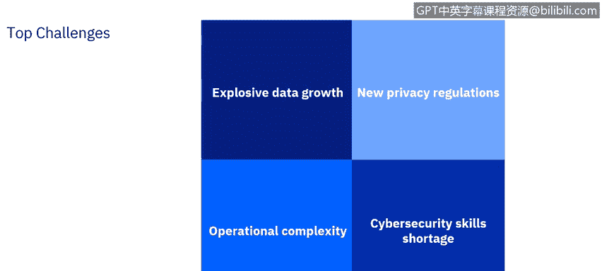

# 课程6：《网络威胁情报课程（IBM）》：45：数据安全的主要挑战 🔐

在本节中，我们将探讨数据安全领域面临的主要挑战。我们将概述确保数据安全时常见的几大难题，并深入分析四个特定行业所面临的独特挑战。

## 概述

数据安全与保护是组织面临的核心挑战之一。随着数据量的爆炸式增长、新隐私法规的出现、运营复杂性的增加以及网络安全人才的短缺，构建一个全面且可行的数据安全解决方案变得日益困难。本节将逐一剖析这些挑战。

## 主要数据安全挑战

以下是企业高管在确保其组织拥有全面、可行的数据安全解决方案时面临的四项主要挑战。

### 1. 数据爆炸式增长 📈

企业不仅在持续积累数据，而且数据积累的速度正在加快。数据来自新的源头和新的数据类型，每个源头都有其自身的数据保护、隐私和安全要求。

例如，过去手机收集的数据几乎只包括通话记录和短信。随着手机变得更智能、连接性更强，新的数据类型出现了。随着廉价的全球定位系统传感器的普及，追踪位置变得容易。技术的进步会带动其他技术的发展：手机摄像头可以拍照，但最初必须下载到另一台设备上才能广泛分享。廉价且无处不在的带宽增长鼓励用户拍摄和分享更多图片和视频，同时也允许了秘密监控。运行应用程序的能力意味着更多的数据共享，以及更多的后台数据收集机会。例如，健身应用可以收集健康信息。更令人担忧的是，一个游戏应用可能秘密收集与游戏无关的信息。

所有这些数据都必须受到保护，防止不当使用。例如，用于执行交通法规的自动红灯摄像头也会收集守法公民车辆的时间和位置信息；这些数据同样需要遵守隐私和保护要求。

因此，跟上日益增长且多样化的数据源，在多场景下提供数据，给数据安全挑战增加了复杂性。

### 2. 新的隐私法规 📜

对数据安全和隐私的担忧催生了新的法律要求。这些法规的范围和侧重点各不相同，许多法规相互重叠。然而，它们具有法律效力，未能遵守可能会带来重大处罚，即使没有发生数据泄露。此外，当数据安全漏洞发生时（没有任何安全保护解决方案是完美的，安全漏洞不可避免），拥有一个在法律上可辩护的安全解决方案至关重要，即它符合适用的法规。

不同的地区和监管机构有各自的法规体系。通用数据保护条例（**GDPR**）旨在保护欧盟境内个人的隐私。它不仅适用于总部设在欧盟的组织，也适用于跨国组织，甚至完全在欧盟境外但向欧盟境内人员提供商品或服务，或仅仅监控欧盟公民行为的组织。

加州消费者隐私法案（**CCPA**）的要求与GDPR有重叠但不完全一致；它适用于与GDPR不同的一组组织。因此，可以利用为遵守GDPR而采取的一些措施来实现CCPA合规，但会存在一些差异。未来，其他政府将出台新措施。巴西的LGPD预计很快生效。一些人预测美国将在联邦层面很快实施一项全面的数据安全和保护法规。

遵守这些新法规可能是一项艰巨的任务。除了这些法规，还有一些数据标准，它们可能没有法律效力，但却是客户所期望的，或者在发生违规或法律诉讼时，为证明尽职调查所必需的。例如，一个组织必须实施支付卡行业数据安全标准（**PCI DSS**）才能与主要信用卡公司开展业务。

### 3. 运营复杂性 ⚙️

组织的关键业务系统可能跨越许多不同部门，并与其他业务系统和应用程序交织在一起。向云端的迁移以及对大数据技术的采用增加了能力，但也增加了运营复杂性，并引入了更多的脆弱点。

关键业务系统可能依赖于来自各种第三方供应商的重要工具和资源。这些工具和资源有其自身的脆弱点，其中许多超出了组织的直接控制范围。

运营复杂性影响数据安全和保护的一种方式是，确定谁监督数据安全的各个方面，以及哪些角色拥有哪些责任和权限。有效数据安全的一个关键原则是，需要一个角色对数据安全负总体责任，并有权实施必要的措施。企业文化可能会抵制这种权力的集中和向集中式数据安全模型的过渡。跨部门协调既是必要的，也是困难的。

要实施有用的数据安全解决方案，必须为组织内的许多关注点以及第三方制定有意义且有效的政策和程序。数据安全可能会驱动运营策略。例如，您可能认为将某些类型的数据保存在第三方云中风险太大，需要将该功能移回内部的私有云，或转移到更可靠的供应商。这可能导致组织内部的摩擦。例如，漏洞评估审计必须在变更管理的背景下进行，并且通常必须精心规划以符合业务需求。您可能无法立即关闭数据库服务器来修复数据安全问题。您必须等到计划停机时间，并获得资产利益相关者（如依赖该数据库服务器产生收入的数据库经理和业务经理）的支持。解决该数据库的安全问题将经过多次迭代，每次迭代都针对最紧迫的问题，并对变更和由此产生的安全改进进行仔细管理和记录。

### 4. 网络安全技能短缺 👨‍💻

我们面临网络安全技能短缺，不仅是现在，在可预见的未来也是如此。我们必须为此做好计划。网络安全很难，它需要值得信赖、技能娴熟、经验丰富的人员，这些人不仅要有技术技能，还要有人际交往能力，因为数据安全最终是关于人的，而我们需要人来完成所有这些工作。

我们需要适应性、合规性、可靠性、好奇心和韧性的安全专业人员。我们需要从网络安全行业内外寻找这些人才。我们需要投资于这些人，并创新促进他们发展的新方法。我们需要关注技能和一套全新的证书，而不仅仅是传统的大学学位。我们不能指望政府或劳动力本身能够满足这一需求。传统教育机构正在努力填补这一空白，但举步维艰，我们需要在这场斗争中帮助他们。创新的培训资源，如IBM自己的安全学习学院，可以帮助解决这个问题。

最后，您必须充分利用现有人员，这意味着购买高质量的工具，并在实际可行的情况下尽可能实现流程自动化。

## 总结

在本节中，我们一起探讨了数据安全面临的四项主要挑战：**数据爆炸式增长**、**新的隐私法规**、**运营复杂性**以及**网络安全技能短缺**。记住，挑战远不止这些，我们只是从这四项开始。在下一部分，我们将讨论一些常见的陷阱。