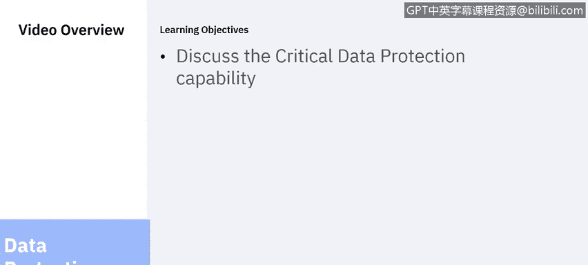

# 课程6：《网络威胁情报课程（IBM）》：48：9_05：数据保护的核心能力

在本节课中，我们将要学习一个有效的数据安全与保护解决方案应具备的十二项关键能力。我们将逐一详细探讨这些能力，以理解如何全面保护组织的数据资产。

上一节我们介绍了数据安全的需求与挑战，本节中我们来看看一个完整的数据保护方案具体应包含哪些能力。

## 数据发现 🔍

数据保护解决方案的第一项能力是数据发现。你无法可靠地保护你不了解的数据。你必须知道你的数据存放在何处。你必须有一个流程，用于在企业中寻找可能包含敏感或受监管数据的数据库和文件系统。

请注意“可能”这个词。这项能力并非对数据进行分类，而是找到它们。数据发现需要迭代执行，这既是因为在动态的IT环境中总是不断出现新的数据源，也是为了捕获之前被忽略的数据源。这项能力的输出是一个数据源的目录或清单。

以下是执行数据发现的几种方法：
*   询问相关人员，例如业务线负责人、数据库管理员和网络管理员。
*   使用工具对网络和单个服务器执行扫描。

此处的目标是尽可能广泛地撒网，以发现组织中的所有数据源，而不仅仅是你认为应该拥有的或你认为拥有的数据。敏感数据可能存在于数据所有者认知之外，这是一种常见但极其不安全且脆弱的场景。除非你知道敏感数据的存在，否则你无法保护它。

## 数据分类 🏷️

数据分类对已发现的数据进行解析，并根据模式或关键词匹配来确定其性质和敏感度。它基于数据类型分配标签或关键词，这将使得为数据应用正确的安全策略成为可能。并非所有数据都是敏感数据，而不同类型的敏感数据必须以不同的方式处理。分类使你能够确定哪些保护措施适用于哪些数据。

一个数据分类方案应考虑与组织相关的标准和法规，以及独特的组织需求。请记住，某些数据可能属于多个分类。

## 漏洞评估 🛡️

你的数据安全解决方案需要某种方法来发现并解决承载数据的硬件、软件和网络中的漏洞。此方法应以一致的方式处理流程，并且应该是自动化的。该解决方案应根据推荐状态或基线评估系统配置，确定薄弱环节。

此类薄弱环节可能包括：
*   应被禁用但未被禁用的用户账户。
*   不适当的权限。
*   不安全的身份验证方法。
*   共享账户。
*   配置错误的配置文件。
*   缺失的安全补丁。

漏洞评估应是一个迭代过程，它利用利益相关者的输入来确定优先重点，而不是试图一次性修复所有漏洞。它应采用分阶段的方法来处理最紧迫的风险，并着眼于持续改进。漏洞评估需要跨部门的协调与支持，因此需要高层的支持、仔细的指标收集和进度报告，以及与变更和配置管理流程的集成。

## 数据风险分析 ⚖️

数据分类和漏洞评估的结果使你能够执行数据风险分析。在此环节，你为数据源分配风险等级，并利用该分配来优先将资源分配到最合适的任务上。风险分析不仅考虑你拥有什么类型的数据，还考虑与数据源相关的威胁、该威胁发生的概率、该威胁可能造成的损害程度，以及应对威胁的方法和缓解措施的成本。

这个过程可能很困难，但对于组织理解与其业务相关的风险至关重要。有一些工具和框架可以帮助进行风险量化。风险分析的结果会反馈到数据发现、分类和漏洞评估能力中，以优化这些流程。风险分析也有助于规划监控数据资产的策略。

## 数据与文件活动监控 👁️

对敏感数据的主动监控对于及时发现可疑活动和安全漏洞至关重要。IBM 2018年的一项研究显示，识别数据泄露的平均时间为197天。想象一下在这段时间内可能发生的数据利用情况，以及当数据泄露最终被发现和披露时对组织声誉造成的损害。正确部署的主动监控可以缩短发现数据泄露的时间。

活动监控具有挑战性。从业务角度看，你必须利用风险分析的结果来制定一套监控策略，首先针对最高风险的数据源，然后迭代地转向其他优先事项。这需要紧密的跨部门协调与沟通，必须咨询业务线负责人以及数据库、服务器、应用程序和网络管理员。

从技术角度看，数据活动监控需要过滤海量的数据库事务（可能每天数十亿），以挑选出少数可能指示可疑活动的事件。这可能极其消耗资源，必须仔细配置监控解决方案，以避免过度占用CPU、内存、磁盘和网络资源。监控解决方案必须解决访问数据的各种方法，无论是远程还是本地访问，无论是内部特权用户、外部攻击者，甚至是配置错误的应用程序。

数据活动监控也是迭代的。其结果会反馈到漏洞评估和风险分析中，进而为优化监控策略提供见解。

## 实时告警 🚨

实时告警涉及对数据监控识别出的可疑活动做出快速且适当的响应。告警需要整合和集中相关信息，与其他安全解决方案的数据进行关联，并将该信息可靠地路由给能够采取行动的相关方。告警流程必须是自动化和可靠的，与安全信息和事件管理控制台的集成是必须的。

在本节课中，我们一起学习了数据安全的前六项核心能力：**数据发现**、**数据分类**、**漏洞评估**、**数据风险分析**、**数据与文件活动监控**以及**实时告警**。在下一节中，我们将继续讨论其余的数据安全能力。