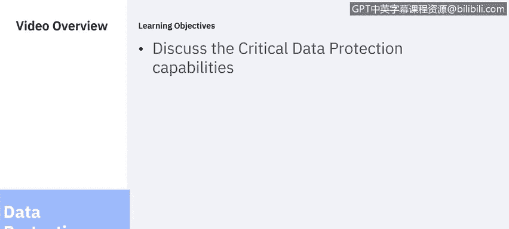
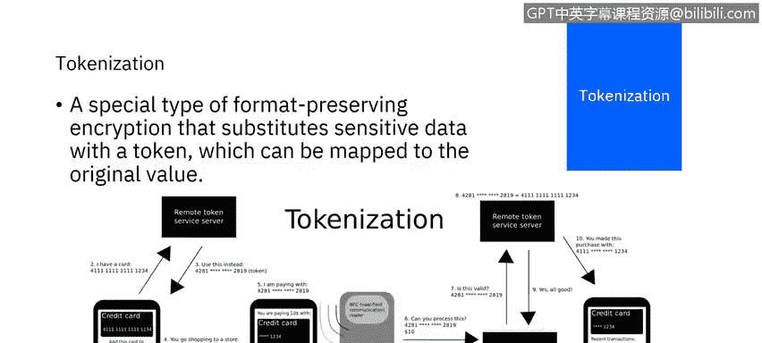
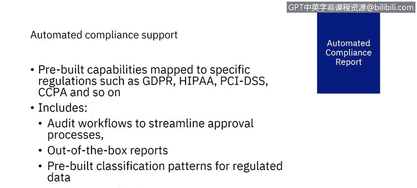

# 课程6：《网络威胁情报课程（IBM）》：49：10_06_关键数据保护能力

在本节课中，我们将继续学习12项关键数据保护能力。上一节我们介绍了前六项能力，本节中我们将详细探讨剩余六项能力：阻断、掩码与隔离；主动分析；加密；令牌化；密钥管理；以及自动化合规报告。

## 阻断、掩码与隔离 🔒

数据安全解决方案必须能够智能地实时限制对敏感数据的访问。当安全解决方案检测到可疑行为时，通过模糊数据或阻止进一步操作来响应非常有用。以下是几种关键的响应措施：

*   **阻断**：阻止可疑的数据请求完成。该请求可能是查看、更改、添加或删除敏感信息。阻断是细粒度的，针对单个请求。由于请求被阻断，数据不会受到影响或返回给请求者，过程只是未能完成。
*   **掩码**：数据被部分返回，但部分内容被省略。例如，查看个人身份证号的请求可能返回用星号替换了部分数字的值。或者，可能只返回部分结果列表，例如，查看薪资信息的请求可能排除高管薪资的结果。
*   **查询修改**：修改实际发送到数据库服务器的命令。这可能会将命令定向到不同的表或列。
*   **隔离**：针对产生可疑活动的用户采取的行动；永久或暂时终止其对敏感数据的访问。

阻断、掩码、隔离和查询修改通常与警报和日志记录操作结合使用，以便报告可疑事件并保存以供审计。这些能力不仅有助于防止恶意行为者造成的数据安全漏洞，也能防范人为错误甚至正常执行必要操作时可能引发的风险。

## 主动分析 📊

主动分析利用数据活动监控生成的数据，来洞察潜在威胁。这些威胁可能包括：

*   SQL注入
*   恶意存储过程
*   拒绝服务攻击
*   数据泄露
*   账户接管
*   模式篡改
*   数据篡改
*   其他异常行为

当识别出这些威胁时，主动分析可以提供应对措施建议，以降低风险。

## 加密 🔐

加密是将数据转换为不可理解形式的过程，原始数据只能通过解密过程获得。加密并非拒绝未授权用户访问数据，而是拒绝他们理解数据的含义。因此，加密数据对未授权用户是无用的。

加密可以应用于传输中的数据（即从一个端点传输到另一个端点时）或静态数据（即驻留在端点上时）。由于数据在传输中和静态时的漏洞不同，加密数据的要求和方法也可能不同。例如，传输中数据的加密方案可能优先考虑速度和最小化加密/解密过程使用的资源，而静态数据可能优先考虑加密强度和加密状态的长期保持，并确保解密在数据的整个生命周期内都可行。

**对称加密**是指解密密钥很容易从加密密钥推导出来。这要求密钥必须受到保护以防泄露，但对称加密通常更快且资源消耗更少。其公式可表示为：`C = E(K, P)` 和 `P = D(K, C)`，其中 `P` 是明文，`C` 是密文，`K` 是密钥，`E` 是加密函数，`D` 是解密函数。

**非对称加密**是指解密密钥不易从加密密钥推导出来。在这种情况下，加密密钥可以公开，但解密密钥必须保持私有并受到保护以防泄露。

## 令牌化 🪙

令牌化类似于加密，旨在向未授权用户隐藏数据的含义。然而，令牌化不是加密数据，而是用令牌替换数据。这个由受信任方颁发的令牌可以被不受信任方访问，但不能被兑换。因此，不需要特定敏感数据的操作可以使用令牌作为代理来执行，例如在参与者之间传递令牌或将令牌用作凭证。当需要原始数据时，再兑换令牌。

## 密钥管理 🔑

正如我们所看到的，加密需要密钥。这些密钥必须被创建、管理并防止泄露。密钥也用于身份验证和其他目的。密钥的数量和复杂性要求组织必须具备密钥管理能力。

密钥管理必须是集中式的。密钥管理必须有条理，以维护数据的机密性、完整性和可用性。密钥的不当暴露会损害数据的机密性和完整性，而授权用户无法访问密钥则会损害可用性。

## 自动化合规报告 📑

由于数据安全和保护的目标之一是遵守适用的法规和标准，我们必须理解这些法规的要求，以及如何将这些要求转化为数据安全解决方案中的流程、策略和程序。

自动化合规支持包括：
*   **预构建的分类模式**：帮助我们识别法规涵盖的敏感数据。
*   **预配置的报告**：收集并显示法规要求的数据。
*   **工作流程**：实施规定的流程和程序。
*   **审计资源和存储库**：证明合规性。

从头开始实施即使一个标准的合规性也需要大量资源，成本将非常高昂。开箱即用的预配置资源使这项工作变得可行。

在本节课中，我们一起学习了数据保护的剩余六项关键能力：阻断、掩码与隔离；主动分析；加密；令牌化；密钥管理；以及自动化合规报告。下一节我们将讨论Guardian数据安全解决方案。