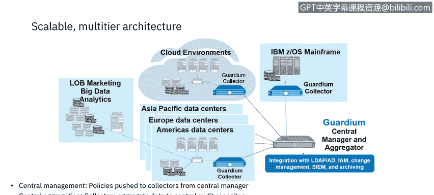
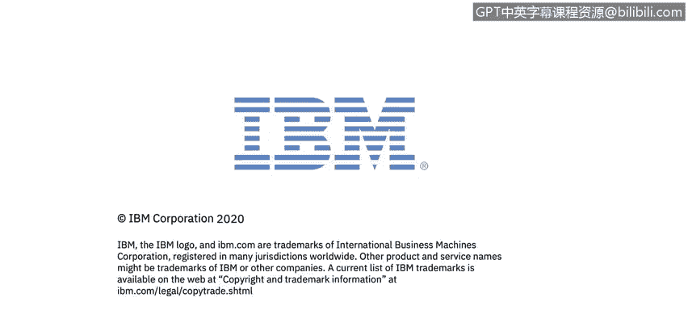

# 课程6：《网络威胁情报课程（IBM）》：50：11_07 数据保护行业示例 🛡️

## 概述
在本节课程中，我们将学习IBM Security Guardian，这是IBM用于实现更智能数据安全的解决方案。我们将探讨其核心组件、功能架构，并了解如何通过IBM Security Learning Academy进行实践学习。

---

## IBM Security Guardian 简介
上一节我们探讨了数据安全与保护的动机、挑战和陷阱。本节中，我们来看看IBM的解决方案——IBM Security Guardian。它是一个支持分阶段实施的强大数据安全与合规解决方案，旨在通过可见性、自动化和可扩展性实现更智能的数据安全。

Guardium帮助您保护数据免受未经授权的访问，确保数据隐私，识别风险并降低合规成本。它能处理本地或云上的数据源，包括数据库服务器、分布式数据存储库以及敏感文档和文件等非结构化数据。

## Guardian 的核心功能
以下是IBM Security Guardian提供的主要能力：

*   **数据库发现与分类**
*   **非结构化数据发现与分类**
*   **漏洞评估**
*   **实时数据库访问监控**
*   **实时非结构化数据监控**
*   **实时警报**
*   **阻断、脱敏、会话终止、隔离和查询重写等操作**
*   **内置及自定义报告**
*   **开箱即用和自定义的合规工作流自动化**
*   **针对GDPR、SOX、Basel II、HIPAA等行业法规和标准的合规加速器**
*   **配置、审计和主动威胁分析**

Guardium为公司提供完整的监控需求解决方案，通常仅占用数据库服务器3%至5%的CPU资源，从而减少对数据库系统操作的影响。

## Guardian 的架构与工作原理
Guardium的实施方式确保了数据库管理员和拥有高级数据访问权限的特权数据库用户无法访问Guardium系统。这是因为Guardium在查询到达数据库之前拦截它们，并在结果返回给请求者之前拦截结果，从而可以阻断或报告数据访问，并对数据进行脱敏处理。

Guardium在异构数据库环境中工作一致，允许标准化策略、流程以及收集和报告的数据。此外，单个Guardium系统可以监控和管理不同供应商的数据库产品的安全性，也能监控Amazon AWS RDS数据库引擎。

为了提供对数据库和应用程序的异构支持，Guardium使用一个名为**STAP**的分布式代理进行基于主机的探测。这提供了轻量级的跨平台支持。

由于STAP代理在数据库服务器上运行于数据库和应用程序之下的底层，因此可以监控所有访问活动。这与网络监控不同，后者无法检测仅在数据库服务器上运行的活动。例如，在服务器控制台上本地工作的特权用户不会被任何仅监控网络流量的解决方案检测到，但会被Guardium检测并可能被监控甚至阻断。

同时，因为STAP运行在数据库和应用程序之下，安装STAP时无需对数据库或应用程序进行任何更改。

独立的收集器和聚合器设备负责大部分资源密集型处理，使得数据库服务器本身的运行干扰最小。

活动被实时记录，并立即可用于警报或报告。此外，字符串被解析成更小的数据元素，使得活动信息更容易分类和生成报告。解析默认实时进行，但也可因资源利用问题推迟到稍后时间。警报实时发生。

Guardium使用收集器、聚合器和中央管理器的分层结构：
*   **收集器** 从数据存储库收集并解析有关敏感数据的活动信息，提供实时分析，并存储以供进一步处理。一个Guardium实施至少有一个，通常有多个收集器。
*   **聚合器** 从多个收集器收集并合并信息，提供敏感数据操作的企业级视图。拥有较多收集器的Guardium实施会有一个或多个聚合器。
*   **中央管理系统** 一个Guardium环境有一个中央管理系统，用于控制和监控该环境中的所有收集器和聚合器，并通过单一控制台提供整体视图。集中管理提供策略的统一性，可以创建一次并分发到众多不同的端点。

集中式聚合从分布式源收集数据安全信息，进行统一处理、存储和报告。异构数据源支持为不同类型的数据存储库提供类似的安全能力。

## 扩展组件：数据加密与密钥生命周期管理
除了核心监控功能，IBM Security Guardian还包含两个关键扩展组件，共同构成完整的数据保护体系。

**IBM Security Guardian Data Encryption** 是一个高度可扩展的集成产品套件，有助于最大限度地降低风险并减少加密密钥管理的运营成本。它提供对文件、数据库、应用程序和云容器数据的加密，并提供令牌化及云密钥管理能力，包括密钥存储、轮换和生命周期管理。它能保护整个企业（包括云、虚拟、大数据和本地环境）的数据资产，并为合规工作提供支持。

**IBM Security Key Lifecycle Manager** 提供加密密钥管理能力。它支持多主集群，允许密钥同步和实时交付，以提高灵活性和易用性。它简化了安全密钥的生命周期，包括生成、分发和生命周期管理，从而降低成本。它可以简单安全地与IBM存储系统集成。

## 实践学习资源
最后，请注意IBM Security Learning Academy上提供的一些Guardium实验课程。在 `www.securitylearningacademy.com`，我们可以查看学院的Guardium专区。

这里有适用于Guardium初学者、用户和管理员的路线图。这些路线图是在本视频系列所学知识基础上进行深入学习的绝佳起点。

以下提供两个优秀的实验：
1.  **Guardium Database Vulnerability Assessment**：这是一个基础级课程，包含解释性视频、实验指南和虚拟实验环境。
2.  **Creating a Guardium Query and Report**：该实验提供实验指南和虚拟实验环境。

## 总结
本节课中，我们一起学习了IBM Security Guardian产品系列，包括其核心监控功能、分层架构、数据加密与密钥管理扩展组件，并预览了IBM Security Learning Academy中的Guardium学习资源。Guardium通过分阶段实施、异构环境支持、低资源消耗和集中管理，为企业提供了全面、智能且可扩展的数据安全与合规解决方案。